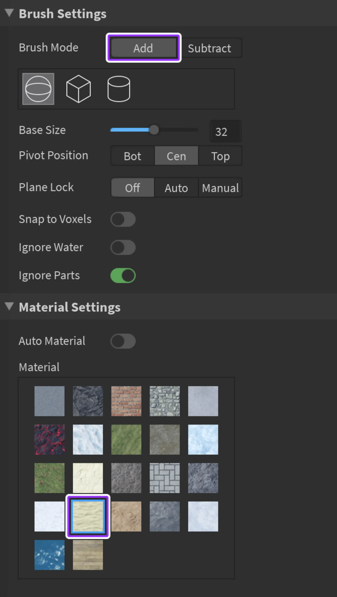
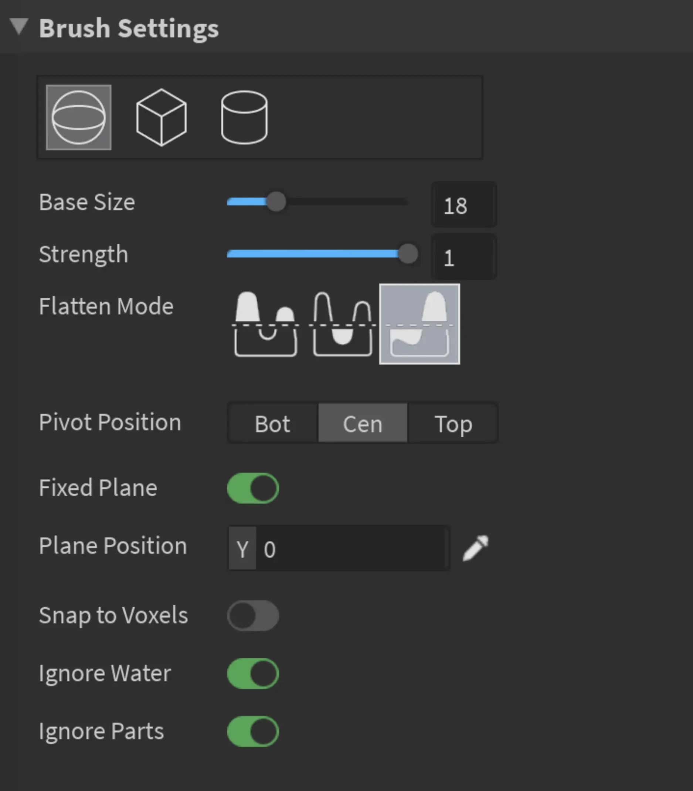
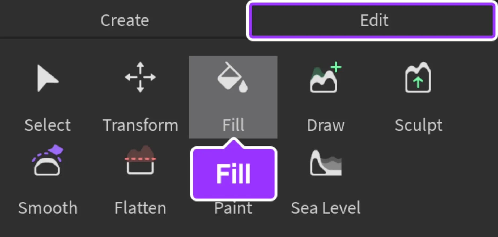
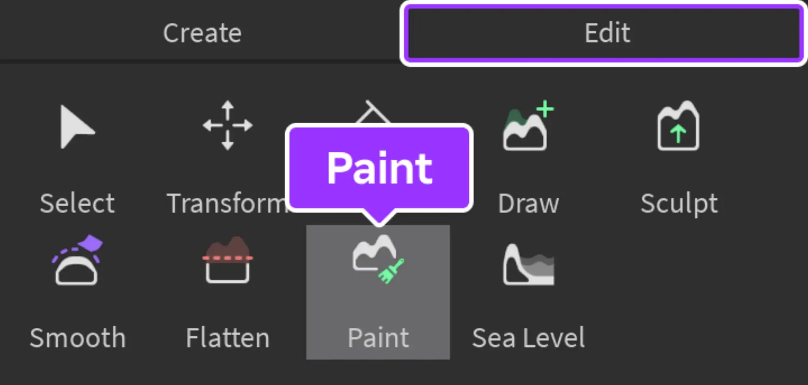
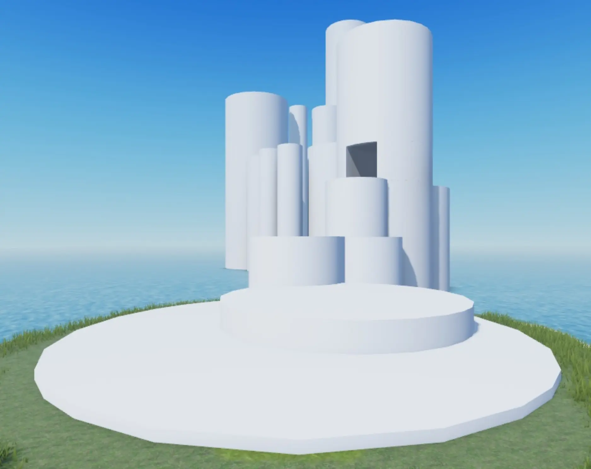
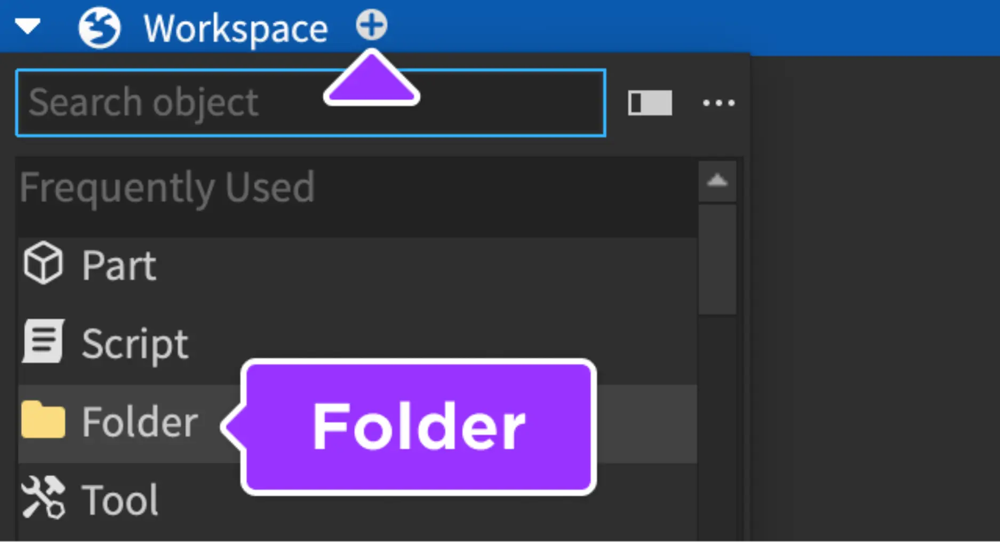
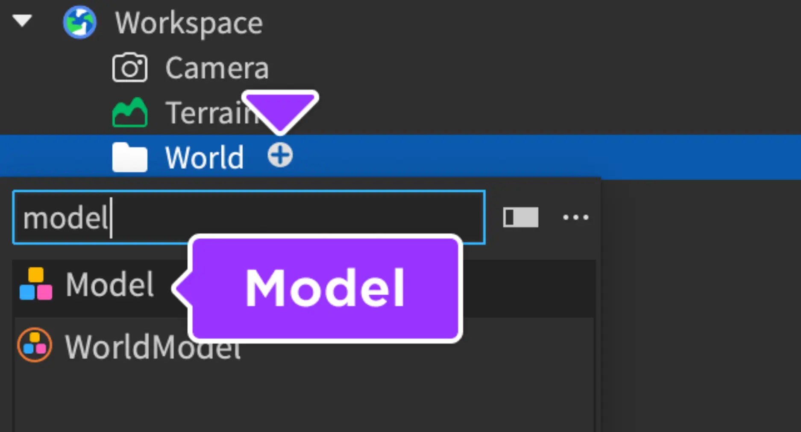
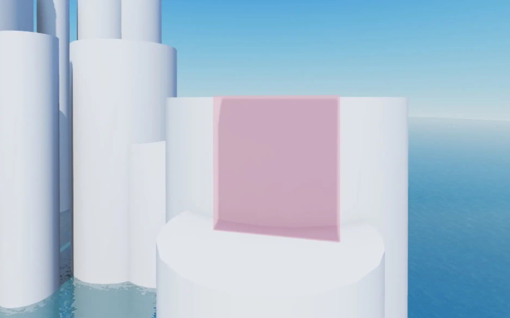
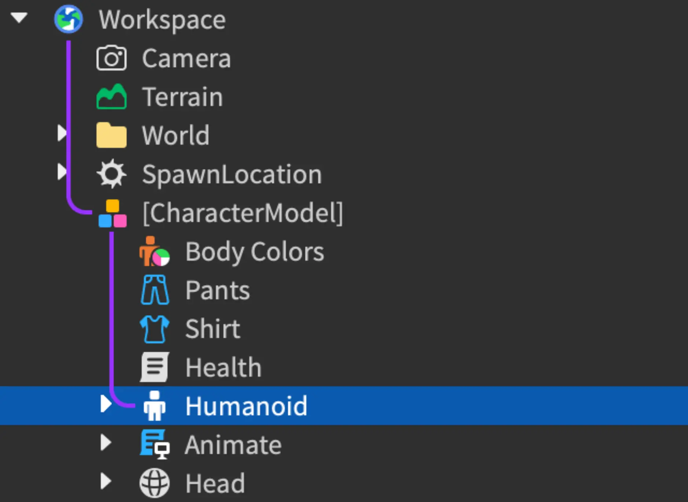
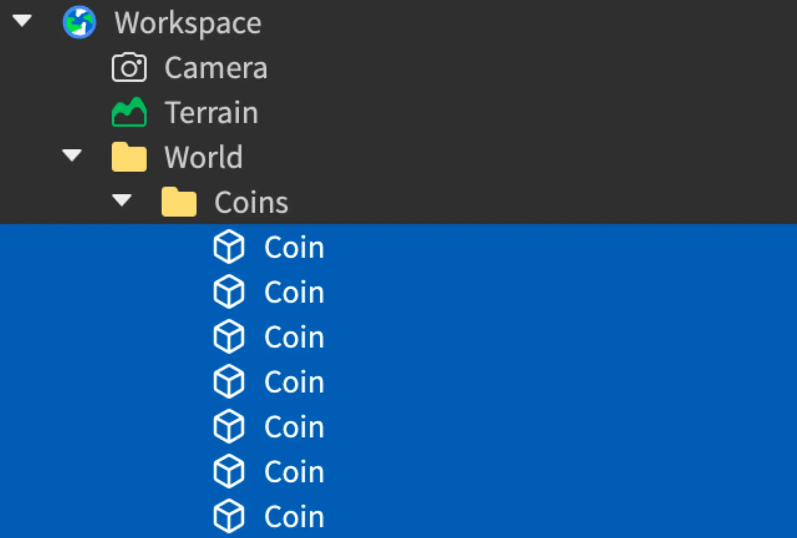

# Roblox tutorial

## 목차
- [Roblox tutorial](#roblox-tutorial)
  - [목차](#목차)
  - [Core](#core)
    - [Core Curriculum](#core-curriculum)
    - [Chapter 1 - Build a Greybox](#chapter-1---build-a-greybox)
      - [Create a Project](#create-a-project)
      - [Create an Environment with Terrain](#create-an-environment-with-terrain)
        - [섬 만들기](#섬-만들기)
        - [섬 모양 만들기](#섬-모양-만들기)
        - [물 만들기](#물-만들기)
        - [재료 적용](#재료-적용)
        - [플레이테스트](#플레이테스트)
      - [Greybox a Playable Area](#greybox-a-playable-area)
        - [플레이 가능한 영역 계획하기](#플레이-가능한-영역-계획하기)
        - [플랫폼 추가하기](#플랫폼-추가하기)
        - [조직 구조 만들기](#조직-구조-만들기)
        - [파트 삽입](#파트-삽입)
        - [파트 정렬](#파트-정렬)
        - [속이 빈 터널 만들기](#속이-빈-터널-만들기)
        - [플레이테스트](#플레이테스트-1)
    - [Chapter 2 - Script the Gameplay](#chapter-2---script-the-gameplay)
      - [Create a Coin Collection Mechanic](#create-a-coin-collection-mechanic)
        - [코인 만들기](#코인-만들기)
        - [스크립트 만들기](#스크립트-만들기)
        - [Code Explanation](#code-explanation)
          - [서비스 및 변수 초기화](#서비스-및-변수-초기화)
          - [이벤트 핸들러 정의](#이벤트-핸들러-정의)
          - [이벤트 핸들러 연결](#이벤트-핸들러-연결)
        - [메커니즘 플레이테스트](#메커니즘-플레이테스트)
      - [Record and Display Player Data](#record-and-display-player-data)
  - [출처](#출처)
  - [다음](#다음)

---
## Core

여기에 Studio에서 창작하는 것에 대한 포괄적인 소개를 시작하세요! 처음부터 간단하지만 완성도 높은 경험을 만드는 데 필요한 모든 것을 다룹니다.

### Core Curriculum

핵심 커리큘럼은 기술 및 창의적 분야 전반에 걸쳐 Studio의 많은 필수 기능을 배우는 데 도움을 줍니다.

플레이어가 점프 파워를 교환하기 위해 코인을 수집하는 간단한 3D 플랫폼 게임 경험을 재창조하는 방법을 배울 수 있습니다. 플레이어는 점점 더 높은 플랫폼을 점프하여 최종적으로 가장 높은 플랫폼에 있는 신호탄에 도달합니다.

이 과정은 일반적인 코딩 개념에 익숙하지만 Roblox에 처음인 독자를 대상으로 합니다. 코딩을 배우는 데 도움이 필요하다면 Studio 작업의 기본 사항과 코딩 기본 개념을 시도해보세요.

코스 내용

 - 핵심 커리큘럼은 세 개의 챕터로 나뉘며, 각 챕터는 해당 장소 파일과 함께 제공됩니다. 각 챕터의 단계를 따라가거나 챕터의 최종 결과를 보고 싶다면 장소 파일을 검사할 수 있습니다.

 -  챕터 1 - 그레이박스 구축
    - 프로젝트 만들기 - Roblox 플랫폼에서 경험을 나타내는 .rbxl 파일을 만드는 방법을 배우세요.
    - 지형으로 환경 만들기 - Studio의 지형 도구를 사용하여 플레이어가 스폰되는 섬을 만드는 방법을 배우세요.
    - 플레이 가능 영역 그레이박스 - 솔리드 모델링 도구를 사용하여 플랫폼의 기본 형태를 계획하는 방법을 배우세요.

 - 챕터 2 - 게임플레이 스크립트 작성
   - 코인 수집 메커니즘 만들기 - 플레이어의 코인 수집을 추적하고 저장하는 방법을 배우세요.
   - 플레이어 데이터 기록 및 표시 - 개별 플레이어 데이터를 시각적으로 리더보드를 통해 저장, 검색 및 표시하는 방법을 배우세요.
   - 플레이어 위험 요소 만들기 - 플레이어 행동을 수정하고 플레이어 생명 주기를 만들어 물에서 위험 요소를 만드는 방법을 배우세요.
   - 업그레이드 버튼 스크립트 작성 - Roblox 서버와 통신하고 GUI 상호작용을 처리하여 플레이어 점프 파워를 업그레이드하는 방법을 배우세요.

 - 챕터 3 - 경험 다듬기
   - 기본 시각 효과 만들기 - 파티클 방출기를 사용하여 두 가지 다른 유형의 시각 효과를 만드는 방법을 배우세요.
   - 글로벌 조명 사용자 지정 - 글로벌 조명 설정을 사용하여 경험의 외관과 느낌을 개선하는 방법을 배우세요.
   - 정교한 자산 적용 - 간단한 부분을 복잡하고 가져온 모델로 교체하여 장면을 마무리하는 방법을 배우세요.

### Chapter 1 - Build a Greybox

#### Create a Project

Island Jump 3D 플랫폼 경험을 재현하기 위해서는 Roblox Studio 내에서 프로젝트를 만들어야 합니다. 프로젝트는 장소, 자산, 설정 및 기타 리소스의 모음으로, 함께 경험을 나타냅니다. 프로젝트는 처음부터 시작할 수도 있고, Studio의 템플릿 중 하나를 사용하여 환경과 게임 메커니즘의 기초를 제공할 수도 있습니다. 예를 들면 다음과 같습니다:

Baseplate 템플릿 — Baseplate와 SpawnLocation 객체를 포함합니다.
Modern City 템플릿 — 고품질의 도시 샘플과 모듈식 자산 키트를 포함합니다.
Mansion of Wonder 템플릿 — 1인칭 슈터 경험을 위한 자산과 스크립트를 포함합니다.

Baseplate 템플릿으로 프로젝트를 만들려면:

1. Roblox Studio를 엽니다.
2. 세로 탐색 바에서 새 탭을 선택합니다. 모든 템플릿이 표시됩니다.
3. Baseplate 템플릿을 선택합니다. Studio가 새로운 경험을 엽니다.<br>
4. Explorer 창에서 Baseplate 객체를 마우스 오른쪽 버튼으로 클릭합니다. 컨텍스트 메뉴가 표시됩니다.
5. 삭제를 선택합니다. 뷰포트에는 중앙에 스폰 위치가 있는 빈 세계가 표시됩니다.<br>

다음 튜토리얼 섹션에서는 스폰 위치 주변에 섬 환경을 만들기 위해 지형 편집기를 사용하는 방법을 배우게 됩니다.

#### Create an Environment with Terrain

지형을 사용하여 환경을 만드는 것은 3D 공간 내에서 실제 자연 재료처럼 보이고 작동하는 유기적 재료를 생성하고 사용자 정의할 수 있게 해줍니다. Terrain Editor 내의 도구를 사용하여 이 튜토리얼 섹션에서는 플레이어가 스폰하고 경험의 첫 번째 몇 개의 플랫폼으로 이동할 수 있는 작은 섬을 위해 지형을 생성하고 조각하는 방법을 가르칩니다.

시작하기 전에 지형을 조각하는 것은 예술 형식이며, 브러쉬 스트로크와 미세한 재료 편집을 정확하게 재현하는 것은 어렵다는 점을 유념하십시오. 지형이 여러분의 경험 요구에 부합하는 한, 여러분의 환경이 샘플 Island Jump 경험과 다르게 보이고 느껴지는 것은 정상이며 예상되는 일입니다.

##### 섬 만들기

환경을 만드는 첫 번째 단계는 플레이어가 경험을 시작할 때와 플랫폼에서 떨어져 건강이 0이 되었을 때 스폰될 작은 섬을 만드는 것입니다. Terrain Editor의 Draw 도구를 사용하여 뷰포트 내 어디에서나 클릭하고 드래그하여 섬을 시작할 큰 구체를 생성할 수 있으며, 나중에 넓은 표면적을 위해 모양을 만들고 평평하게 할 수 있습니다.

섬을 만들려면:

1. 메뉴 바에서 홈 탭으로 이동한 다음 Terrain Editor 버튼을 클릭합니다. Terrain Editor 창이 표시됩니다.<br>
2. Terrain Editor 창에서 Edit 탭을 클릭한 다음 Draw 버튼을 클릭합니다.<br>
3. 브러쉬 설정 및 재료 설정 섹션에서 다음을 제외한 모든 기본 설정을 유지합니다:<br>
    - 기본 크기를 32로 설정합니다.
    - 재료를 모래로 설정합니다.
4. 뷰포트에서 스폰 위치 근처를 클릭합니다. 모래 재료의 구체가 표시됩니다.

<video src="../img/05_Roblox_tutorial/Terrain-Adding-First-Sphere.mp4" width="320" height="240" controls></video>

구체가 보이지 않으면 카메라를 줌 아웃하여 스폰 위치가 작아질 때까지 시도하십시오.

##### 섬 모양 만들기

현재 모양의 섬을 유지하면 플레이어가 섬에서 떨어지지 않고 탐색하기 어려울 것입니다. Terrain Editor의 Flatten 도구를 사용하여 고정 평면에서 지형을 균일하게 평평하게 만들고 플레이어가 경험을 시작할 때 상대적으로 평평한 표면을 제공할 수 있습니다. 이 모양이 처음에는 자연스럽지 않아 보이지만, Terrain Editor의 Sculpt 도구를 사용하여 섬의 가장자리를 다듬어 보다 유기적이고 현실적으로 보이게 할 수 있습니다.

섬 모양을 만들려면:

1. Terrain Editor 창에서 Flatten 버튼을 클릭합니다.<br>
2. 브러쉬 설정 섹션에서 다음을 제외한 모든 기본 설정을 유지합니다:<br>
    - 기본 크기를 18로 설정합니다.
    - 고정 평면을 활성화합니다. 새로운 설정이 표시됩니다.
    - 평면 위치를 0으로 설정합니다.
3. 뷰포트에서 마우스를 클릭하고 드래그하여 구체의 상단이 완전히 평평해질 때까지 이동합니다.
<video src="../img/05_Roblox_tutorial/Terrain-Flattening-Sphere.mp4" width="320" height="240" controls></video>

4. 다시 Terrain Editor 창으로 이동하여 Sculpt 버튼을 클릭합니다.<br>
5. 브러쉬 설정 및 재료 설정 섹션에서 재료를 모래로 설정하고 다른 모든 기본 설정을 유지합니다.<br>
6. 뷰포트에서 마우스를 클릭하고 드래그하여 섬의 가장자리와 물 아래 라인을 따라 이동하여 섬이 보다 자연스럽게 보이도록 합니다.

<video src="../img/05_Roblox_tutorial/Terrain-Sculpting-Edges.mp4" width="320" height="240" controls></video>

Draw 도구는 브러쉬 위치에 따라 재료를 추가하거나 빼지만, Sculpt 도구는 기존 지형을 성장시키거나 침식시키기만 합니다.

##### 물 만들기

큰 수역을 생성하는 방법은 여러 가지가 있지만, 다음 지침에서는 Terrain Editor의 Fill 도구를 사용합니다. 이 방법을 사용하면 특정 영역의 모든 재료를 다른 재료(공기 포함)로 교체할 수 있습니다.

섬 주변에 물을 만들려면:

1. Terrain Editor 창에서 Fill 버튼을 클릭합니다.<br>
2. 선택 설정 섹션에서,
    1. 위치를 0, -15, 0으로 설정하여 섬 상단 아래에 물이 채워지도록 합니다.
    2. 크기를 1800, 5, 1800으로 설정하여 경험의 지평선까지 물이 채워지도록 합니다.
3. 재료 설정 섹션에서 도구를 다음 설정으로 구성합니다:<br>
    - 재료 모드를 대체로 설정합니다.
    - 원본 재료를 공기로 설정합니다.
    - 대상 재료를 물로 설정합니다.
4. 적용 버튼을 클릭합니다. 섬 주변에 물이 생성됩니다.
<video src="../img/05_Roblox_tutorial/Terrain-Filling-Water.mp4" width="320" height="240" controls></video>

##### 재료 적용

이제 섬의 기초가 마련되었으므로 다양한 재료로 외관을 사용자 정의할 수 있습니다. Terrain Editor의 Paint 도구를 사용하여 클릭하고 드래그하여 섬 표면의 중간 부분에 풀과 풀잎을 적용할 수 있습니다.

섬에 재료를 적용하려면:
1. Terrain Editor에서 Paint 버튼을 클릭합니다.<br>
2. 브러쉬 설정 및 재료 설정 섹션에서 다음을 제외한 모든 기본 설정을 유지합니다:
    <br>
    - 재료 모드를 페인트로 설정합니다.
    - 재료를 잎이 많은 풀로 설정합니다.
3. 뷰포트에서 섬의 중간을 클릭하고 드래그하여 잎이 많은 풀 재료를 적용합니다.
<video src="../img/05_Roblox_tutorial/Terrain-Painting-Grass.mp4" width="320" height="240" controls></video>

4. 다시 Terrain Editor 창으로 이동하여 브러쉬 설정 및 재료 설정 섹션에서
    - 기본 크기를 3으로 설정합니다.
    - 재료를 풀로 설정합니다.
5. 뷰포트에서 섬 가장자리를 따라 드래그하여 풀잎을 적용하고, 섬의 중간에 스폰 위치와 초기 플랫폼을 위한 공간을 남깁니다.
6. Explorer 창에서 SpawnLocation 객체를 선택합니다.
7. 홈 탭에서 이동 도구를 선택합니다.
8. 뷰포트에서 스폰 위치를 섬 가장자리 쪽으로 이동하여 첫 번째 플랫폼을 위한 공간을 만듭니다. 샘플 Island Jump - Building .rbxl 파일은 위치를 -127, -3, 9로 사용합니다.

<video src="../img/05_Roblox_tutorial/create-an-environment-with-terrain-spawn.mp4" width="320" height="240" controls></video>

재료 오버라이드를 사용하여 사용자 정의 텍스처 자산을 제공하여 기본 지형 텍스처를 대체하는 완전히 사용자 정의된 재료 외관을 만들 수 있습니다.

##### 플레이테스트

섬의 외관에 만족하면 플레이테스트를 통해 섬의 규모와 3D 세계에서의 느낌을 확인할 수 있습니다.

경험을 플레이테스트하려면:
1. 메뉴 바에서 재생 버튼을 클릭합니다. Studio가 플레이테스트 모드로 전환됩니다.<br>
2. 섬을 걸어 다니며 플레이 중에 어떻게 보이는지 확인합니다. 완료되면 메뉴 바로 돌아가서 정지 버튼을 클릭합니다. Studio가 플레이테스트 모드를 종료합니다.<br>

스폰 시 캐릭터가 예상과 다른 방향을 향하고 있다면, 예를 들어 섬의 중앙이 아닌 바다를 향하고 있다면 SpawnLocation 객체를 회전시키고 다시 플레이테스트하여 캐릭터가 적절한 방향으로 스폰될 때까지 과정을 반복합니다.

<video src="../img/05_Roblox_tutorial/create-an-environment-with-terrain-walking.mp4" width="320" height="240" controls></video>

다음 튜토리얼 섹션에서는 플레이어가 가장 높은 플랫폼에 도달할 수 있는 플레이 가능한 영역을 만드는 방법을 배웁니다.

#### Greybox a Playable Area

환경의 그레이박싱(Greyboxing), 또는 환경을 대략적으로 배치하는 과정은 스크립팅이나 복잡한 자산을 만들기 전에 사용자가 게임플레이를 어떻게 경험할지 알아보기 위해 3D 공간에 간단한 모양을 추가하는 과정입니다. 이 과정은 레이아웃의 문제를 찾는 데 많은 시간을 절약할 수 있으며, Studio에 고품질 메시를 가져오는 것보다 기본 부품을 조정하는 것이 훨씬 쉽습니다.

기본 부품과 고체 모델링 작업을 사용하여 이 튜토리얼 섹션에서는 경험의 플레이 가능한 영역을 구성하는 해상 암초 플랫폼을 그레이박싱하는 방법을 가르칩니다. 환경을 완료한 후에는 Luau 스크립트를 사용하여 경험의 게임플레이를 만드는 방법을 배우게 됩니다.

##### 플레이 가능한 영역 계획하기

경험의 최종 버전에서는 플레이어가 섬과 해상 암초 플랫폼에서 동전을 모아 점프력을 업그레이드하고 더 높은 플랫폼에 도달해야 합니다. 다음 튜토리얼 섹션에서는 이 동작을 추가하도록 스크립트를 구성하겠지만, 환경을 그레이박싱할 때 플랫폼 간의 높이 차이를 계획하는 것이 중요합니다. 예를 들어, 각 높이 수준마다 플랫폼 간의 높이 차이가 점차 증가하여 플레이어가 동전을 모아 레벨을 진행하도록 유도해야 합니다.

가이드로서, 샘플 Island Jump - Building .rbxl 파일에는 7개의 다른 높이 수준이 포함되어 있으며, 첫 번째 수준은 섬에 잠기도록 하여 몇 개의 스터드 높이만 노출됩니다. 이는 플레이어가 경험 초기에 몇 개의 동전만 모으면 다음 플랫폼으로 진행할 수 있도록 합니다. 각 수준 간의 후속 높이 차이는 8, 20, 35, 55, 81 및 110 스터드로 증가하여 플레이어가 경험을 진행하면서 성취감을 느낄 수 있습니다.

스터드는 Studio의 주요 길이 단위이며, 28cm에 해당합니다.


샘플 Island Jump 경험의 그레이박스 지오메트리의 먼 뷰. 각 해상 암초 간의 높이 차이가 강조 표시되어 있습니다.

샘플의 단순한 디자인을 넘어 세계를 확장하려면, 점프 업그레이드를 필요로 하는 각 새로운 높이 수준이 이전 수준보다 적어도 30 스터드 이상 높아지도록 해야 합니다.

##### 플랫폼 추가하기

이제 플랫폼 간의 높이 차이에 대한 계획이 마련되었으므로, 해상 암초 플랫폼을 나타내는 자리 표시자 `Part` 객체를 추가할 차례입니다. Part는 모양, 크기, 색상 등의 물리적 외관을 사용자 정의할 수 있는 Roblox의 기본 빌딩 블록입니다.

해상 암초 플랫폼을 나타내기 위해 거의 모든 파트 모양을 사용할 수 있지만, 플랫폼 간 점프를 플레이테스트할 때 착지할 수 있는 평평한 표면을 제공하고 튜토리얼의 최종 섹션에서 사용할 해상 암초 메시와 유사하기 때문에 실린더 파트로 환경을 그레이박싱하는 것이 좋습니다.

샘플 Island Jump 경험의 그레이박스와 최종 지오메트리 비교


샘플 Island Jump 경험의 그레이박스 지오메트리.


샘플 Island Jump 경험의 최종 지오메트리.

##### 조직 구조 만들기
3D 공간에 자리 표시자 파트를 삽입하기 전에, Workspace의 자산에 대한 조직 구조를 만드는 것이 중요합니다. 이 과정은 특히 관리해야 할 자산이 많은 경험을 만드는 과정에서 Workspace가 조직되고 쉽게 스캔되도록 보장합니다.

자산을 함께 그룹화할 수 있는 컨테이너 유형에는 Folder와 Model 객체 두 가지가 있습니다. 폴더는 다양한 유형의 많은 객체를 저장하는 데 유용하고, 모델은 파트의 기하학적 그룹을 저장하는 데 유용합니다. 다음 지침에서는 3D 세계의 모든 자산을 저장하는 데 두 가지 컨테이너 객체를 사용하는 방법을 가르칩니다.

조직 구조를 만들려면:
1. Explorer 창에서 Workspace 위로 마우스를 올리고 ⊕ 아이콘을 클릭합니다. 컨텍스트 메뉴가 표시됩니다.
2. 컨텍스트 메뉴에서 Folder 객체를 삽입합니다. 3D 세계의 모든 자산을 포함할 폴더 객체가 표시됩니다.
<br>
<br>Explorer 창에서 Workspace의 플러스 아이콘과 폴더 객체가 강조 표시된 모습.

3. 새 폴더 이름을 World로 변경합니다.
    1. 폴더 객체를 마우스 오른쪽 버튼으로 클릭합니다. 컨텍스트 메뉴가 표시됩니다.
    2. 컨텍스트 메뉴에서 이름 변경을 클릭하고 폴더의 이름을 World로 입력합니다.
    이름이 올바르게 철자가 맞고 대소문자가 올바른지 확인합니다. Roblox에서 작성한 스크립트는 대소문자를 구분하며, 나중에 이 폴더에 접근하기 위해 하나의 스크립트를 작성할 것입니다.
4. World 폴더 위로 마우스를 올리고 ⊕ 아이콘을 클릭합니다.
5. 컨텍스트 메뉴에서 Model을 삽입합니다.<br><br>Explorer 창에서 World 폴더의 플러스 아이콘과 Model 객체가 강조 표시된 모습.
6. 모델 이름을 Blockout_Parts로 변경합니다.<br><br>Explorer 창에서 World 폴더 아래에 있는 새 Blockout_Parts 모델이 강조 표시된 모습.

##### 파트 삽입

```
다음 지침에서는 두 가지 다른 교육 경로를 제공합니다. 고유한 환경에 파트를 삽입하거나 샘플 Island Jump - Building 내의 그레이박스 환경을 정확하게 재현할 수 있습니다.
```

이제 자산을 포함할 조직 구조가 마련되었으므로, 3D 공간에 해상 암초 플랫폼을 나타내는 파트를 삽입할 수 있습니다.

첫 번째 플랫폼을 위한 실린더 파트를 삽입하려면:
1. 메뉴 바에서 홈 탭을 선택합니다.
2. 삽입 섹션에서 파트 드롭다운 화살표를 클릭한 다음 실린더를 선택합니다. 실린더 파트가 뷰포트에 표시됩니다.<br>
3. Explorer 창에서 새 Part를 클릭하고 Blockout_Parts 모델로 드래그합니다. 파트가 모델의 자식이 됩니다.<br><br>Explorer 창에서 Blockout_Parts 모델 객체 아래에 새 Part가 강조 표시된 모습.
4. 다시 홈 탭으로 이동하여 이동, 크기 조정 및 회전 도구를 사용하여 실린더를 섬의 중앙에 큰 평평한 표면이 되도록 위치, 크기 조정 및 회전합니다. 이 도구에 대한 자세한 내용은 파트 조작을 참조하십시오.<br><br><br><br>
5. 같은 과정을 사용하여 높이가 증가하는 적어도 7개의 해상 암초 플랫폼을 Blockout_Parts 모델에 추가하고 구성합니다.<br>
6. Explorer 창에서 Block_Out 모델을 선택합니다.
7. 홈 탭에서 편집 섹션으로 이동하여 앵커 아이콘을 클릭합니다. 이는 경험이 시작될 때 물리 시스템이 파트를 이동시키지 않도록 보장합니다.<br>

##### 파트 정렬
해상 암초 플랫폼을 삽입할 때 샘플 Island Jump - Building 경험 값을 사용한 경우 이 단계를 건너뛸 수 있습니다.

섬 외부에 더 많은 해상 암초 자리 표시자 파트를 추가할 때, 이러한 파트의 높이 차이를 서로 다른 위치 대신 다양한 크기를 사용하여 관리하는 것이 더 쉽습니다. 이를 통해 각 플랫폼의 기반을 정렬하여 모든 수직 크기 차이가 다른 높이로 반영되도록 하고, 같은 크기의 파트는 동일한 수준에 있도록 할 수 있습니다.

`Align Tool`은 특정 축에 따라 최소, 중앙 또는 최대 가장자리에 파트를 정렬합니다. 이 경험의 목적을 위해 Y 축에서 아래 가장자리를 정렬하여 모든 파트가 물에 부분적으로 잠기도록 해야 합니다.

파트를 정렬하려면:
1. Explorer 창에서 모든 플랫폼을 선택합니다.
2. 메뉴 바에서 모델 탭으로 이동한 다음 Align Tool을 클릭합니다. Align Tool 창이 표시됩니다.<br>
3. Align Tool 창에서,
    1. 모드를 Min으로 설정합니다.
    2. 정렬 대상을 World, Y로 설정합니다.
    3. Relative To를 Selection Bounds로 유지합니다.
4. Align 버튼을 클릭합니다. 모든 파트가 가장 낮은 Y Part.Position 값을 가진 파트에 따라 Y 축에서 정렬됩니다.

모든 플랫폼이 아래 가장자리를 정렬합니다.

##### 속이 빈 터널 만들기

플레이 가능한 영역을 차단하는 데 파트를 그대로 사용하는 것 외에도 고체 모델링 작업을 적용하여 파트를 독특한 방식으로 결합하여 속이 빈 터널과 같은 더 복잡한 모양을 만들 수 있습니다. 이 기술은 플레이어가 환경과 상호 작용하는 방식에 시각적 흥미와 변화를 제공합니다.

고체 모델링 도구에는 네 가지가 있습니다:

 - Union – 두 개 이상의 파트를 결합하여 하나의 고체 유니언을 만듭니다.
 - Intersect – 겹치는 파트를 하나의 고체 교차로 교차합니다.
 - Negate – 파트를 제거하여 구멍과 함몰부를 만드는 데 유용합니다.
 - Separate – 유니언이나 교차를 개별 파트로 다시 분리합니다.

속이 빈 터널을 만드는 목적을 위해 Union과 Negate 도구만 사용하면 됩니다. 모든 도구에 대한 전체 분석은 고체 모델링을 참조하십시오.


모델 탭에서 고체 모델링 도구가 강조 표시된 모습.

속이 빈 터널을 만들려면:
1. 해상 암초 플랫폼 위에 실린더 파트를 삽입하고 위치를 지정합니다. 샘플 Island Jump - Building 경험은 다음 값으로 Level_4b 플랫폼 위에 이 파트를 위치시킵니다:<br>
    | 이름 |	크기 |	CFrame.Position |	CFrame.Orientation |
    |---|---|---|---|
    |Tunnel |	24, 65, 69	| 137, 77, 69	| 0, 0, 90 |
2. 실린더 파트 안에 속이 빈 부분을 나타내는 블록 파트를 삽입하고 위치를 지정하여 플레이어가 통과할 수 있을 정도로 높고 적절한 너비를 가집니다. 샘플 Island Jump - Building 경험은 다음 값으로 이전 실린더 안에 이 파트를 위치시킵니다:<br>
    | 이름 |	크기 |	CFrame.Position |	CFrame.Orientation |
    |---|---|---|---|
    |Hollow_Part |	24.5, 72, 22	| 134.5, 77, 71	| 0, 135, 90 |
    <br>
3. Explorer 창에서 블록 파트를 선택합니다.
4. 모델 탭에서 고체 모델링 섹션으로 이동한 다음 Negate 버튼을 클릭합니다. 파트가 반투명해집니다.<br>
5. Explorer 창에서 반투명 파트와 실린더 터널 파트를 모두 선택합니다.
6. 모델 탭에서 고체 모델링 섹션으로 돌아가서 Union 버튼을 클릭합니다. 반투명 파트가 겹치는 터널 실린더에서 잘립니다.<br>
7. 새 유니언의 이름을 높이 수준과 위치를 반영하도록 Level_4b_Union과 같이 변경합니다.
8. 새 유니언 아래에 해상 암초 플랫폼을 복제하고 터널 위에 위치시킵니다. 샘플 Island Jump - Building 경험은 다음 값으로 유니언 위에 복제된 Level_4b 플랫폼을 위치시킵니다:<br>
    | 이름 |	크기 |	CFrame.Position |	CFrame.Orientation |
    |---|---|---|---|
    |Level_4b_Top |	74, 65, 69	| 137, 126, 69	| 0, 0, 90 |
    <br>

##### 플레이테스트

플레이 가능한 영역을 그레이박싱한 후에는 환경의 레이아웃을 플레이테스트하여 경험이 재미있고 기능적이며, 개발 과정이 진행됨에 따라 작은 문제가 더 큰 프로젝트로 변하기 전에 잡을 수 있도록 해야 합니다. 예를 들어, 경험의 게임플레이는 플레이어가 수집한 동전 수에 따라 점프력을 점진적으로 업그레이드해야 하므로, 플레이어가 다양한 플랫폼 높이 수준에서 기대하는 Humanoid.JumpPower에 따라 플랫폼 간 점프할 수 있는지 확인하는 것이 중요합니다.

다음 단계별 지침은 다양한 Humanoid.JumpPower 값으로 경험을 플레이테스트하는 방법을 가르칩니다. 플레이테스트를 할 때 다음 질문을 스스로에게 던져 보세요:

 - 플레이어가 각 플랫폼으로 성공적으로 점프할 수 있나요?
 - 플랫폼 간의 높이 차이가 점차 증가하여 플레이어가 진행하도록 유도하나요?
 - 레이아웃이나 게임플레이에서 무엇을 즐기고 있거나 좌절하고 있나요?

경험을 플레이테스트하려면:
1. 메뉴 바에서 재생 버튼을 클릭합니다. Studio가 플레이테스트 모드로 전환됩니다.<br>
2. Explorer 창에서 Roblox 사용자 이름을 표시하는 캐릭터 모델 옆의 화살표를 선택합니다. 모든 캐릭터 모델의 자식 객체가 표시됩니다.
3. Humanoid를 선택합니다.<br>
4. 속성 창에서 점프 설정 섹션으로 이동한 다음 UseJumpPower를 활성화합니다 JumpPower 속성이 기본값 50으로 표시됩니다.
5. JumpPower를 0으로 설정합니다. 이는 캐릭터가 점프할 수 없도록 하여 게임플레이를 스크립트한 후 플레이어의 시작 상태와 동일하게 만듭니다.<br><br>속성 창이 보이지 않으면 보기 탭을 열고 표시 섹션에서 속성이 선택되어 있는지 확인하십시오.
6. 새 수준에 도달하면 JumpPower를 30의 배수로 설정하여 점프 업그레이드를 시뮬레이션합니다.

<video src="../img/05_Roblox_tutorial/playable-area-walk.mp4" width="320" height="240" controls></video>

튜토리얼의 다음 섹션에서는 경험의 전체 게임플레이를 스크립트하는 방법을 배우게 됩니다.

### Chapter 2 - Script the Gameplay
#### Create a Coin Collection Mechanic

이제 3D 세계가 마련되었으므로, 이 튜토리얼 섹션에서는 코인 수집 메커니즘을 정의하는 첫 번째 스크립트를 추가하는 방법을 가르칩니다. 이 메커니즘은 플레이어가 코인을 수집할 수 있게 하며, 최근에 수집된 코인의 수집을 비활성화합니다.

##### 코인 만들기

스크립트를 작성하기 전에, 코인으로 사용할 자리 표시자 객체를 세계에 추가해야 합니다. 이전 섹션에서 만든 해상 암초 플랫폼처럼, 코인도 간단한 Part 객체일 수 있습니다.

코인을 만들려면:
1. Explorer 창에서 World 폴더에 새 폴더를 추가한 다음 이름을 Coins로 변경합니다.
2. Coins 폴더에 실린더 파트를 삽입한 다음 파트 이름을 Coin으로 변경합니다.<br>
3. 파트를 선택한 다음 속성 창에서,
    - BrickColor를 Gold로 설정합니다.
    - 재료를 Metal로 설정합니다.
    - 크기를 0.6, 8, 4로 설정합니다.
    - CanCollide를 비활성화합니다. 이는 다른 파트가 코인을 통과할 수 있음을 엔진에 알리며, 플레이어가 코인을 수집하기 위해 코인을 통과할 수 있음을 의미합니다.
    - Anchored를 활성화합니다. 이는 물리 관련 시뮬레이션으로 인해 코인의 위치가 변경되지 않도록 엔진에 알리며, 플레이어가 코인에 닿아도 위치에 영향을 미치지 않음을 의미합니다.
    <br>
4. 몇 개의 코인을 복제하여 테스트 목적으로 지도 주변에 배치합니다.<br>


이제 실린더 파트가 코인처럼 보이고 물리 시뮬레이션을 방지하지만, 플레이어가 코인을 수집할 수 있도록 논리를 추가해야 합니다.

##### 스크립트 만들기

코인을 수집 가능하게 하려면 플레이어가 코인에 닿을 때 반응해야 합니다. Roblox 엔진은 코인에 무언가가 닿을 때 알려줄 수 있지만, 이를 스크립트에서 선언해야 합니다. 

스크립트를 만들려면:
1. Explorer 창에서 ServerScriptService 위로 마우스를 올리고 ⊕ 버튼을 클릭합니다. 컨텍스트 메뉴가 표시됩니다.
2. 컨텍스트 메뉴에서 스크립트를 선택합니다. ServerScriptService 아래에 새 스크립트가 표시되며, 이는 엔진에 스크립트를 서버에서 실행하고 클라이언트가 코드에 액세스하지 못하도록 합니다.<br>
3. 스크립트 이름을 CoinService로 변경합니다.<br>
4. 기본 코드를 다음 코드로 바꿉니다:<br>
    ```lua
    -- 서비스 및 변수 초기화
    local Workspace = game:GetService("Workspace")
    local Players = game:GetService("Players")

    local coinsFolder = Workspace.World.Coins
    local coins = coinsFolder:GetChildren()

    local COOLDOWN = 10

    -- 이벤트 핸들러 정의
    local function onCoinTouched(otherPart, coin)
        if coin:GetAttribute("Enabled") then
            local character = otherPart.Parent
            local player = Players:GetPlayerFromCharacter(character)
            if player then
                -- 플레이어가 코인에 닿음
                coin.Transparency = 1
                coin:SetAttribute("Enabled", false)
                print("Player collected coin")
                task.wait(COOLDOWN)
                coin.Transparency = 0
                coin:SetAttribute("Enabled", true)
            end
        end
    end

    -- 이벤트 리스너 설정
    for _, coin in coins do
        coin:SetAttribute("Enabled", true)
        coin.Touched:Connect(function(otherPart)
            onCoinTouched(otherPart, coin)
        end)
    end
    ```

이제 플레이어가 코인에 닿을 때마다 코인이 10초 동안 사라지고, 출력 로그에 "Player collected coin"이 표시됩니다.

##### Code Explanation

다음 섹션에서는 스크립트가 작동하는 방식을 자세히 설명합니다.

###### 서비스 및 변수 초기화

다른 언어에서 작성한 많은 코드와 마찬가지로, 나중에 필요할 변수를 스크립트 상단에 정의합니다. 우리의 코드는 다음을 수행합니다:
 - 서비스 인스턴스 가져오기 - Roblox 서비스는 일반 기능에 대한 내장 기능을 제공합니다. 스크립트는 먼저 3D 세계의 모든 객체를 포함하는 Workspace 서비스와 경험에 연결된 모든 플레이어를 관리하고 포함하는 Player 서비스를 가져옵니다.
 - 모든 코인 참조 가져오기 - 스크립트는 GetChildren() 메서드를 사용하여 3D 워크스페이스에서 코인 객체에 대한 모든 참조를 쿼리합니다. 이 메서드는 이 경우 생성한 Workspace.World.Coins 폴더에 연결된 모든 것을 포함하는 배열을 반환합니다.
 - 전역 변수 정의 - COOLDOWN 변수는 코인이 수집된 후 비활성화되는 시간을 정의하는 데 사용됩니다.

서비스 및 변수 초기화
```lua
local Workspace = game:GetService("Workspace")
local Players = game:GetService("Players")

local coinsFolder = Workspace.World.Coins
local coins = coinsFolder:GetChildren()

local COOLDOWN = 10
```

###### 이벤트 핸들러 정의

Roblox 엔진은 3D 세계를 물리적으로 시뮬레이션하고 렌더링, 물리 및 네트워킹과 관련된 이벤트를 처리하는 논리의 많은 부분을 처리합니다. 이러한 이벤트 중 일부에서 사용자 정의 논리를 스크립팅하려는 경우, 이벤트를 청취하고 처리할 수 있으며, 엔진이 나머지를 처리하게 할 수 있습니다. 이 경우, 코인이 닿는 것과 관련된 이벤트를 청취하고 처리합니다. 스크립트는 onCoinTouched() 메서드에서 이 이벤트를 처리하는 논리를 정의하며, 다음을 수행합니다:
 - 코인이 활성화되었는지 감지 - 모든 Instance에는 객체가 3D 세계에 존재하는지 여부를 정의하는 Enabled 부울 속성이 있습니다. GetAttribute() 메서드를 사용하여 인스턴스 속성을 가져올 수 있습니다.
 - 플레이어가 코인에 닿았는지 감지 - 코인이 활성화된 경우, 메서드는 플레이어 서비스로 코인에 닿은 객체가 실제로 플레이어인지 확인합니다. 터치 이벤트가 발생하면 Roblox 엔진은 코인에 닿은 객체를 otherPart 매개변수로 전달합니다. 스크립트는 otherPart의 부모가 플레이어에 속하는지 확인합니다.
 - 플레이어가 코인에 닿았을 때 코인을 비활성화하고 10초 후에 다시 활성화 - 마지막으로, 플레이어가 코인에 닿았을 경우, 메서드는 코인을 비활성화하고 10초 동안 기다렸다가 코인을 다시 수집할 수 있도록 활성화합니다. task.wait()은 wait() 대신 사용되며, 코드 실행을 완전히 중지하지 않고 다른 스레드의 작업을 동시에 실행할 수 있도록 하여 성능을 향상시킵니다.

이벤트 핸들러 정의
```lua
local function onCoinTouched(otherPart, coin)
   if coin:GetAttribute("Enabled") then
      local character = otherPart.Parent
      local player = Players:GetPlayerFromCharacter(character)
      if player then
         -- 플레이어가 코인에 닿음
         coin.Transparency = 1
         coin:SetAttribute("Enabled", false)
         print("Player collected coin")
         task.wait(COOLDOWN)
         coin.Transparency = 0
         coin:SetAttribute("Enabled", true)
      end
   end
end
```

###### 이벤트 핸들러 연결

모든 시뮬레이션된 3D 객체는 BasePart를 상속받아 Touched() 이벤트를 가집니다. 다음 루프는 일반 반복을 사용하여 각 코인을 반복하고 코인이 기본적으로 활성화되도록 하여 코인이 3D 세계에서 보이도록 하고, onCoinTouched() 핸들러 메서드를 코인의 Touched 이벤트에 연결하여 이벤트가 발생할 때마다 실행되도록 합니다. 엔진이 터치를 감지하면, 다른 객체를 otherPart 매개변수로 전달합니다.

이벤트 핸들러 연결
```lua
for _, coin in coins do
   coin:SetAttribute("Enabled", true)
   coin.Touched:Connect(function(otherPart)
      onCoinTouched(otherPart, coin)
   end)
end
```

##### 메커니즘 플레이테스트
코인 수집 메커니즘이 의도한 대로 작동하는지 확인할 시간입니다. 경험을 플레이테스트하려면:
1. 메뉴 바에서 재생 버튼을 클릭합니다. Studio가 플레이테스트 모드로 전환됩니다.<br>
2. 캐릭터를 이동하여 코인에 닿게 합니다. 스크립트가 제대로 작동하면 출력 창에 "Player collected coin"이 표시되고, 코인이 10초 동안 사라졌다가 다시 나타납니다.<br>

출력 창이 보이지 않으면 보기 탭으로 이동한 다음 출력이 선택되어 있는지 확인하십시오.

<video src="../img/05_Roblox_tutorial/script-game-behavior-coin-collection.mp4" width="320" height="240" controls></video>

#### Record and Display Player Data

이제 플레이어가 코인을 수집했을 때 이를 감지할 수 있으므로, 이 튜토리얼 섹션에서는 플레이어가 수집한 코인의 수를 세고, 그 수를 리더보드에 표시하는 방법을 배웁니다.

코인 수집을 기록하는 모듈 스크립트 만들기
각 플레이어의 코인 수집 데이터를 저장하고 관리하려면, 모든 플레이어의 코인 수집 데이터에 접근하는 데이터 구조와 함수를 포함한 ModuleScript 객체를 만들어야 합니다. 모듈 스크립트는 다른 스크립트에서 요구할 수 있는 재사용 가능한 코드입니다. 이 경우, CoinService는 플레이어가 코인을 터치할 때 코인 수집 데이터를 업데이트할 수 있도록 이 모듈 스크립트를 요구합니다.

모듈 스크립트를 만들려면:

Explorer 창에서 ServerStorage 위로 마우스를 올리고 ⊕ 버튼을 클릭합니다. 컨텍스트 메뉴가 표시됩니다.

컨텍스트 메뉴에서 ModuleScript를 선택합니다. ServerStorage 아래에 새 모듈 스크립트가 표시됩니다. 코인 수집 로직을 서버에서 관리하기 때문에 모듈 스크립트를 ServerStorage에 배치합니다.

Explorer 창에서 ServerScriptService의 플러스 아이콘과 ModuleScript 객체가 강조 표시된 모습.
모듈 스크립트의 이름을 PlayerData로 변경합니다.

Explorer 창에서 ServerStorage 아래에 PlayerData 스크립트가 강조 표시된 모습.
기본 코드를 다음 코드로 바꿉니다:

```lua
local PlayerData = {}
PlayerData.COIN_KEY_NAME = "Coins"

local playerData = {
  --[[
    [userId: string] = {
      ["Coins"] = coinAmount: number
    }
  ]]
}

local DEFAULT_PLAYER_DATA = {
  [PlayerData.COIN_KEY_NAME] = 0
}

local function getData(player)
  local data = playerData[tostring(player.UserId)] or DEFAULT_PLAYER_DATA
  playerData[tostring(player.UserId)] = data
  return data
end

function PlayerData.getValue(player, key)
  return getData(player)[key]
end

function PlayerData.updateValue(player, key, updateFunction)
  local data = getData(player)
  local oldValue = data[key]
  local newValue = updateFunction(oldValue)

  data[key] = newValue
  return newValue
end

return PlayerData
```

모듈 스크립트는 플레이어의 코인 수집 데이터를 나타내는 zero 또는 많은 playerData 테이블을 포함하는 PlayerData 테이블을 정의합니다. 이 모듈 스크립트를 요구하는 모든 스크립트는 PlayerData 테이블의 동일한 복사본을 받으므로 여러 스크립트가 코인 수집 데이터를 수정하고 공유할 수 있습니다.

데이터 구조 선언
모듈 스크립트는 빈 테이블 PlayerData 선언으로 시작하며, 스크립트 끝에서 반환됩니다. 또한 테이블의 값을 가져오고 설정하는 접근자 메서드를 포함합니다.

playerData 테이블에는 테이블의 구조를 설명하는 주석이 포함되어 있어 코드를 이해하기 쉽게 합니다. 이 경우, playerData 테이블에는 userId와 그 플레이어의 수집된 코인 수를 나타내는 Coins라는 필드가 포함됩니다.

```lua
local PlayerData = {}
PlayerData.COIN_KEY_NAME = "Coins"

local playerData = {
  --[[
    [userId: string] = {
        ["Coins"] = coinAmount: number
    }
  ]]
}
...
return PlayerData
```

로컬 데이터 접근자 정의
getData()는 특정 playerData 테이블에 대한 데이터를 가져오는 로컬 함수입니다. 플레이어가 코인을 수집하지 않았다면, 이 함수는 DEFAULT_PLAYER_DATA 테이블을 반환하여 모든 플레이어에게 일부 데이터가 연결되도록 보장합니다. 일반적인 관례는 간단하고 공개된 함수를 만들어 실제 작업을 로컬 범위의 함수에 맡기는 것입니다.

```lua
local DEFAULT_PLAYER_DATA = {
 [PlayerData.COIN_KEY_NAME] = 0
}

local function getData(player)
  local data = playerData[tostring(player.UserId)] or DEFAULT_PLAYER_DATA
  playerData[tostring(player.UserId)] = data
  return data
end
```

공개 데이터 접근자 정의
getValue()와 updateValue()는 이 모듈 스크립트를 요구하는 다른 스크립트가 호출할 수 있는 공개된 함수입니다. 이 경우, CoinService는 플레이어가 코인을 터치할 때 플레이어의 코인 수집 데이터를 업데이트하는 데 이 함수를 사용합니다.

```lua
function PlayerData.getValue(player, key)
 return getData(player)[key]
end

function PlayerData.updateValue(player, key, updateFunction)
  local data = getData(player)
  const oldValue = data[key]
  local newValue = updateFunction(oldValue)

  data[key] = newValue
  return newValue
end
```

리더보드 구현
코인 수집 데이터를 화면에 표시되는 리더보드로 시각적으로 표현할 수 있습니다. Roblox는 기본 UI를 사용하여 자동으로 리더보드를 생성하는 내장 시스템을 포함합니다.

리더보드를 만들려면:

Explorer 창에서 ServerStorage에 ModuleScript를 생성한 다음 모듈 스크립트의 이름을 Leaderboard로 변경합니다.

Explorer 창에서 ServerStorage 아래에 Leaderboard 스크립트가 강조 표시된 모습.
기본 코드를 다음 코드로 바꿉니다:

```lua
local Leaderboard = {}

-- 새로운 리더보드 생성
local function setupLeaderboard(player)
  local leaderstats = Instance.new("Folder")
  -- 'leaderstats'는 리더보드를 생성하기 위해 Roblox에서 인식하는 예약된 이름입니다.
  leaderstats.Name = "leaderstats"
  leaderstats.Parent = player
  return leaderstats
end

-- 새로운 리더보드 통계 값 생성
local function setupStat(leaderstats, statName)
  local stat = Instance.new("IntValue")
  stat.Name = statName
  stat.Value = 0
  stat.Parent = leaderstats
  return stat
end

-- 플레이어의 통계 값 업데이트
function Leaderboard.setStat(player, statName, value)
  local leaderstats = player:FindFirstChild("leaderstats")
  if not leaderstats then
    leaderstats = setupLeaderboard(player)
  end

  local stat = leaderstats:FindFirstChild(statName)
  if not stat then
    stat = setupStat(leaderstats, statName)
  end

  stat.Value = value
end

return Leaderboard
```

다음 섹션에서는 리더보드가 작동하는 방식을 자세히 설명합니다.

리더보드 생성
setupLeaderboard() 함수는 leaderstats라는 이름의 새 폴더 인스턴스를 생성하고 이를 지정된 플레이어의 자식으로 설정합니다. Roblox는 leaderstats라는 이름의 폴더를 통계의 컨테이너로 인식하고 통계를 표시하기 위한 UI 요소를 생성합니다. leaderstats의 값은 "값" 객체(예: StringValue, IntValue 또는 NumberValue)로 저장되어야 합니다.

```lua
-- 새로운 리더보드 생성
local function setupLeaderboard(player)
  local leaderstats = Instance.new("Folder")
  -- 'leaderstats'는 리더보드를 생성하기 위해 Roblox에서 인식하는 예약된 이름입니다.
  leaderstats.Name = "leaderstats"
  leaderstats.Parent = player
  return leaderstats
end

-- 새로운 리더보드 통계 값 생성
local function setupStat(leaderstats, statName)
  local stat = Instance.new("IntValue")
  stat.Name = statName
  stat.Value = 0
  stat.Parent = leaderstats
  return stat
end
```

플레이어 통계 업데이트
setStat()는 Leaderboard 모듈에서 유일한 공개 함수입니다. 이 함수는 지정된 플레이어나 리더보드 자체에 대해 통계 값을 생성합니다.

FindFirstChild()는 객체의 이름을 받아 객체가 존재하면 반환하고, 그렇지 않으면 nil을 반환합니다. 이는 객체가 존재하는지 확인하기 전에 사용하는 일반적이고 안전한 방법입니다.

```lua
-- 플레이어의 통계 값 업데이트
function Leaderboard.setStat(player, statName, value)
  local leaderstats = player:FindFirstChild("leaderstats")
  if not leaderstats then
    leaderstats = setupLeaderboard(player)
  end

  local stat = leaderstats:FindFirstChild(statName)
  if not stat then
    stat = setupStat(leaderstats, statName)
  end

  stat.Value = value
end
```

모듈 스크립트 통합
PlayerData 및 Leaderboard 모듈 스크립트가 완료되면, CoinService 스크립트에서 이를 요구하여 플레이어 코인 데이터를 관리하고 표시합니다. CoinService를 업데이트하려면:

Explorer 창에서 CoinService 스크립트를 엽니다.

기존 코드를 다음 코드로 바꿉니다:

```lua
-- 서비스 및 변수 초기화
local Workspace = game:GetService("Workspace")
local Players = game:GetService("Players")
local ServerStorage = game:GetService("ServerStorage")

-- 모듈
local Leaderboard = require(ServerStorage.Leaderboard)
local PlayerData = require(ServerStorage.PlayerData)

local coinsFolder = Workspace.World.Coins
local coins = coins

Folder:GetChildren()

local COIN_KEY_NAME = PlayerData.COIN_KEY_NAME
local COOLDOWN = 10
local COIN_AMOUNT_TO_ADD = 1

local function updatePlayerCoins(player, updateFunction)
  -- 코인 테이블 업데이트
  local newCoinAmount = PlayerData.updateValue(player, COIN_KEY_NAME, updateFunction)

  -- 코인 리더보드 업데이트
  Leaderboard.setStat(player, COIN_KEY_NAME, newCoinAmount)
end

-- 이벤트 핸들러 정의
local function onCoinTouched(otherPart, coin)
  if coin:GetAttribute("Enabled") then
    local character = otherPart.Parent
    local player = Players:GetPlayerFromCharacter(character)
    if player then
      -- 플레이어가 코인에 닿음
      coin.Transparency = 1
      coin:SetAttribute("Enabled", false)
      updatePlayerCoins(player, function(oldCoinAmount)
        oldCoinAmount = oldCoinAmount or 0
        return oldCoinAmount + COIN_AMOUNT_TO_ADD
      end)

      task.wait(COOLDOWN)
      coin.Transparency = 0
      coin:SetAttribute("Enabled", true)
    end
  end
end

-- 이벤트 리스너 설정
for _, coin in coins do
  coin:SetAttribute("Enabled", true)
  coin.Touched:Connect(function(otherPart)
    onCoinTouched(otherPart, coin)
  end)
end
```

원래 CoinService 스크립트의 변경 사항은 다음을 포함합니다:

require() 함수를 사용하여 PlayerData 및 Leaderboard 모듈을 가져옵니다.
플레이어가 코인을 수집할 때 추가할 코인의 수를 COIN_AMOUNT_TO_ADD로 선언하고, PlayerData에서 정의한 키 이름을 COIN_KEY_NAME으로 선언합니다.
플레이어의 코인 수와 관련 리더보드 통계를 업데이트하는 도우미 함수 updatePlayerCoins()를 생성합니다.
onCoinTouched()에서 플레이어가 코인에 닿았을 때 호출되는 print() 문을 updatePlayerCoins() 호출로 대체합니다.
플레이테스트
코인 수집이 의도한 대로 작동하는지 확인할 시간입니다. 게임에서 코인을 터치하고 수집할 때, 리더보드 UI에 수집한 코인의 수가 표시되어야 합니다. 경험을 플레이테스트하려면:

메뉴 바에서 재생 버튼을 클릭합니다. Studio가 플레이테스트 모드로 전환됩니다.

메뉴 바에서 재생 버튼이 강조 표시된 Studio의 홈 탭.
캐릭터를 이동하여 코인에 닿게 합니다. 스크립트가 제대로 작동하면 리더보드 UI가 표시되고 코인을 더 많이 수집할수록 코인 수가 증가합니다.


---
## 출처
 - [Creating Your First Experience](https://create.roblox.com/docs/ko-kr/tutorials/first-experience)
---
## [다음]()