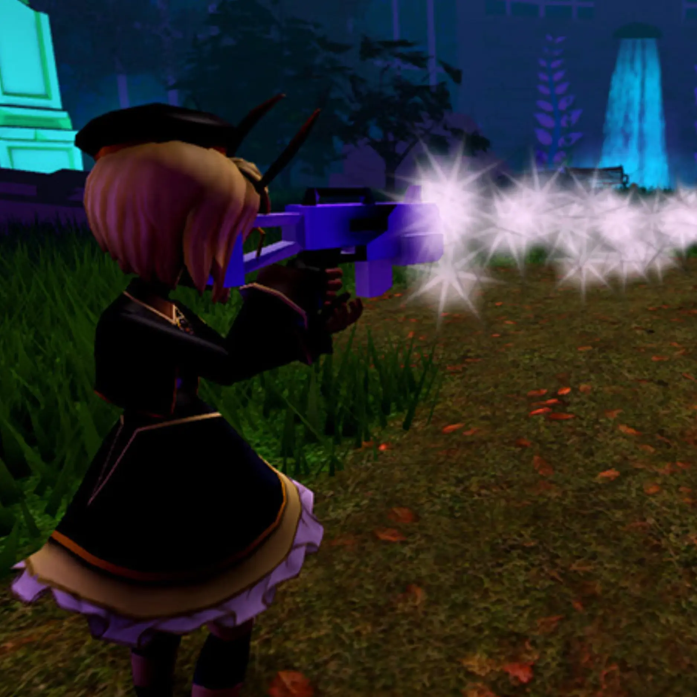
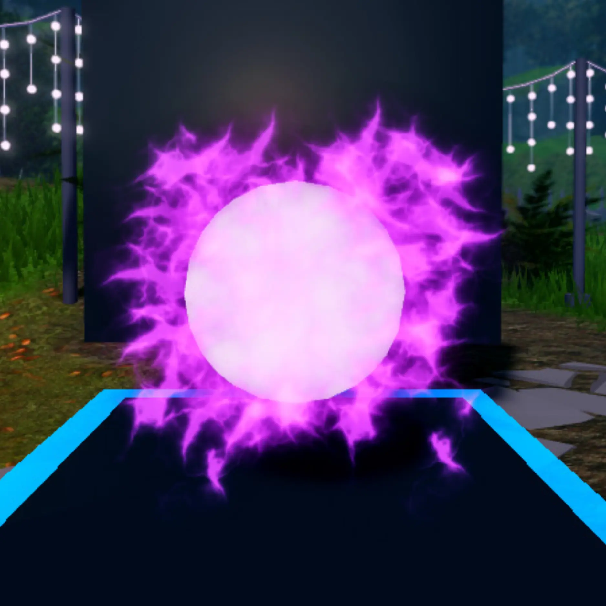
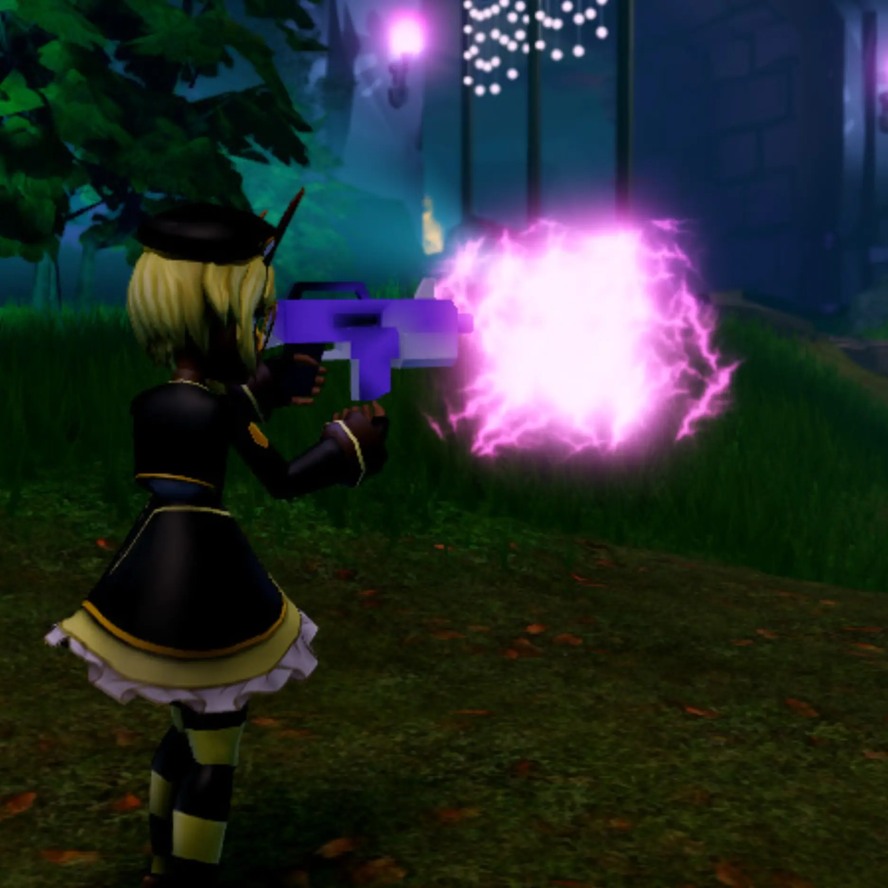

# Welcome to Build It, Play It!

## 목차
- [Welcome to Build It, Play It!](#welcome-to-build-it-play-it)
  - [목차](#목차)
  - [시리즈 개요](#시리즈-개요)
  - [출처](#출처)
  - [다음](#다음)

---
Roblox Studio에서 **Mansion of Wonder** 템플릿의 요소를 커스터마이즈하여 나만의 Roblox 경험을 만들어 보세요! 여러분과 친구들이 스산한 카니발 경험을 하면서 악랄한 슬라임과 무시무시한 유령을 물리칠 수 있는 마법 폭발을 디자인하고 개인화하세요.

번개로 이 생물들을 정복할 건가요, 아니면 화난 고양이 무리로 할 건가요? 여러분이 직접 결정하세요: 여러분이 만들고, 직접 플레이하세요!

<video controls src="../img/01_02_Welcome_to_Build_It_Play_It/trailer.mp4" width="100%"></video>

## 시리즈 개요

나만의 **마법 폭발**을 디자인하려면, 다음의 세 단계별 튜토리얼을 따라오세요.

<GridContainer numColumns="3">
  <figure>
    
    <figcaption>1: 폭발 디자인하기</figcaption>
  </figure>
  <figure>
    
    <figcaption>2: 독특하게 만들기</figcaption>
  </figure>
  <figure>
    
    <figcaption>3: 최종 수정</figcaption>
  </figure>
</GridContainer>

준비되셨다면, **다음**을 클릭하여 시작하세요.

---
## 출처
[Welcome to Build It, Play It!](https://create.roblox.com/docs/ko-kr/education/build-it-play-it-mansion-of-wonder/beginner-landing-page)

---
## [다음](./01_03_Become_an_Artist.md)
