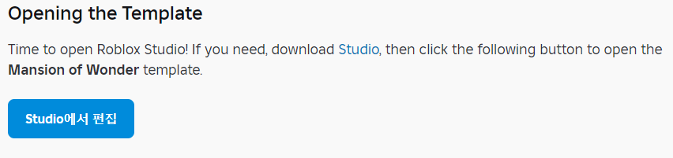

# Become an Artist

## 목차
- [Become an Artist](#become-an-artist)
  - [목차](#목차)
  - [템플릿 개요](#템플릿-개요)
  - [템플릿 열기](#템플릿-열기)
  - [불필요한 창 닫기](#불필요한-창-닫기)
  - [출처](#출처)
  - [다음](#다음)

---

**Mansion of Wonder** 카니발 놀이기구에서 플레이어는 놀이기구에 올라타 적들로부터 자신의 카트를 방어합니다. 싸움에서 도움을 주기 위해, 모두가 마법 블래스터를 사용합니다. 여러분은 **FX 아티스트**가 되어, 블래스터가 사용하는 마법 폭발과 폭발 같은 특수 효과를 디자인하게 됩니다.

<video controls src="../img/01_03_Become_an_Artist/game-example.mp4" width="100%"></video>

## 템플릿 개요

개발 여정을 시작하기 위해 시작 세계와 코드가 포함된 템플릿이 만들어졌습니다. 기본 레슨을 완료하면 원하는 만큼 경험을 커스터마이즈할 수 있습니다.

## 템플릿 열기

Roblox Studio를 열 시간입니다! 필요하다면 [Studio](https://www.roblox.com/create)를 다운로드한 다음, [다음](https://create.roblox.com/docs/ko-kr/education/build-it-play-it-mansion-of-wonder/become-an-artist#opening-the-template)으로 이동하여 **Mansion of Wonder** 템플릿을 엽니다.

<!-- <UseStudioButton variant="" buttonTextTranslationKey="Action.EditInStudio" placeId="6936227200" universeId="2653926164" /> -->

## 불필요한 창 닫기

처음 Roblox Studio를 실행하면, 지금은 필요 없는 추가 창이 열릴 수 있습니다. 이 창들을 닫으면 작업할 공간이 더 많이 확보됩니다. 나중에 언제든지 다시 열 수 있습니다.

1. 3D 뷰의 왼쪽에 있는 각 창을 X를 클릭하여 닫습니다. 왼쪽에 닫을 것이 보이지 않으면 다음 단계로 넘어갑니다.
   

2. 오른쪽의 창은 열어 둡니다. Studio는 아래 이미지와 같아야 합니다:
   

   <Alert severity="warning">
   오른쪽에 창이 보이지 않으면, 보기 탭을 클릭하세요. 거기서 탐색기와 속성 버튼을 클릭합니다.
   </Alert>

---
## 출처
[Become an Artist](https://create.roblox.com/docs/ko-kr/education/build-it-play-it-mansion-of-wonder/become-an-artist)

---
## [다음](./01_04_Test_and_Play.md)
