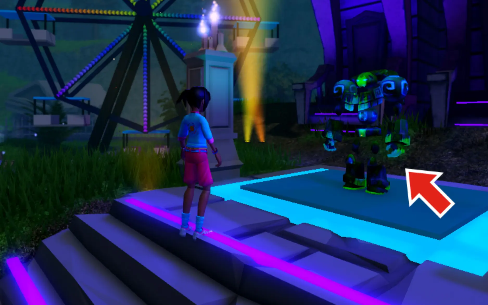
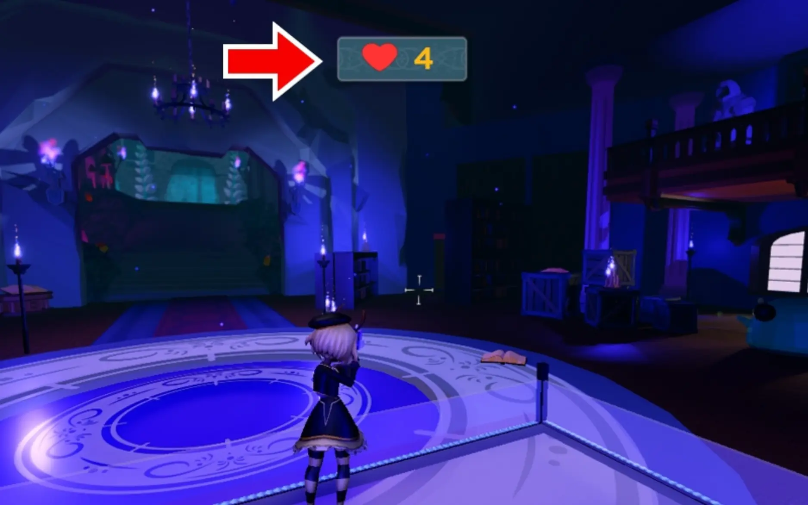
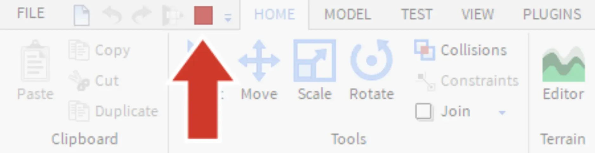

# Test and Play

## 목차
- [Test and Play](#test-and-play)
  - [목차](#목차)
  - [출처](#출처)
  - [다음](#다음)

---
카니발 놀이기구가 어떻게 작동하는지 확인하려면 테스트해보세요. 플레이할 때는 카트에 올라타 다가오는 적들을 물리칩니다. 적이 놀이기구를 만지지 않도록 주의하세요. 적에게 너무 많이 맞으면 카트가 폭발할 것입니다!

1. 테스트하려면 **Play**를 클릭하세요.

   

2. 경험에서 **Play It** 표지판 아래에 있는 캐릭터에게 다가가서 <kbd>E</kbd>를 눌러 메뉴를 엽니다. 그 화면에서 **Join Game**을 클릭하세요.
   

   <Alert severity="warning">
   놀이기구를 타는 동안 마우스로 Studio의 부분을 클릭할 수 없습니다. 마우스를 사용하려면 키보드에서 <kbd>1</kbd>을 누르세요.
   </Alert>

3. 놀이기구가 시작되면, 적에게 블래스터를 쏘기 위해 왼쪽 클릭하세요. 화면 상단의 카트 **체력**을 주시하며 끝의 보물 방에 도달하려고 노력하세요.
   

4. 한 라운드를 완료하거나, 마우스를 사용하려면 <kbd>1</kbd>을 누르세요. 테스트를 중지하려면 **Stop** 버튼을 누르거나 키보드에서 <kbd>Shift</kbd>+<kbd>F5</kbd>를 누르세요.

   

---
## 출처
[Test and Play](https://create.roblox.com/docs/ko-kr/education/build-it-play-it-mansion-of-wonder/test-and-play)

---
## [다음](./01_05_Adding_Particle_Emitters.md)
