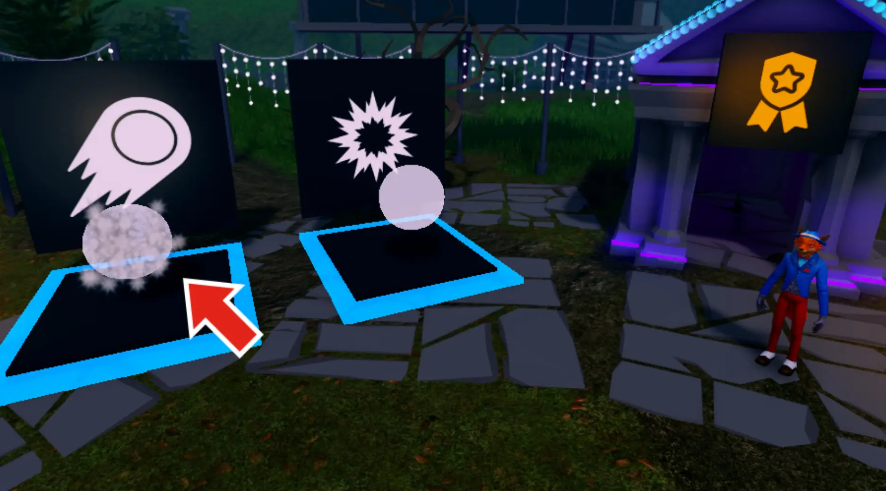
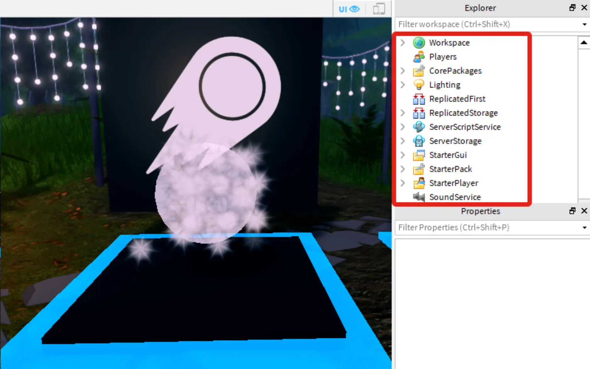
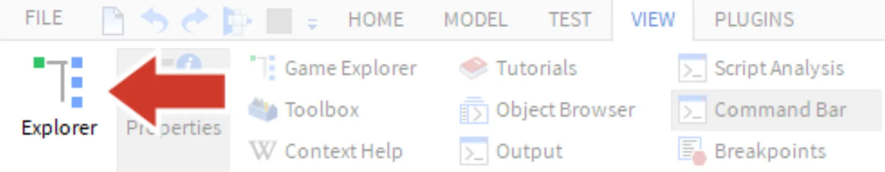
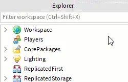
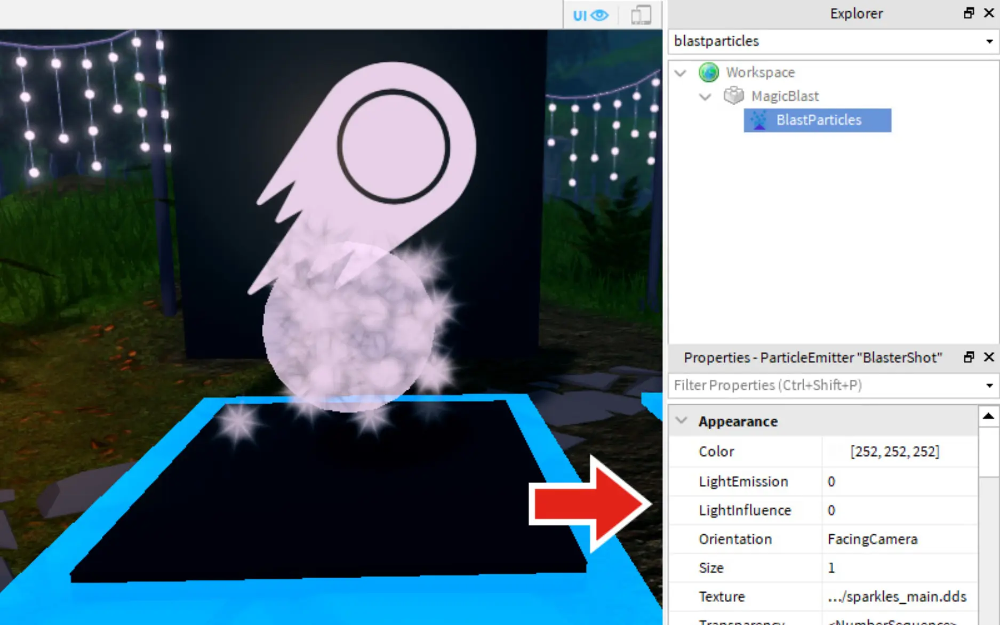
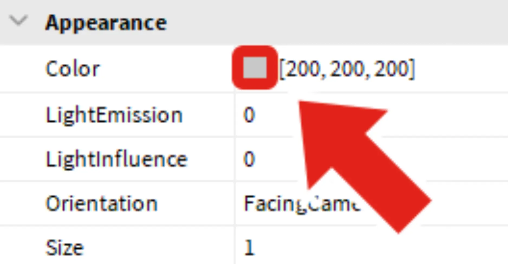
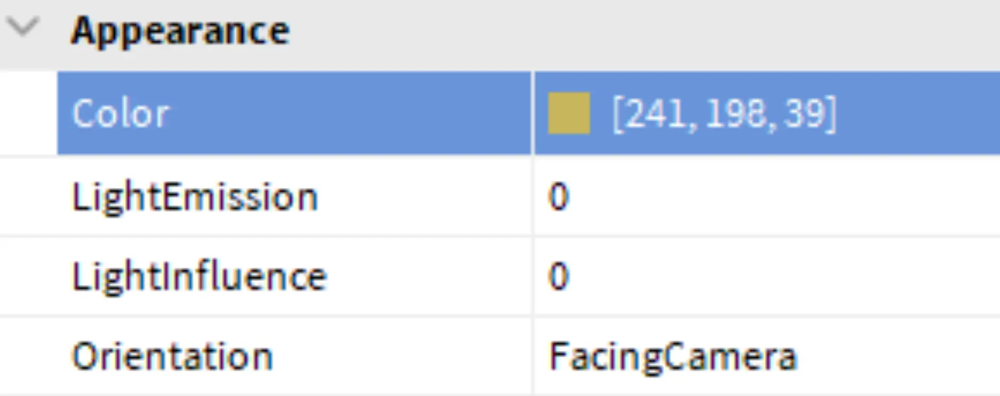
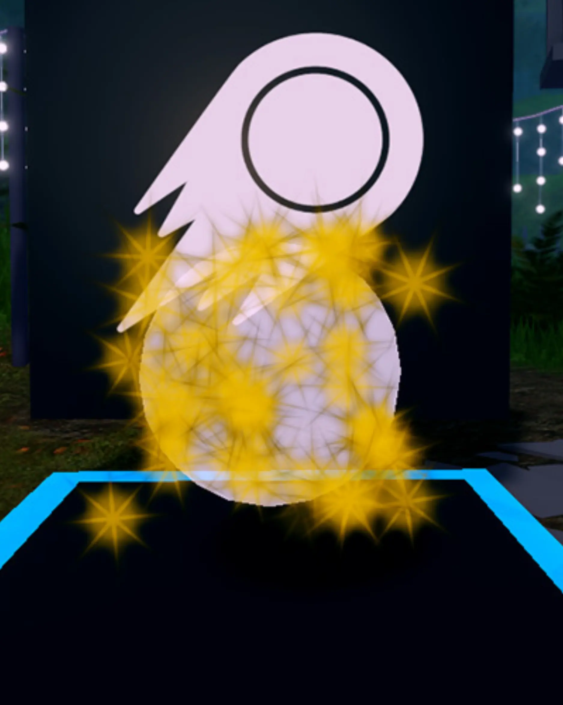

# Adding Particle Emitters

## 목차
- [Adding Particle Emitters](#adding-particle-emitters)
  - [목차](#목차)
  - [폭발 찾기](#폭발-찾기)
  - [색상 변경](#색상-변경)
  - [출처](#출처)
  - [다음](#다음)

---
테스트 중에 마법 폭발이 조금 밋밋하다는 것을 느꼈을 것입니다. 지금 보이는 하얀 불꽃은 시작에 불과합니다. `Class.ParticleEmitter`를 변경하여 훨씬 멋지게 만들 수 있습니다.

이 객체들은 Roblox Studio에서 특수 효과를 만드는 데 사용됩니다. 다른 Roblox 경험에서 연기, 불, 심지어 마법 포털 같은 효과를 본 적이 있다면, `Class.ParticleEmitter|ParticleEmitters`를 본 것입니다.

<video controls src="../img/01_05_Adding_Particle_Emitters/particle-example.mp4" width="100%"></video>

## 폭발 찾기

템플릿에는 사용자 지정 가능한 두 개의 ParticleEmitter가 있습니다. 하나는 공중을 나는 **마법 폭발**용이고, 다른 하나는 적에게 닿았을 때의 **폭발**용입니다. 먼저 폭발부터 시작하고, 이후 튜토리얼에서 폭발을 작업할 것입니다.

1. 카메라 컨트롤을 사용하여 (아래 설명 참조) 흰 불꽃이 있는 공 모양의 마법 폭발을 잘 볼 수 있도록 카메라를 이동합니다.

   

   아래는 Studio에서 카메라를 사용하는 **컨트롤**입니다.

   <table>
    <thead>
    <tr>
      <th>동작</th>
      <th>컨트롤</th>
    </tr>
    </thead>
    <tbody>
    <tr>
      <td><b>이동</b></td>
      <td><kbd>W A S D</kbd> 또는 화살표 키</td>
    </tr>
    <tr>
      <td><b>회전</b></td>
      <td>
      **컴퓨터 마우스:** 오른쪽 마우스 버튼을 누른 상태에서 마우스를 움직여 주변을 둘러봅니다.  
      **노트북 트랙패드:** 두 손가락을 누르고 다른 손가락으로 클릭합니다.
      </td>
    </tr>
    <tr>
      <td><b>줌</b></td>
      <td>
      **컴퓨터 마우스:** 마우스 스크롤 휠을 사용합니다.  
      **노트북 트랙패드:** 두 손가락을 위아래로 움직입니다.
      </td>
    </tr>
   </tbody>
   </table>

2. Roblox Studio의 오른쪽 상단 상자에서 **Explorer** 창을 찾습니다. 여기에는 코드, 장식 및 개인화할 폭발 등 프로젝트의 모든 요소가 포함되어 있습니다.

   

   <Alert severity="info">
   Explorer를 닫았거나 보이지 않으면, **View** 탭으로 가서 **Explorer**를 클릭하여 활성화하세요.

   
   </Alert>

3. Explorer에서 마법 폭발의 입자를 찾아 작업해야 합니다. Explorer **검색창**에 **BlastParticles**를 입력한 다음, 검색된 객체를 선택합니다.

   

## 색상 변경

마법 폭발에 새로운 색상을 부여하여 개인화하기 시작하세요.

1. ParticleEmitter의 변경은 **Properties** 창에서 이루어집니다. 이 창은 Studio의 오른쪽 하단, Explorer 창 아래에 있습니다.

   

   <Alert severity="info">
   Properties 창이 보이지 않으면, **View** 탭을 클릭한 후 **Properties** 버튼을 클릭하세요.
   </Alert>

2. Properties에서 Color 속성을 찾아 오른쪽의 연한 회색 상자를 더블 클릭합니다.

   

3. 팝업 창에서 색상을 선택한 다음 **OK**를 클릭합니다.

   

   그러면 아래 예시와 같은 입자가 만들어질 것입니다.

   

---
## 출처
[Adding Particle Emitters](https://create.roblox.com/docs/ko-kr/education/build-it-play-it-mansion-of-wonder/particle-emitters)

---
## [다음](./01_06_Save_by_Publishing.md)
