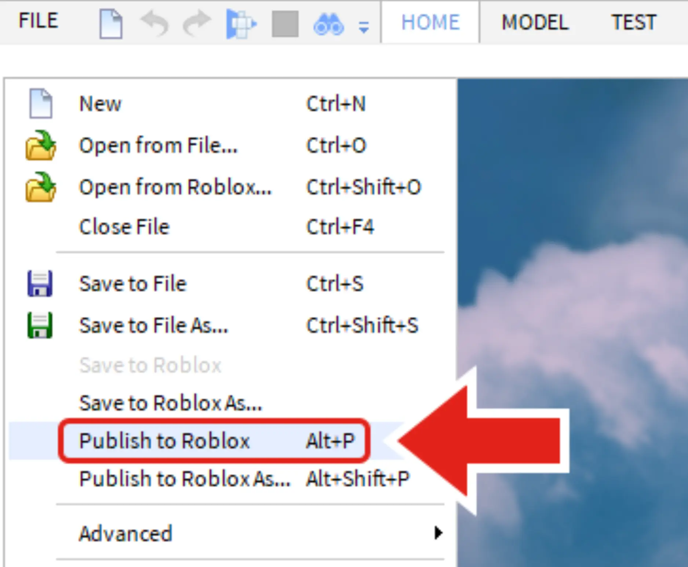
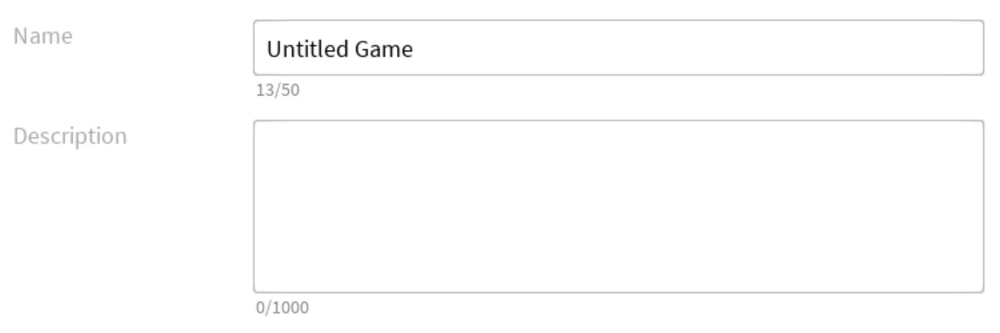
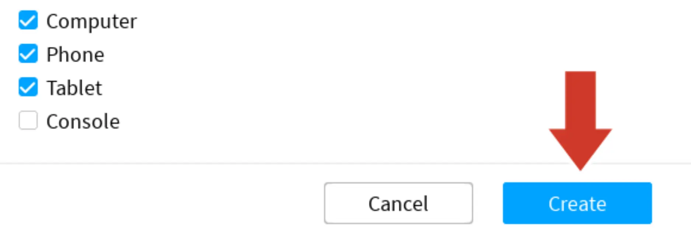

# Save by Publishing

## 목차
- [Save by Publishing](#save-by-publishing)
  - [목차](#목차)
  - [출처](#출처)
  - [다음](#다음)

---
다음 섹션으로 이동하기 전에 잠시 시간을 내어 프로젝트를 저장하세요. 프로젝트 전체를 Roblox에 게시하여 저장하는 것이 중요합니다. **게시**는 프로젝트를 Roblox 계정에 저장하는 것일 뿐, 아직 공개되지 않습니다. 작업하는 동안 또는 큰 변경을 한 후에는 10분마다 게시하는 것이 좋습니다.

1. **File**(Studio의 왼쪽 상단)을 선택하고 **Publish to Roblox**를 클릭하여 게시 창을 엽니다.

   

   <Alert severity="info">
   게시 버튼이 회색으로 비활성화되어 있다면, 플레이 테스트를 **중지**했는지 확인하세요.
   </Alert>

2. 경험의 **이름**과 선택 사항인 **설명**을 입력합니다.

   

3. 프로젝트의 이름과 설명에 만족하면 (언제든지 다시 변경할 수 있습니다), **Create** 버튼을 클릭합니다. 게시된 프로젝트는 계정에 연결된 모든 컴퓨터에서 편집할 수 있습니다.

   

   <Alert severity="info">
   다음 번에 작업을 저장하려면, **File → Publish to Roblox**로 이동하거나 단축키 (<kbd>Alt</kbd>+<kbd>P</kbd>)를 사용하세요.
   </Alert>

---
## 출처
[Save by Publishing](https://create.roblox.com/docs/ko-kr/education/build-it-play-it-mansion-of-wonder/save-by-publishing)

---
## [다음](./01_07_Challenge_Checkpoint.md)