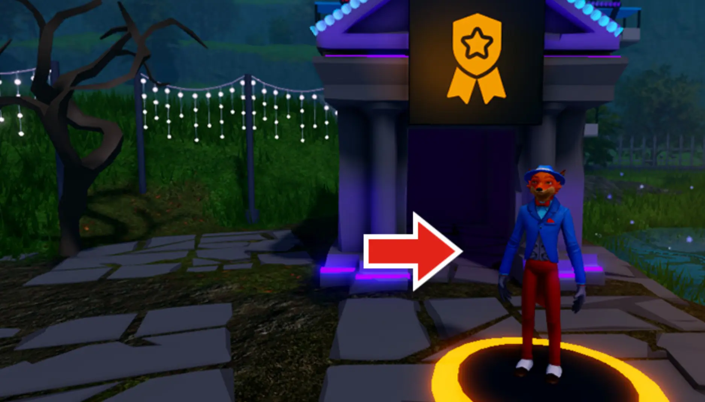

# Challenge Checkpoint

## 목차
- [Challenge Checkpoint](#challenge-checkpoint)
  - [목차](#목차)
  - [출처](#출처)
  - [다음](#다음)

---

애니메이션 준비가 완료되었습니다! **아티스트 백팩**과 **색채의 마법사** 배지를 받아 새로운 기술을 축하하세요.

1. 아래 **코드**를 **복사**하여 시작하세요.

   `FXArtist`

2. 아래의 **Enter World**를 클릭하여 Roblox 게임을 엽니다. 게임에서 인게임 캐릭터인 프레디와 상호작용하고 **REDEEM CODE**를 클릭하세요. 이 페이지의 코드를 사용하여 아이템을 받으세요.

   
   <a href="https://www.roblox.com/games/6901029464/">
   <Button variant="contained">Enter World</Button>
   </a>

---
## 출처
[Challenge Checkpoint](https://create.roblox.com/docs/ko-kr/education/build-it-play-it-mansion-of-wonder/challenge-checkpoint)

---
## [다음](./01_08_Using_Textures.md)
