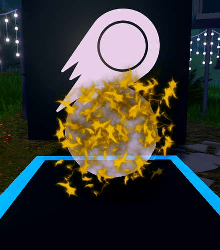

# Using Textures

## 목차
- [Using Textures](#using-textures)
  - [목차](#목차)
  - [폭발 텍스처 변경하기](#폭발-텍스처-변경하기)
  - 
  - [출처](#출처)
  - [다음](#다음)

---
ParticleEmitter가 생성하는 모든 것, 흰 불꽃이든 불이든 사실은 그림입니다. Roblox Studio에서 이러한 그림들을 **텍스처**라고 하며, 심볼이나 여러분이 그린 2D 시각 요소가 될 수 있습니다.

예를 들어, 아래 비디오에서 단일 텍스처가 변경되고 반복되어 효과를 만드는 방법을 확인하세요.

<video controls src="../img/01_08_Using_Textures/particle-texture-example.mp4" width="100%"></video>

## 폭발 텍스처 변경하기

1. 텍스처 시작 팩이 제공되었습니다. 사용할 텍스처를 선택하고 아래 이미지 아래의 **번호**를 **복사**하세요.

   <Alert severity="info">
   이 텍스처는 폭발과 폭발에 모두 사용됩니다. 이동하기 전에 다른 텍스처를 사용할지 동일한 텍스처를 사용할지 생각해보세요.
   </Alert>

   <GridContainer numColumns="3">
     <figure>
       
       <figcaption>5860841663</figcaption>
     </figure>
     <figure>
       
       <figcaption>5857851812</figcaption>
     </figure>
     <figure>
       
       <figcaption>5857851618</figcaption>
     </figure>
     <figure>
       
       <figcaption>6711256324</figcaption>
     </figure>
     <figure>
       
       <figcaption>5833235272</figcaption>
     </figure>
     <figure>
       
       <figcaption>6772783963</figcaption>
     </figure>
     <figure>
       
       <figcaption>5833323391</figcaption>
     </figure>
     <figure>
       
       <figcaption>5857892330</figcaption>
     </figure>
     <figure>
       
       <figcaption>5857892405</figcaption>
     </figure>
     <figure>
       
       <figcaption>5857931724</figcaption>
     </figure>
     <figure>
       
       <figcaption>5857851618</figcaption>
     </figure>
     <figure>
       
       <figcaption>5860841737</figcaption>
     </figure>
   </GridContainer>

2. 방출기가 선택된 상태에서 Properties 창에서 **Texture** 속성을 찾습니다.

   

   <Alert severity="warning">

   위 사진에 보이는 속성이 보이지 않으면 방출기를 다시 선택해야 할 수도 있습니다. 이렇게 하려면, Explorer 검색창에 BlastParticles를 입력한 다음 BlastParticles 방출기를 선택하세요.

   </Alert>

3. **Texture** 행을 클릭하여 텍스트를 강조 표시합니다. <kbd>Ctrl</kbd>+<kbd>V</kbd> (<kbd>⌘</kbd>+<kbd>V</kbd>)를 눌러 이전에 복사한 ID를 붙여넣고 Enter를 누릅니다. 그러면 텍스처가 변경됩니다.

   

   그런 다음 아래 예시와 같은 입자를 보게 될 것입니다.

   
---
## 출처
[Using Textures](https://create.roblox.com/docs/ko-kr/education/build-it-play-it-mansion-of-wonder/using-textures)

---
## [다음](./01_09)
