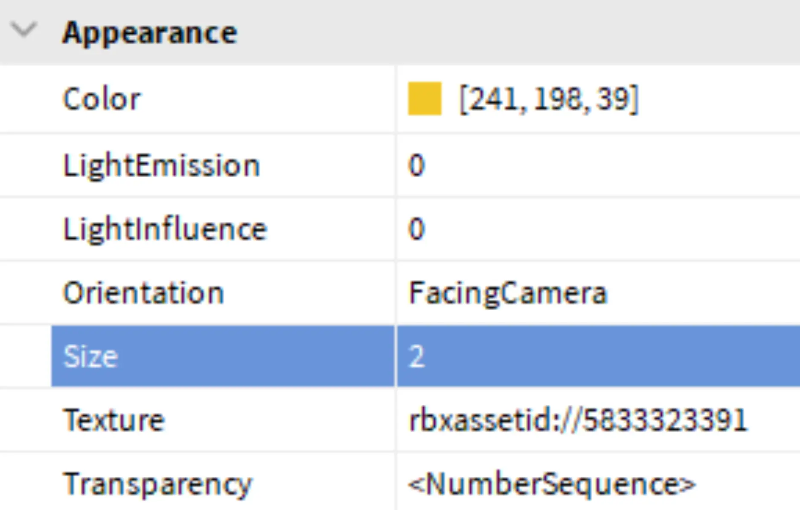

# Finish the Blast

## 목차
- [Finish the Blast](#finish-the-blast)
  - [목차](#목차)
  - [크기 변경](#크기-변경)
  - [움직임 스타일 변경](#움직임-스타일-변경)
    - [꼬리형 폭발 만들기](#꼬리형-폭발-만들기)
    - [단일 폭발 만들기](#단일-폭발-만들기)
  - [출처](#출처)
  - [다음](#다음)

---
폭발의 크기와 움직임을 편집하여 최종 변경을 완료하세요.

## 크기 변경

1. **Size**를 찾아 해당 행을 클릭하세요. 1에서 10 사이의 숫자를 입력한 다음 **Enter**를 누릅니다.

   

   아래 예시와 같은 텍스처가 있을 수 있습니다.

   

2. **Play**를 눌러 프로젝트를 테스트합니다. 필요에 따라 색상과 크기를 조정하여 비전에 맞게 만드세요. 완료되면 **Stop** 버튼을 클릭하거나 <kbd>Shift</kbd> + <kbd>F5</kbd>를 눌러 테스트를 마칩니다.

   <video controls src="../img/01_09_Finish_the_Blast/show-shot-color.mp4"></video>

## 움직임 스타일 변경

입자는 **LockedToPart** 속성을 토글하여 **꼬리형 폭발** 또는 **단일 폭발**로 만들 수 있습니다. 아래 비디오는 꼬리형 폭발과 단일 폭발의 모습을 보여줍니다. 더 마음에 드는 것을 선택한 후 계속 진행하세요.

<video controls src="../img/01_09_Finish_the_Blast/locked-to-part.mp4" width="100%"></video>

### 꼬리형 폭발 만들기

1. [다음 섹션으로 이동](./01_10_Making_an_Explosion.md)합니다. 꼬리형 폭발을 유지하려면 아무 것도 하지 마세요.

### 단일 폭발 만들기

1. 입자 속성에서 **LockToPart**를 찾기 위해 스크롤을 내립니다. 체크박스를 클릭하여 켭니다.
   

2. 프로젝트를 **Play**하여 단일 부품으로 이동하는지 확인합니다.
---
## 출처
[Finish the Blast](https://create.roblox.com/docs/ko-kr/education/build-it-play-it-mansion-of-wonder/finish-the-blast)

---
## [다음](./01_10_Making_an_Explosion.md)
