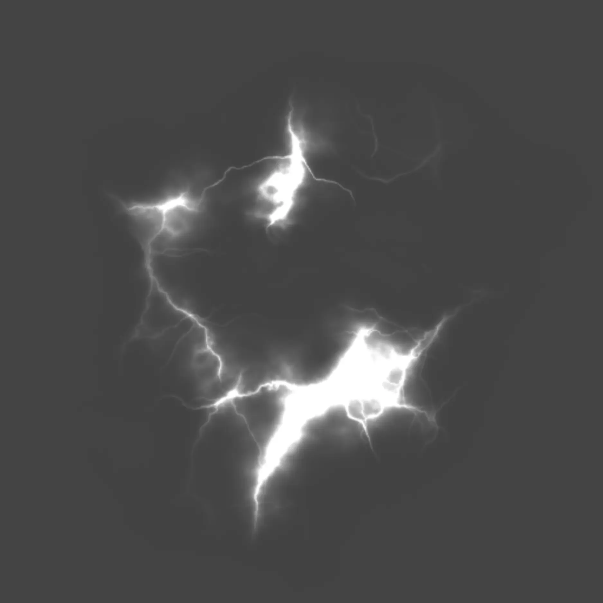

# Making an Explosion

## 목차
- [Making an Explosion](#making-an-explosion)
  - [목차](#목차)
  - [외형 변경](#외형-변경)
  - [출처](#출처)
  - [다음](#다음)

---
이제 폭발을 만들어 봅시다! 마법 폭발을 만들 때 배운 기술을 사용하여 색상과 크기 등을 변경할 수 있습니다.

<video controls src="../img/01_10_Making_an_Explosion/final-shot-example.mp4"></video>

## 외형 변경

먼저 폭발의 기본 속성, 예를 들어 색상과 텍스처를 변경해 보세요.

1. Explorer 검색창에서 이전 검색을 지우세요 (있다면). 그런 다음 **ExplosionParticles**를 입력하고 검색된 객체를 클릭합니다.

   

2. Properties 창에서 폭발의 **색상**을 변경합니다. 폭발과 잘 어울리는 색상을 생각해 보세요. 비슷한 색상이나 대조적인 색상도 좋습니다.

   

   <Alert severity="warning">
   경험을 테스트해야 폭발의 모습을 확인할 수 있다는 점을 유념하세요.
   </Alert>

3. 아래 옵션 중에서 폭발에 사용할 텍스처를 찾아 해당 **번호**를 **복사**합니다. 폭발 텍스처는 마법 폭발과 동일하거나 다를 수 있습니다.

   <GridContainer numColumns="3">
     <figure>
       
       <figcaption>5860841663</figcaption>
     </figure>
     <figure>
       
       <figcaption>5857851812</figcaption>
     </figure>
     <figure>
       
       <figcaption>5857851618</figcaption>
     </figure>
     <figure>
       
       <figcaption>6711256324</figcaption>
     </figure>
     <figure>
       
       <figcaption>5833235272</figcaption>
     </figure>
     <figure>
       
       <figcaption>6772783963</figcaption>
     </figure>
     <figure>
       
       <figcaption>5833323391</figcaption>
     </figure>
     <figure>
       
       <figcaption>5857892330</figcaption>
     </figure>
     <figure>
       
       <figcaption>5857892405</figcaption>
     </figure>
     <figure>
       
       <figcaption>5857931724</figcaption>
     </figure>
     <figure>
       
       <figcaption>5857851618</figcaption>
     </figure>
     <figure>
       
       <figcaption>5860841737</figcaption>
     </figure>
   </GridContainer>

4. **Texture**를 찾아 이전 단계에서 복사한 번호 ID를 붙여넣습니다. 예시 사진에서는 별 텍스처를 사용하고 있습니다.

   

5. 새로운 색상의 텍스처를 보려면 **Play**를 눌러 확인합니다. 그런 다음 Play It 섹션으로 이동하여 새로운 게임을 시작합니다.

   <video controls src="../img/01_10_Making_an_Explosion/explosion-color-texture.mp4"></video>

   지금은 폭발이 조금 작게 보이거나 다른 조정이 필요할 수 있습니다. 계속해서 폭발의 외형을 미세 조정하세요.

---
## 출처
[Making an Explosion](https://create.roblox.com/docs/ko-kr/education/build-it-play-it-mansion-of-wonder/making-an-explosion)

---
## [다음](./01_11_Challenge_Checkpoint.md)
