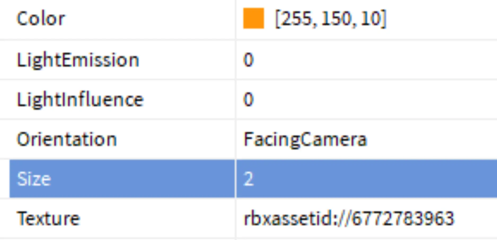
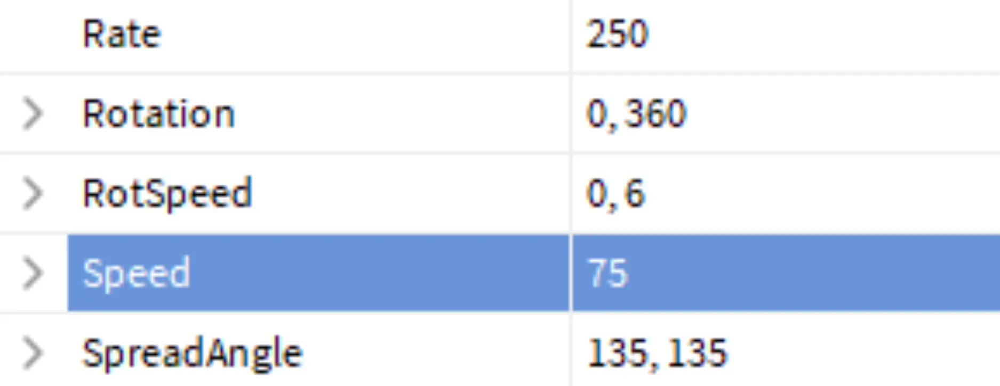
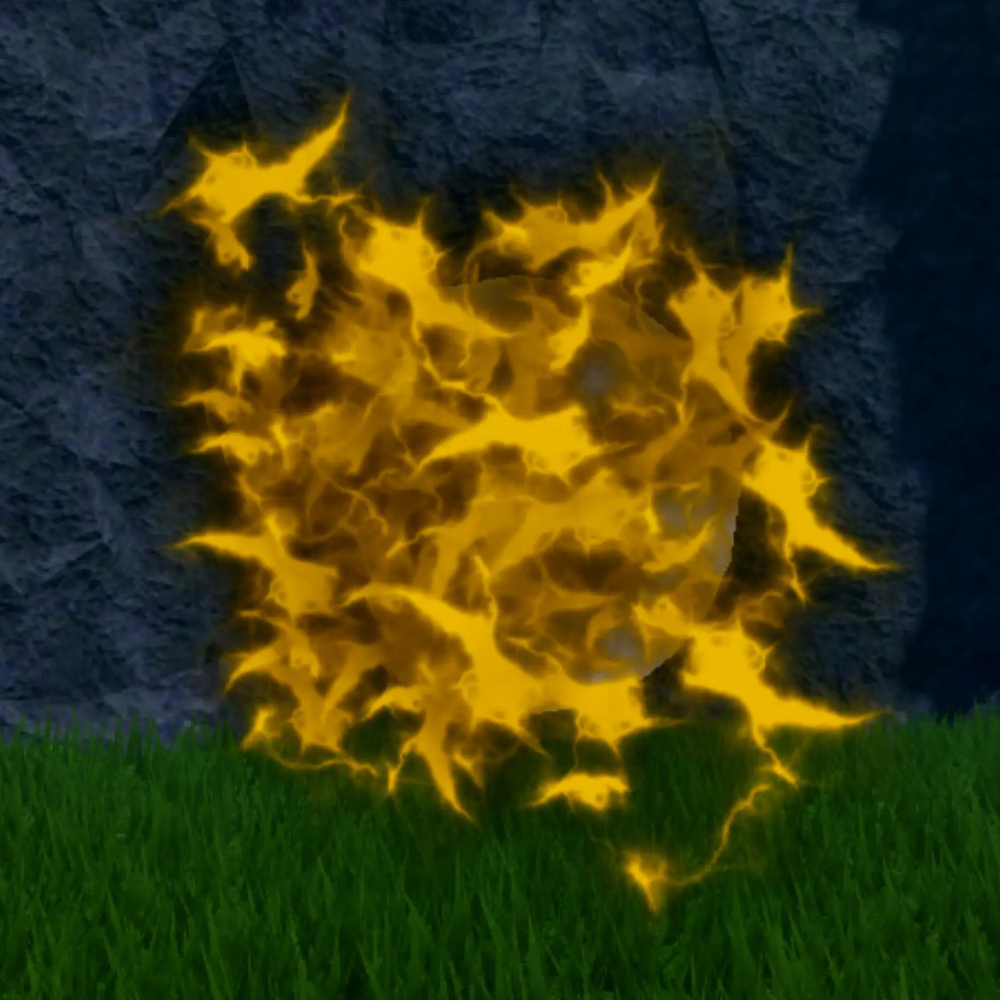
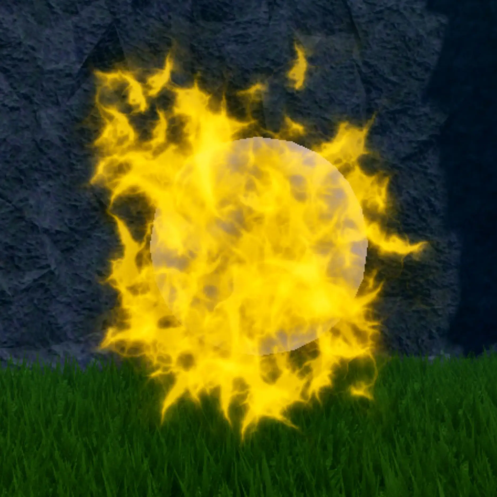
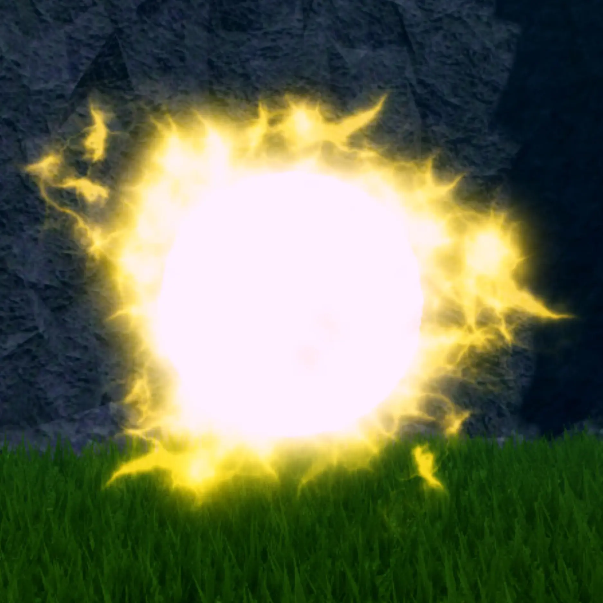
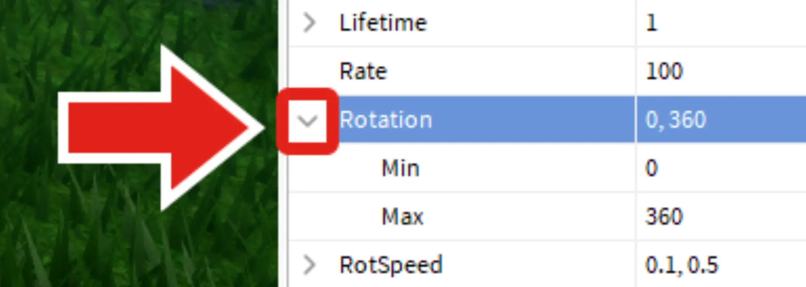

# Make Final Touches

## 목차
- [Make Final Touches](#make-final-touches)
  - [목차](#목차)
  - [크기와 속도](#크기와-속도)
  - [추가 속성](#추가-속성)
    - [LightEmission](#lightemission)
    - [RotSpeed](#rotspeed)
    - [Lifetime](#lifetime)
    - [Randomized Numbers](#randomized-numbers)
  - 
  - [출처](#출처)
  - [다음](#다음)

---
폭발을 더 독특하게 느끼게 하려면 여러 속성을 사용자 정의하세요.

## 크기와 속도

이 두 가지 속성을 변경하여 원하는 비전을 실현하세요.

1. 폭발 속성에서 **Size**를 `1`에서 `10` 사이의 숫자로 변경하세요. 서로 다른 입자 텍스처는 서로 다른 크기에서 더 잘 작동할 수 있습니다.

   

   아래 비디오에서 몇 가지 예제 크기를 볼 수 있습니다.

   <video controls src="../img/01_12_Make_Final_Touches/size-comparison.mp4"></video>

2. 입자가 빠르게 터지거나 천천히 퍼질 수 있습니다. 이 속도를 실험하려면 **Emission** 섹션으로 스크롤하고 **Speed**를 찾으세요. `10` (느림)에서 `100` (빠름) 사이의 숫자를 시도해 보세요.

   

3. 완료되면 프로젝트를 실행하여 입자를 테스트합니다. 디자인이 마음에 들 때까지 변경하세요.

   <video controls src="../img/01_12_Make_Final_Touches/explosion-final.mp4"></video>

## 추가 속성

마법 폭발과 블래스터에서 폭발의 기본 속성을 실험해 보았지만, 작업을 개인화할 수 있는 몇 가지 추가 속성이 있습니다. 아래 속성을 변경하거나 목록에 없는 속성을 실험해 보세요.

### LightEmission

입자를 빛나게 하며 `0` (불투명)에서 `1` (빛남)까지 범위가 될 수 있습니다.

<GridContainer numColumns="3">
  <figure>
    
    <figcaption>0</figcaption>
  </figure>
  <figure>
    
    <figcaption>0.5</figcaption>
  </figure>
  <figure>
    
    <figcaption>1.0</figcaption>
  </figure>
</GridContainer>

### RotSpeed

입자가 시간이 지남에 따라 회전하게 합니다. 아래 텍스처(직선)의 회전 속도가 어떻게 변하는지 주목하세요.

<video controls src="../img/01_12_Make_Final_Touches/rotation-speed.mp4"></video>

### Lifetime

이 속성은 입자가 존재하는 시간을 초 단위로 나타냅니다. 폭발에 따라 짧은 수명(예: 0.5초)으로 빠르고 경쾌한 폭발을 원하거나, 긴 수명(예: 2초)으로 오래 지속되는 폭발을 원할 수 있습니다.

<video controls src="../img/01_12_Make_Final_Touches/lifetime.mp4"></video>

### Randomized Numbers

속성을 무작위로 설정하면 입자가 덜 반복적으로 느껴질 수 있습니다. **Lifetime** 및 **Rotation**과 같은 일부 입자 속성에 최소값과 최대값을 입력하여 무작위화를 추가할 수 있습니다.

1. 무작위 속성을 사용하려면 속성 이름 옆의 작은 화살표를 클릭하세요. 속성이 확장되면 최소값과 최대값을 입력할 수 있습니다.

   

   <Alert severity="info">
   폭발에 대한 새로운 지식을 사용하여 **폭발 입자**도 개선하세요. Lifetime과 같은 속성을 실험해 보세요. 폭발 방출기는 Explorer에서 BlastParticles를 검색하여 찾을 수 있음을 기억하세요.
   </Alert>
---
## 출처
[Make Final Touches](https://create.roblox.com/docs/ko-kr/education/build-it-play-it-mansion-of-wonder/make-final-touches)

---
## [다음](./01_13_Invite_Friends.md)
