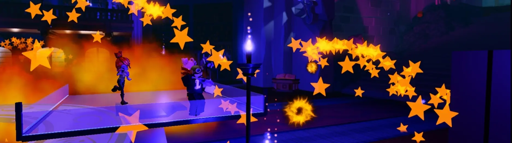
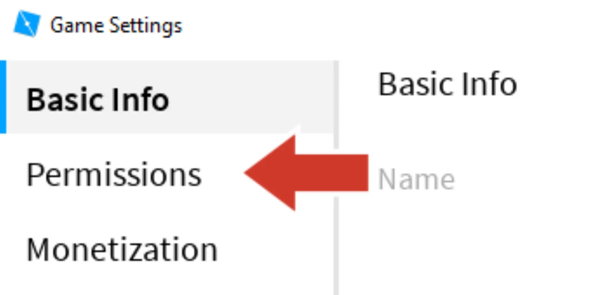
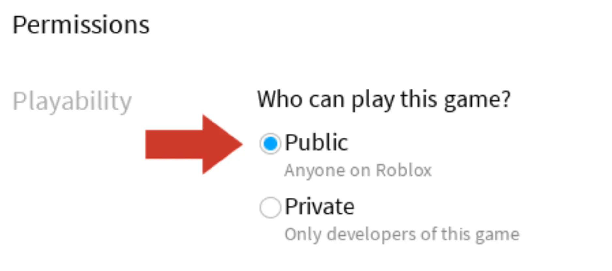

# Invite Friends

## 목차
- [Invite Friends](#invite-friends)
  - [목차](#목차)
  - [출처](#출처)
  - [다음](#다음)

---

모험은 친구들과 함께할 때 더 즐겁습니다. 다른 사람들이 플레이할 수 있도록 경험을 설정해 봅시다. 경험이 처음 게시되면 자동으로 비공개로 설정됩니다. 이를 공개로 설정하여 다른 사람들이 참여할 수 있도록 하세요.

1. **경험을 게시**하여 친구들이 최신 변경 사항을 받을 수 있도록 합니다. 왼쪽 상단의 파일 메뉴로 가서 게시할 수 있다는 것을 기억하세요.

2. **Home** 탭에서 **Game Settings**를 클릭합니다.

   

3. 왼쪽 바에서 **Permissions**를 선택합니다.

   

4. **Public**을 선택합니다.

   

5. **Save**를 클릭합니다.

---
## 출처
[Invite Friends](https://create.roblox.com/docs/ko-kr/education/build-it-play-it-mansion-of-wonder/invite-friends)

---
## [다음](./01_14_Challenge_Checkpoint.md)
