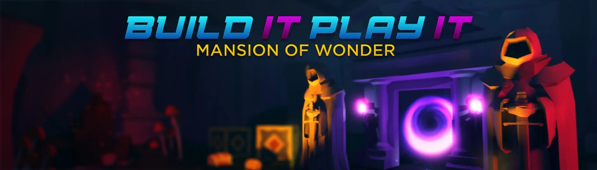

# Mansion of Wonder

## 목차
- [Mansion of Wonder](#mansion-of-wonder)
  - [목차](#목차)
  - [출처](#출처)
  - [다음](#다음)

---

Roblox Studio를 사용하여 아케이드 게임의 마법 폭발 효과부터 새로운 플레이어가 세계를 탐험하는 데 도움을 주는 화살 표시에 이르기까지 특별한 효과를 만드는 법을 배우게 됩니다. 이 두 가지 튜토리얼은 단계별로 진행되며, 학습하고 독점 상품을 획득할 수 있습니다.

---
## 출처
[Mansion of Wonder](https://create.roblox.com/docs/ko-kr/education/build-it-play-it-mansion-of-wonder/landing-page)

---
## [다음](./02_02_A_Players_First_Experience.md)
