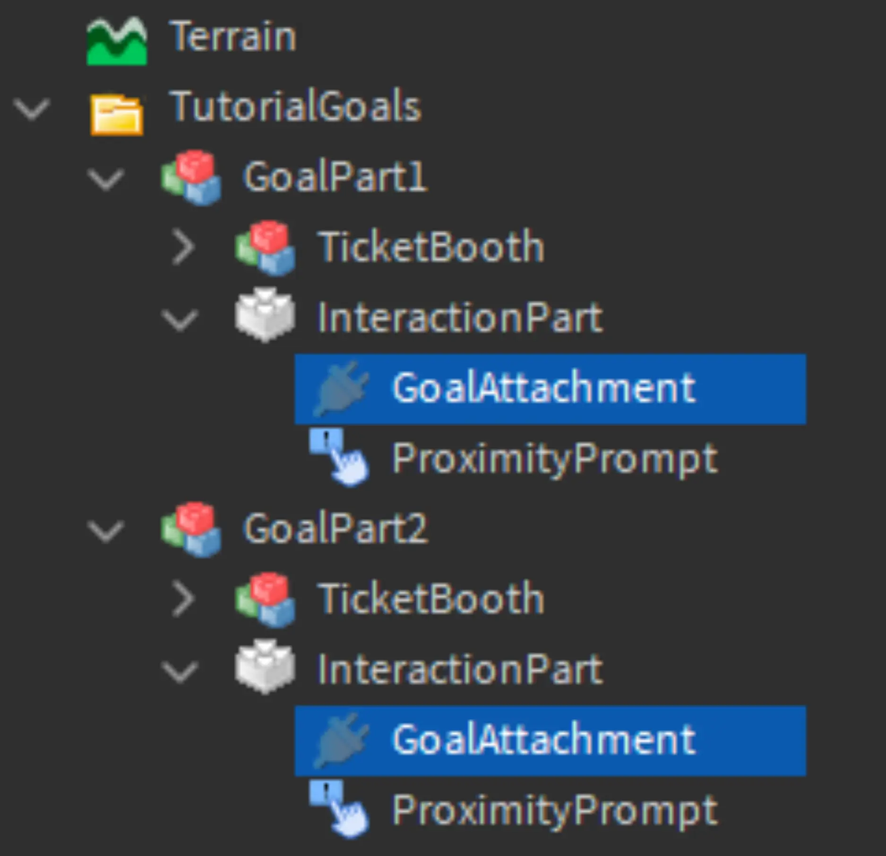

# Creating Engaging Experiences

## 목차
- [Creating Engaging Experiences](#creating-engaging-experiences)
  - [목차](#목차)
  - [프로젝트 설정](#프로젝트-설정)
    - [템플릿 가져오기](#템플릿-가져오기)
    - [자신의 프로젝트 사용하기](#자신의-프로젝트-사용하기)
  - [템플릿](#템플릿)
  - [빔과 애착](#빔과-애착)
  - [출처](#출처)
  - [다음](#다음)

---
시작하기 전에 새로운 게임이나 스마트폰 앱을 처음 열었던 경험을 떠올려보세요. 혼란스러운 앱을 사용하려다 포기하고 닫은 적이 있나요? 또는 게임에서 처음부터 너무 많은 정보를 주어 기억하기 어려웠던 적이 있나요?

좋은 경험을 만들기 위해서는 창작자가 새로운 사용자에게 정보를 제공하면서도 동시에 흥미를 끌어야 합니다. 이를 연구하는 직업도 있습니다. **사용자 경험(UX)** 디자이너는 사용자가 좌절하지 않고 어디로 가야 하는지, 목표를 어떻게 달성할 수 있는지 파악할 수 있도록 시간을 들여 작업하는 사람들입니다.

예를 들어, 아래 두 사진은 사용자 경험이 게임의 첫인상에 미치는 영향을 비교합니다.

<GridContainer numColumns="2">
  <figure>
    
    <figcaption>접근 가능한 UX</figcaption>
  </figure>
  <figure>
    
    <figcaption>압도적인 UX</figcaption>
  </figure>
</GridContainer>

## 프로젝트 설정

이 강좌에서는 스타터 템플릿을 사용하여 가이드형 튜토리얼을 설계하는 과정을 안내합니다. 또는 자체 프로젝트를 사용할 수 있으며, 완료된 튜토리얼 시스템은 모든 경험에 적용할 수 있습니다.

이 시리즈의 시작 장소에는 플레이어가 상품을 위해 티켓을 수집하는 놀이공원 테마의 게임 일부가 포함되어 있습니다. 새로운 플레이어는 티켓을 수집하기 위해 부스로 안내됩니다.

### 템플릿 가져오기

1. [Build It Play It - Boardwalk](https://www.roblox.com/games/6763393969) 시작 장소를 엽니다. 새 웹 페이지에서 **...** 버튼을 클릭하고 **Edit**을 선택합니다. 메시지가 표시되면 브라우저에서 Roblox를 열도록 허용합니다.

   

2. Studio의 새 인스턴스가 맵과 함께 열립니다. 첫 번째로 보이는 것은 플레이어를 시뮬레이션하는 TestPlayer 객체입니다.

   

### 자신의 프로젝트 사용하기

자신의 프로젝트를 사용하는 경우, 플레이어가 경험하는 동안 수행할 주요 작업을 사용하세요. 예를 들어 농업 게임에서는 플레이어가 밀을 수집하여 상점 부스에서 판매하도록 합니다.

또한, 다음을 권장합니다:

1. **파일 가져오기** - 인벤토리를 사용하여 [Boardwalk Starter Objects](https://www.roblox.com/library/6777983114/Boardwalk-Starter-Objects)를 프로젝트의 작업 공간으로 가져옵니다. 여기에는 ProximityPrompts가 포함된 티켓 부스와 TestPlayer가 포함되어 있습니다.

2. **코스 따라가기 및 적응하기** - 완료되면 사전 제작된 모델을 자신의 모델로 교체하세요. 스크립트에서 일부 변수 참조를 변경해야 할 수도 있습니다.

## 템플릿

이 장소에는 `ProximityPrompts`가 있는 두 개의 인터랙티브 부스가 포함되어 있습니다. 이는 플레이어가 템플릿에서 무언가와 상호작용할 때 스크립트를 실행하는 객체입니다. 튜토리얼 동안 플레이어는 각 부스와 상호작용하여 티켓을 수집하고 튜토리얼을 진행합니다. 부스와 테스트 플레이어 외의 모든 부분은 잠겨 있습니다.

## 빔과 애착

플레이어를 티켓 부스로 안내하기 위해 아래 비디오와 같이 빔을 사용하여 경로를 만듭니다.

<video controls src="../img/02_03_Creating_Engaging_Experiences/beam-example.mp4" width="100%"></video>

**빔**은 레이저나 포스 필드와 같은 효과에도 사용되는 객체입니다. 이 객체는 속도, 너비, 곡선 크기와 같은 사용자 정의 가능한 속성으로 두 지점 사이에 텍스처를 그립니다.

빔을 표시하려면 **애착**이 필요하며, 빔의 시작점과 끝점을 설정합니다. 하나의 애착을 플레이어에 삽입하고 다른 애착을 목표 객체에 삽입합니다.

1. Explorer에서 **TestPlayer**를 찾아 **PlayerAttachment**라는 이름의 **애착**을 추가합니다.

   

2. **TestPlayer** 아래에 **TutorialBeam**이라는 이름의 **빔**을 추가합니다. 빔은 나중에 시작점과 끝점을 설정하기 전까지는 보이지 않습니다.

   

3. **TutorialGoals** 폴더를 찾아 **확장**합니다. 두 InteractionPart 객체 모두에 **GoalAttachment**라는 이름의 애착을 추가합니다.

   
   
---
## 출처
[Creating Engaging Experiences](https://create.roblox.com/docs/ko-kr/education/build-it-play-it-mansion-of-wonder/creating-engaging-experiences)

---
## [다음](./02_04_Connect_the_Beam.md)
