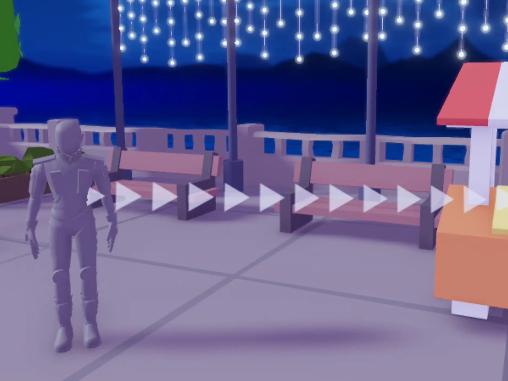

# Connect the Beam

## 목차
- [Connect the Beam](#connect-the-beam)
  - [목차](#목차)
  - [빔 조정](#빔-조정)
  - [튜토리얼 화살표 만들기](#튜토리얼-화살표-만들기)
    - [색상 선택 팁](#색상-선택-팁)
  - [출처](#출처)
  - [다음](#다음)

---
이제 애착을 만들었으니, 이를 빔에 연결하여 텍스처를 표시할 시간입니다.

1. TestPlayer 아래에서 **TutorialBeam**을 선택합니다. Properties에서 **Attachment0**를 찾습니다. 속성 오른쪽의 빈 상자를 클릭합니다. 그런 다음, Explorer에서 TestPlayer를 찾고 **PlayerAttachment**를 클릭합니다.

   <video controls src="../img/02_04_Connect_the_Beam/attachment0-to-player.mp4"></video>

2. TutorialBeam 속성에서 **Attachment1**를 GoalPart1에서 만든 **GoalAttachment**로 설정합니다.

   

## 빔 조정

기본적으로 빔은 항상 카메라를 향하지 않습니다. 이로 인해 플레이어가 다양한 각도에서 빔을 보지 못하는 상황이 발생할 수 있습니다. 이를 해결하려면 **FaceCamera**라는 속성을 켭니다.

<GridContainer numColumns="2">
  <figure>
    
    <figcaption>FaceCamera 끔</figcaption>
  </figure>
  <figure>
    
    <figcaption>FaceCamera 켬</figcaption>
  </figure>
</GridContainer>

1. 빔의 속성으로 이동하여 **FaceCamera**를 활성화하여 모든 위치에서 빔이 보이도록 만듭니다.

   

   완료되면, 카메라 각도에 관계없이 플레이어와 목표 사이에 흰색 빔이 보일 것입니다.

   

## 튜토리얼 화살표 만들기

빔을 따라 표시되는 이미지는 2D 텍스처를 변경하여 사용자 정의할 수 있습니다. 또한, 빔에는 텍스처, 색상, 움직임 등 다양한 시각적 옵션이 있습니다.

1. 예제와 같이 빔을 따라 화살표를 스트리밍하려면 `5886559421`을 복사하여 빔의 **Texture** 속성에 붙여넣습니다.

   <video controls src="../img/02_04_Connect_the_Beam/beam-texture-change.mp4"></video>

   <Alert severity="info">
   사용자 지정 텍스처는 여러분이 가진 이미지일 수 있습니다. [Asset Manager](https://create.roblox.com/docs/ko-kr/projects/assets/manager) 문서에서 업로드하는 방법을 배우세요.
   </Alert>

2. 현재 화살표 텍스처가 늘어나 있습니다. 화살표를 원래 크기로 반복하려면 **TextureMode**를 **Static**으로 설정하세요.

   <GridContainer numColumns="2">
     
     
   </GridContainer>

   <Alert severity="warning">
   화살표가 올바른 방향을 가리키지 않으면 애착이 바뀌었을 수 있습니다. Attachment0이 PlayerAttachment에 연결되고 Attachment1이 GoalAttachment에 연결되었는지 확인하세요. 또는 사용자 지정 텍스처를 사용하는 경우 사진 편집 프로그램에서 이미지를 미러링해야 할 수 있습니다.
   </Alert>

3. **Color**, **LightEmission**, **TextureSpeed**와 같은 빔 속성을 수정하여 눈에 띄고 매력적인 디자인을 만드세요. 아래는 그 중 하나의 예입니다.

   <video controls src="../img/02_04_Connect_the_Beam/finished-beam-example.mp4"></video>

### 색상 선택 팁

**색상**은 첫 사용자 경험을 개선할 수 있는 기회입니다. 예를 들어, 대조되거나 채도가 높은 색상은 더 많은 주목을 받아 플레이어가 화면에서 어디를 봐야 하는지 쉽게 알 수 있습니다.

또한, 디자인할 때 플레이어의 [접근성](https://create.roblox.com/docs/ko-kr/production/publishing/accessibility)을 고려하세요. 일부 플레이어는 특정 색상 조합을 보기 어려워할 수 있으므로, 가장 넓은 관객에게 어필할 수 있도록 색상을 선택하는 것이 중요합니다.

---
## 출처
[Connect the Beam](https://create.roblox.com/docs/ko-kr/education/build-it-play-it-mansion-of-wonder/connect-the-beam)

---
## [다음](./02_05_Using_Particles_for_Actions.md)
