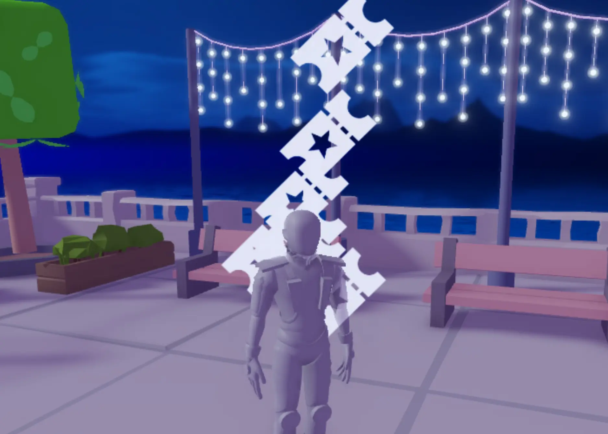

# Using Particles for Actions

## 목차
- [Using Particles for Actions](#using-particles-for-actions)
  - [목차](#목차)
  - [입자 만들기](#입자-만들기)
  - [폭발 효과 만들기](#폭발-효과-만들기)
  - [입자 확산시키기](#입자-확산시키기)
  - [다양한 폭발 속성](#다양한-폭발-속성)
  - [출처](#출처)
  - [다음](#다음)

---
화살표가 완성되면, 처음 플레이하는 플레이어는 목표로 가는 경로를 따라갈 수 있어 초기 도입이 더 명확해지고 길을 잃고 포기할 가능성이 줄어듭니다. 사용자 경험을 더욱 향상시키기 위해 플레이어가 작업을 성공적으로 완료했음을 매력적인 입자 효과로 알려주세요.

아래 예제에서는 플레이어가 부스와 상호작용할 때마다 티켓 모양의 입자가 터지는 축하 효과를 보여줍니다.

<video controls src="../img/02_05_Using_Particles_for_Actions/particle-interaction.mp4" width="100%"></video>

<Alert severity="info">
피드백을 **여러 형태**로 제공하는 것도 플레이어의 사용자 경험을 개선하는 또 다른 방법입니다. 소리를 낮추거나 청각 장애가 있는 플레이어는 시각적 신호에 더 의존할 수 있습니다. 시력이 약한 다른 플레이어는 소리에 더 집중할 수 있습니다.
</Alert>

## 입자 만들기

입자를 만들 때는 이를 파트나 애착에 삽입해야 합니다. 이 예제에서는 이전에 사용한 TestPlayer 객체에 입자를 배치합니다.

1. **TestPlayer**에서 **Burst**라는 이름의 **ParticleEmitter**를 만듭니다. 기본 입자가 TestPlayer 객체에서 방출되기 시작합니다. 방출기를 사용자 정의하여 폭발 효과를 만듭니다.

   

   아래는 예제입니다.

   

   <Alert severity="warning">
   나중에 스크립트가 이름을 찾을 것이므로 입자의 이름을 정확하게 지정해야 합니다.
   </Alert>

2. **Burst** 입자의 속성에서 **Texture**를 찾습니다. 아래 제공된 텍스처 ID 중 하나를 복사하여 텍스처 필드에 붙여넣고 <kbd>Enter</kbd>를 누릅니다.
   <GridContainer numColumns="3">
     <figure>
       
       <figcaption>6772766862</figcaption>
     </figure>
     <figure>
       
       <figcaption>6772766551</figcaption>
     </figure>
     <figure>
       
       <figcaption>5857851618</figcaption>
     </figure>
     <figure>
       
       <figcaption>6803084085</figcaption>
     </figure>
     <figure>
       
       <figcaption>6772783963</figcaption>
     </figure>
     <figure>
       
       <figcaption>6703369286</figcaption>
     </figure>
     <figure>
       
       <figcaption>6749057157</figcaption>
     </figure>
     <figure>
       
       <figcaption>6772766413</figcaption>
     </figure>
   </GridContainer>

   티켓 텍스처를 사용하면 아래와 같이 보일 것입니다.

   

    <Alert severity="info">
    사용자 지정 텍스처는 여러분이 가진 모든 이미지가 될 수 있습니다. [Asset Manager](https://create.roblox.com/docs/ko-kr/projects/assets/manager) 문서에서 업로드하는 방법을 배우세요.
    </Alert>

3. TestPlayer의 속성에서 **Color**와 **Size** 속성을 찾아 경험에 적합하게 변경합니다.

   

   아래는 예제입니다.

   

## 폭발 효과 만들기

입자를 더 빠른 폭발처럼 보이게 하려면 다양한 속성을 변경할 수 있습니다. 입자를 설계한 후 스크립트에 의해 활성화될 때만 재생되도록 방출기를 비활성화합니다.

## 입자 확산시키기

ParticleEmitter는 **SpreadAngle** 속성에 의해 제어되는 두 평면을 따라 입자를 방출합니다.

1. 예제처럼 입자가 모든 방향으로 날아가도록 하려면 **SpreadAngle X**와 **Y**를 **360**으로 설정합니다.
   <video controls src="../img/02_05_Using_Particles_for_Actions/spread-angle.mp4"></video>

## 다양한 폭발 속성

아래 비디오에 권장 값을 추가한 후 입자는 불꽃놀이처럼 빠르게 폭발하는 것처럼 보일 것입니다.

<video controls src="../img/02_05_Using_Particles_for_Actions/before-after-particle-settings.mp4"></video>

1. 폭발 모션을 얻으려면 다음 속성을 이러한 값으로 설정하여 입자가 폭발한 후 빠르게 사라지도록 만듭니다.
   <table>
   <thead>
   <tr>
   <th>속성</th>
   <th>값</th>
   <th>이유</th>
   </tr>
   </thead>
   <tbody>
   <tr>
   <td>**LightEmission**</td>
   <td>0.4</td>
   <td>희미한 빛을 추가합니다. 최대 값은 1입니다.</td>
   </tr>
   <tr>
   <td>**Drag**</td>
   <td>8</td>
   <td>더 많은 드래그는 입자가 빠르게 속도를 잃게 만듭니다.</td>
   </tr>
   <tr>
   <td>**Lifetime**</td>
   <td>0.6, 1</td>
   <td>입자가 0.6초에서 1초 동안 존재하게 합니다.</td>
   </tr>
   <tr>
   <td>**Rate**</td>
   <td>50</td>
   <td>초당 방출되는 입자의 수입니다.</td>
   </tr>
   <tr>
   <td>**Speed**</td>
   <td>40</td>
   <td>입자가 처음 방출될 때의 속도입니다.</td>
   </tr>
   </tbody>
   </table>

   <Alert severity="info">
    무작위 숫자를 추가하여 입자가 덜 반복적으로 느껴지게 만드세요. **Lifetime** 및 **Rotation**과 같은 일부 속성은 최소값과 최대값을 허용하여 무작위화를 추가합니다.
    </Alert>

2. 마지막으로 입자는 스크립트(다음 레슨에서 확인할 수 있음)가 이를 실행할 때만 재생되어야 합니다. **Enabled** 속성을 찾아 **off**로 설정합니다.

   

   <Alert severity="info">
   이 페이지에서는 몇 가지 속성만 다루었습니다. 자세한 내용은 [Particle Emitters](https://create.roblox.com/docs/ko-kr/effects/particle-emitters) 참조 문서를 참조하세요.
   </Alert>

---
## 출처
[Using Particles for Actions](https://create.roblox.com/docs/ko-kr/education/build-it-play-it-mansion-of-wonder/using-particles-for-actions)

---
## [다음](./02_06_Adding_Scripts.md)
