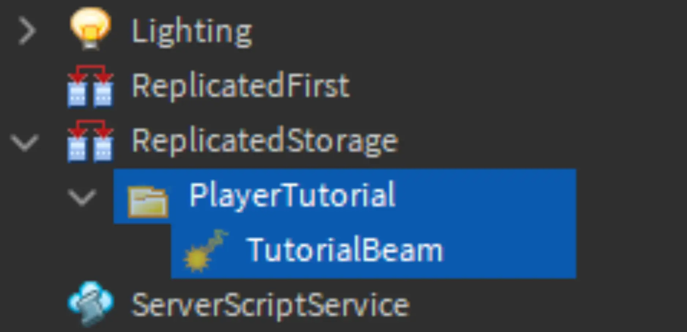
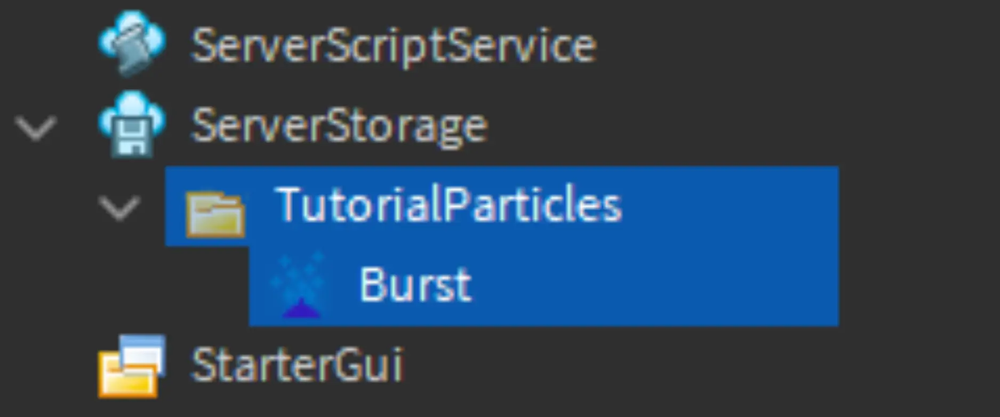
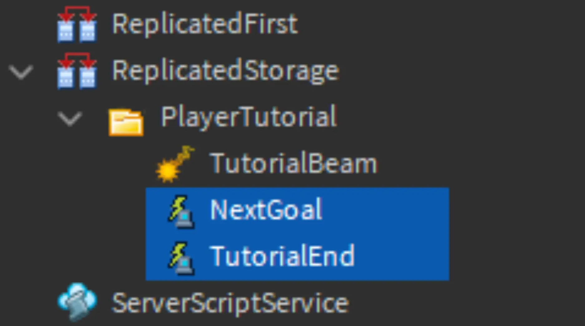
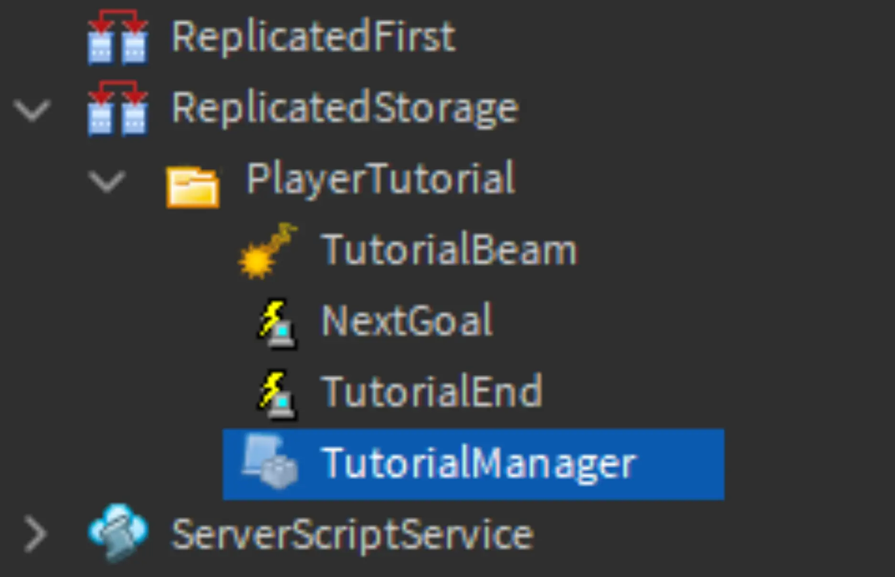
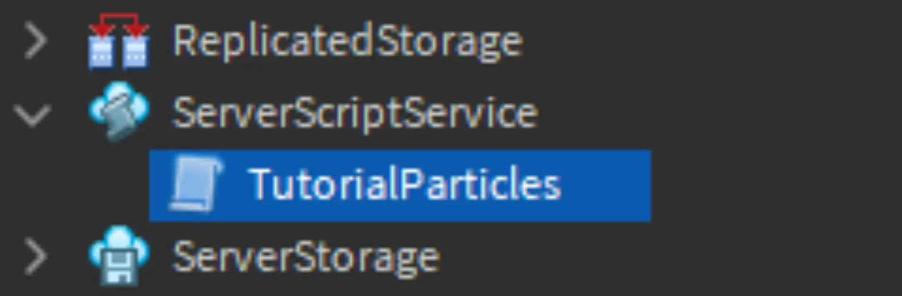
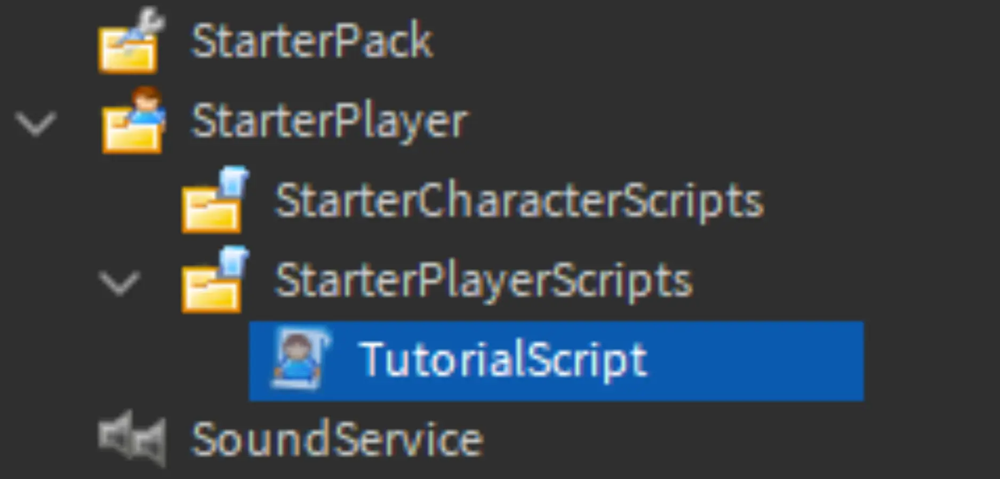

# Adding Scripts

## 목차
- [Adding Scripts](#adding-scripts)
  - [목차](#목차)
  - [빔과 입자 저장](#빔과-입자-저장)
  - [이벤트 생성](#이벤트-생성)
  - [스크립트 추가](#스크립트-추가)
    - [문제 해결 팁](#문제-해결-팁)
    - [스크립트의 이점과 한계](#스크립트의-이점과-한계)
  - [출처](#출처)
  - [다음](#다음)

---
모든 작업을 하나로 합칠 시간입니다! 이제 빔과 입자 구성 요소를 만들었으니, 세 개의 사전 제작된 스크립트를 추가합니다. 이 스크립트는 구성 요소가 언제 무엇을 해야 하는지 알려주어 튜토리얼을 관리합니다. 예를 들어, 스크립트는 새로운 플레이어를 위한 빔을 만들고 목표와 상호작용할 때마다 입자를 방출합니다.

<video controls src="../img/02_06_Adding_Scripts/final-example.mp4" width="100%"></video>

<Alert severity="info">
코드를 작성해 본 경험이 없어도 모든 단계를 따라 할 수 있지만, 그 지식이 있다면 이러한 스크립트를 자신의 경험에 맞게 수정하는 데 도움이 될 수 있습니다. 자세한 내용은 [코딩 기본 사항](https://create.roblox.com/docs/ko-kr/tutorials/fundamentals/coding-1/coding-fundamentals) 튜토리얼을 참조하세요.
</Alert>

## 빔과 입자 저장

스크립트를 추가하기 전에 빔과 입자를 이동하여 스크립트가 필요할 때 이를 복사할 수 있도록 해야 합니다.

<Alert severity="warning">
자체 프로젝트를 사용하는 경우, 일부 스크립트 변수의 값을 객체에 맞게 변경해야 할 수 있습니다.
</Alert>

1. **ReplicatedStorage**에 **PlayerTutorial**이라는 새 폴더를 만듭니다. TutorialBeam을 TestPlayer에서 새 폴더로 이동합니다.

   

2. **ServerStorage**에 **TutorialParticles**라는 폴더를 만듭니다. **Burst** 입자를 TestPlayer에서 해당 폴더로 이동합니다.

   

3. 빔과 입자 방출기를 이동한 후에는 TestPlayer가 더 이상 필요하지 않습니다. TestPlayer를 **삭제**하세요. 스크립트는 실제 플레이어와 함께 작동할 것입니다.

   <video controls src="../img/02_06_Adding_Scripts/delete-test-player.mp4"></video>

## 이벤트 생성

플레이어가 목표와 상호작용할 때마다 튜토리얼 스크립트는 해당 플레이어의 진행 상황을 업데이트하고 입자 효과를 방출해야 합니다. 스크립트에 알리기 위해 **이벤트**를 사용하여 신호를 보낼 수 있습니다.

1. ReplicatedStorage > PlayerTutorial에서 두 개의 **RemoteEvent** 객체를 만듭니다. 이름을 각각 **NextGoal**과 **TutorialEnd**로 지정합니다.

   

## 스크립트 추가

아래의 세 가지 스크립트는 이전에 만든 입자 방출기와 빔 객체를 찾아 튜토리얼 시스템을 관리합니다.

1. ReplicatedStorage > PlayerTutorial에서 **ModuleScript**를 새로 만들어 **TutorialManager**라는 이름을 지정합니다.
   

   기본 코드를 아래의 전체 코드로 대체합니다.

   ```lua
   local TutorialManager = {}

   local ReplicatedStorage = game:GetService("ReplicatedStorage")

   local tutorialFolder = ReplicatedStorage:WaitForChild("PlayerTutorial")
   local TutorialEndEvent = tutorialFolder:WaitForChild("TutorialEnd")
   local NextGoalEvent = tutorialFolder:WaitForChild("NextGoal")

   -- Note Goal parts must be ordered in the table, or else Goal order may be different in-game
   local goalParts = {
    workspace.TutorialGoals.GoalPart1,
    workspace.TutorialGoals.GoalPart2
   }

   local function checkTutorialEnd(player, goalParts)
    local currentIndex = player:WaitForChild("GoalProgress")
    return currentIndex.Value >= #goalParts
   end

   local function finishTutorial(player)
    local playerBeam = player.Character.HumanoidRootPart:FindFirstChildOfClass("Beam")
    playerBeam:Destroy()

    print(player.Name .. " finished the tutorial")

    -- Placeholder for further code. E.g. if you wanted to send messages to the server to do other tasks

   end

   function TutorialManager.interactGoal(player)
    NextGoalEvent:FireServer()
   end

   function TutorialManager.getTutorialGoals()
    return goalParts
   end

   function TutorialManager.nextGoal(player, goalParts)
    if checkTutorialEnd(player, goalParts) then
      finishTutorial(player)
    else
      -- Increment the player's Goal tracker
      local currentGoalIndex = player:WaitForChild("GoalProgress")
      currentGoalIndex.Value += 1
    end
   end

   -- Creates an int value to locally track player's progress through the tutorial Goals
   function TutorialManager.setupPlayerProgress(player)
    local currentGoalProgress = Instance.new("IntValue")
    currentGoalProgress.Name = "GoalProgress"
    currentGoalProgress.Value = 1
    currentGoalProgress.Parent = player
   end

   return TutorialManager
   ```

   이 스크립트는 플레이어의 튜토리얼 진행 상황을 관리하는 코드를 실행합니다. 여기에는 목표와 상호작용하는 코드 실행 또는 튜토리얼이 끝났을 때 발생하는 작업과 같은 작업이 포함됩니다.

2. **ServerScriptService**에서 **TutorialParticles**라는 이름의 새 **Script**를 만듭니다.
   

   아래 코드를 붙여넣습니다.

   ```lua
   local Players = game:GetService("Players")
   local ReplicatedStorage = game:GetService("ReplicatedStorage")
   local ServerStorage = game:GetService("ServerStorage")

   local tutorialFolder = ReplicatedStorage:WaitForChild("PlayerTutorial")
   local NextGoalEvent = tutorialFolder:WaitForChild("NextGoal")

   local EMIT_RATE = 50

   local function playParticleBurst(player)
     local character = player.Character or player.CharacterAdded:Wait()
     local humanoidRootPart = character:WaitForChild("HumanoidRootPart")
     local particleAttachment = humanoidRootPart:WaitForChild("ParticleAttachment")

     -- Go through particles on the attachment and play them according to the type of particle
     for _, particle in particleAttachment:GetChildren() do
       if particle:IsA("ParticleEmitter") then
         particle:Emit(EMIT_RATE)
       end
     end
   end

   local function setupPlayerParticles(player)
     player.CharacterAdded:Connect(function(character)
       local humanoidRootPart = character:WaitForChild("HumanoidRootPart")
       local playerParticleAttachment = Instance.new("Attachment")
       playerParticleAttachment.Name = "ParticleAttachment"
       playerParticleAttachment.Parent = humanoidRootPart

       -- Clone particles in the folder, even if there are more than one and attach to player
       for _, emitter in ServerStorage.TutorialParticles:GetChildren() do
         emitter:Clone().Parent = playerParticleAttachment
       end
     end)
   end

   Players.PlayerAdded:Connect(setupPlayerParticles)
   NextGoalEvent.OnServerEvent:Connect(playParticleBurst)
   ```

   이 스크립트는 플레이어가 목표와 상호작용할 때마다 폭발 입자를 재생합니다. 또한 상호작용 중에 생성되는 입자의 수를 결정하는 `EMIT_RATE`라는 변수가 있습니다.

3. StarterPlayer > StarterPlayerScripts에서 **TutorialScript**라는 이름의 새 **LocalScript**를 만듭니다.

   

   그런 다음 아래 스크립트를 붙여넣습니다. 이 스크립트는 플레이어를 안내하는 데 사용되는 빔을 생성하고 관리합니다.

   ```lua
   local Players = game:GetService("Players")
   local ReplicatedStorage = game:GetService("ReplicatedStorage")

   local tutorialFolder = ReplicatedStorage:WaitForChild("PlayerTutorial")
   local TutorialManager = require(tutorialFolder:WaitForChild("TutorialManager"))
   local TutorialEndEvent = tutorialFolder:WaitForChild("TutorialEnd")

   local player = Players.LocalPlayer
   local goalParts = TutorialManager.getTutorialGoals()
   local playerBeam = nil
   local goalIndex = nil

   local function getTargetAttachment()
     local currentTarget = goalParts[goalIndex.Value]
     local interactionPart = currentTarget:FindFirstChild("InteractionPart")
     local attachment = interactionPart and interactionPart:FindFirstChildOfClass("Attachment")

     if not attachment then
       attachment = Instance.new("Attachment")
       attachment.Name = "BeamAttachment"
       attachment.Parent = currentTarget
     end

     return attachment
   end

   local function updateBeamTarget()
     playerBeam = player.Character.HumanoidRootPart:FindFirstChildOfClass("Beam")

     local targetBeamAttachment = getTargetAttachment()

     if targetBeamAttachment then
       playerBeam.Attachment1 = targetBeamAttachment
     else
       warn("Attachment not found in a goal. Check that goals have attachments or they're included under the InteractionPart")
     end
   end

   local function setupGoals()
     for _, part in goalParts do
       local interactionPart = part:FindFirstChild("InteractionPart")
       local proximityPrompt = interactionPart and interactionPart:FindFirstChild("ProximityPrompt")

       if proximityPrompt then
         proximityPrompt.Triggered:Connect(function(player)
           proximityPrompt.Enabled = false
           TutorialManager.nextGoal(player, goalParts)
           TutorialManager.interactGoal(player)
         end)
       else
         warn("Proximity prompt not included in goal. Add one to each goal part under the InteractionPart")
       end
     end
   end

   local function createBeamForCharacter(character)
     local humanoidRootPart = character:WaitForChild("HumanoidRootPart")
     local playerBeamAttachment = Instance.new("Attachment")
     local beamTemplate = tutorialFolder:WaitForChild("TutorialBeam")

     if not beamTemplate then
       warn("Tutorial Beam not found in ReplicatedStorage")
     end

     playerBeamAttachment.Name = "BeamAttachment"
     playerBeamAttachment.Parent = humanoidRootPart

     local targetBeamAttachment = getTargetAttachment()

     playerBeam = beamTemplate:Clone()
     playerBeam.Attachment0 = playerBeamAttachment
     playerBeam.Attachment1 = targetBeamAttachment
     playerBeam.Parent = humanoidRootPart
     playerBeam.Enabled = true
   end

   local function setupPlayer()
     setupGoals()
     TutorialManager.setupPlayerProgress(player)
     goalIndex = player:WaitForChild("GoalProgress")

     player.CharacterAdded:Connect(createBeamForCharacter)
     if player.Character then
       createBeamForCharacter(player.Character)
     end
   end

   setupPlayer()
   goalIndex.Changed:Connect(updateBeamTarget)
   ```

4. 프로젝트를 실행하여 스크립트를 테스트합니다. 상호작용 기능을 사용하여 부스에서 부스로 이동하여 코드가 작동하는지 확인하세요.

   <video controls src="../img/02_06_Adding_Scripts/final-example-2.mp4" width="100%"></video>

### 문제 해결 팁

**문제**: 게임 시작 시 입자가 재생됩니다.

- ServerStorage > Tutorial Particles > Burst로 이동합니다. Enabled가 꺼져 있는지 확인하세요.

**문제**: "무한 대기"와 같은 컴파일러 경고가 표시됩니다.

- 스크립트가 특정 위치의 특정 객체를 찾고 있기 때문에 부품 이름이 잘못될 수 있습니다. 게임 내 각 부품의 이름과 위치가 튜토리얼과 일치하는지 다시 확인하세요.

### 스크립트의 이점과 한계

이 튜토리얼 시스템을 경험에 사용하는 경우 다음 사항을 염두에 두세요.

**이점**

- TutorialEnd와 같은 이벤트는 다른 스크립트를 트리거하는 데 사용할 수 있습니다. 예를 들어, 이 이벤트가 발생할 때 플레이어에게 특별 아이템을 수여할 수 있습니다.
- TutorialParticles 스크립트는 여러 입자를 동시에 재생할 수 있습니다. ServerStorage/TutorialParticles에 더 많은 입자를 추가하여 더 복잡한 효과를 만들 수 있습니다.

**한계**

- 튜토리얼에서 플레이어의 진행 상황은 지속되지 않으므로 해당 진행 상황을 저장하는 방법을 코딩해야 합니다. 가이드는 데이터 저장 문서를 참조하세요.

---
## 출처
[Adding Scripts](https://create.roblox.com/docs/ko-kr/education/build-it-play-it-mansion-of-wonder/adding-scripts)

---
## [다음](./03_01_Island_of_Move.md)
