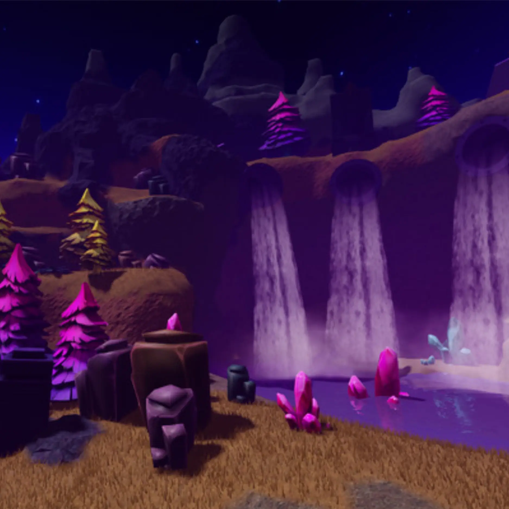
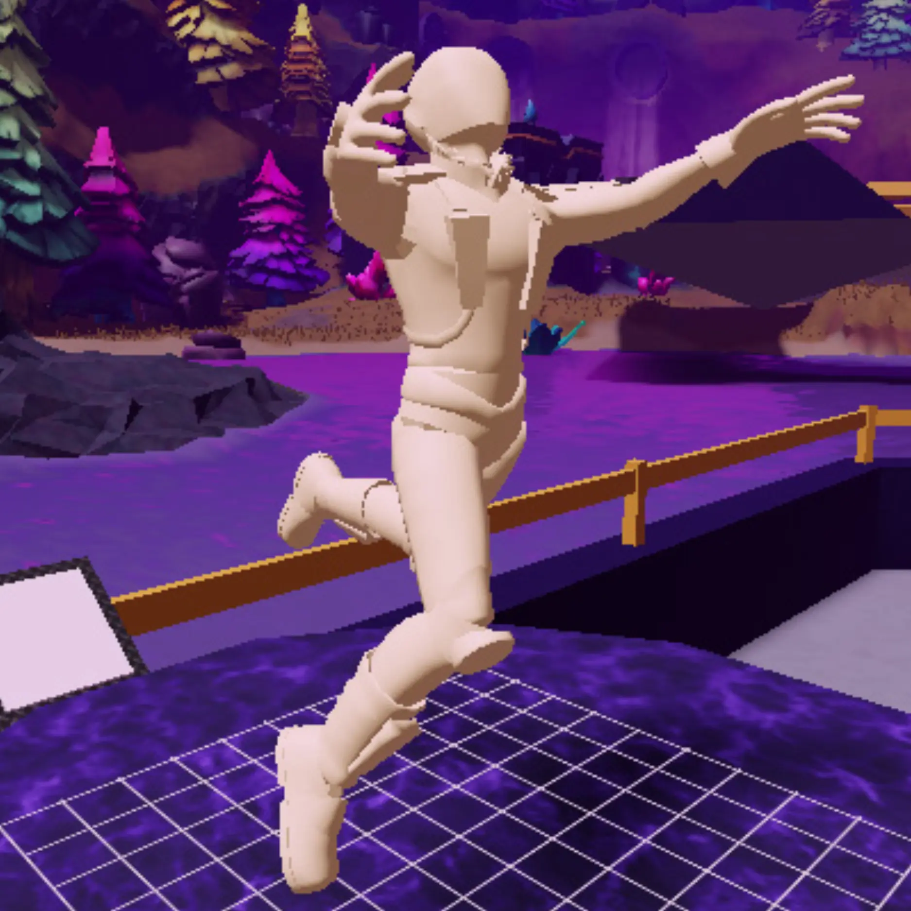
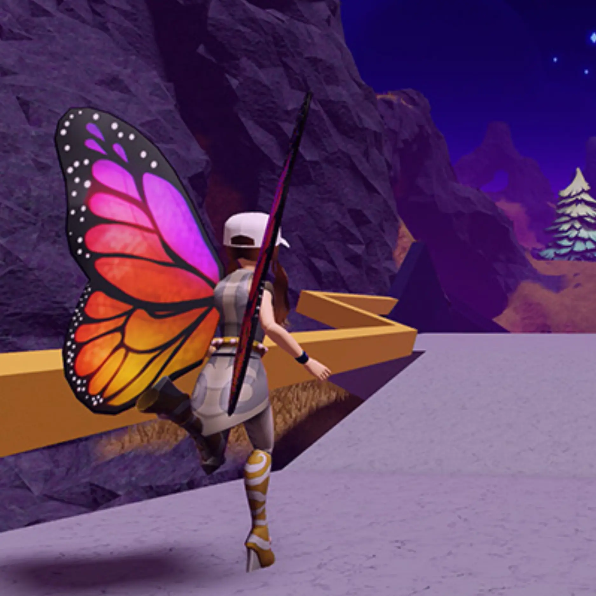
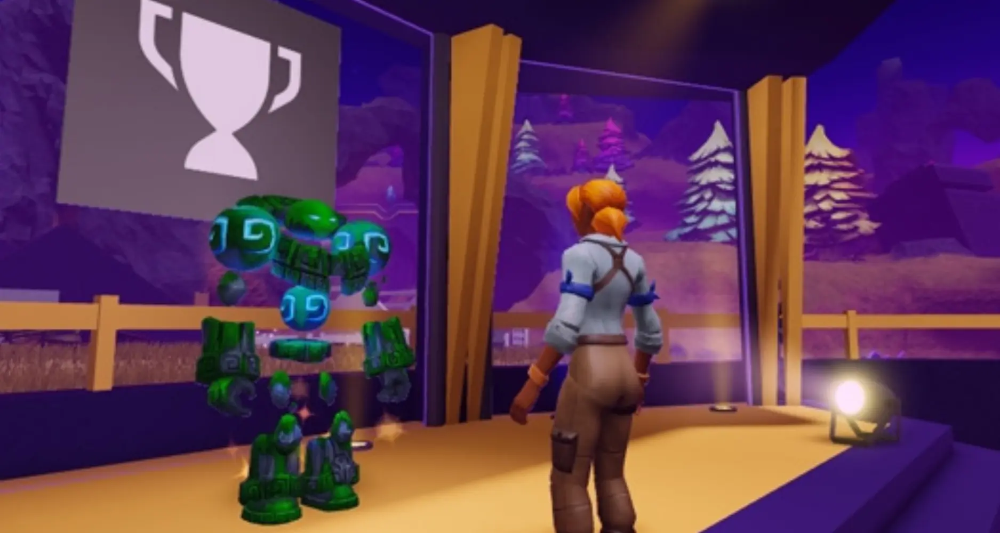

# Island of Move

## 목차
- [Island of Move](#island-of-move)
  - [목차](#목차)
  - [Roblox Studio 다운로드](#roblox-studio-다운로드)
  - [세 가지 레슨, 세 가지 보상](#세-가지-레슨-세-가지-보상)
  - [출처](#출처)
  - [다음](#다음)

---
**Island of Move**에 오신 것을 환영합니다. 이곳은 Roblox 플레이어들이 항상 움직이는 고대의 먼 땅입니다. Roblox Studio를 사용하여 사람들이 움직여서 포인트를 얻는 시뮬레이터 게임을 만드는 방법을 배워보세요. 플레이어가 어떻게 움직일지는 여러분에게 달려 있습니다. 하늘을 나는 수영이 될 수도 있고, 트랙을 따라 춤추는 것이 될 수도 있습니다.

<video controls src="../img/03_02_Island_of_Move/overview.mp4" width="100%"></video>

이 **Build It, Play It** 챌린지를 완료한 후에는 친구들과 공유할 수 있는 완성된 게임을 갖게 됩니다. 플레이어들은 모바일 기기로도 접속하여 실제로 걷고 움직이며 포인트를 얻을 수 있습니다.

자, 이제 움직일 시간입니다!

## Roblox Studio 다운로드

시작하려면 **Roblox Studio**가 필요합니다. 이 프로그램은 Roblox의 모든 게임을 만드는 데 사용되며 **PC**와 **Mac**에서 무료로 이용할 수 있습니다. 컴퓨터에서 Roblox 게임을 플레이한 적이 있다면 Studio가 이미 설치되어 있을 것입니다. 제작 중에는 **스크롤 휠**이 있는 **2버튼 마우스**를 사용하는 것을 강력히 권장합니다.

<Alert severity="info">
<AlertTitle>새 계정 만들기 및 Studio 다운로드</AlertTitle>
Roblox가 완전히 처음이라면, 다음 지침을 따라 시작하세요:

1. [계정 가입](https://www.roblox.com/account/signupredir).
2. [Roblox Studio 다운로드](https://www.roblox.com/create).
3. 설치 후, Roblox Studio 데스크탑 아이콘(Windows) 또는 도크 아이콘(Mac)을 더블 클릭합니다.
4. 로그인 화면에서 Roblox 사용자 이름과 비밀번호를 입력한 후 **로그인**을 클릭합니다.

새 계정을 만들 때는 다음 안전 수칙을 기억하세요:

- **비밀번호를 절대 공유하지 마세요**, 실제 친구와도 공유하지 마세요.
- **비밀번호를 추측하기 어렵게 만드세요** — 사용자 이름이 "bloxcool"이라면, 비밀번호는 "bloxcool123"이 되어서는 안 됩니다.
- **Roblox 직원은 절대 비밀번호를 묻지 않습니다** — 비밀번호를 묻는 사람은 [부정 행위 신고](https://en.help.roblox.com/hc/articles/203312410) 기능을 사용하여 신고하세요.
- **무료 Robux는 없습니다** — 무료 Robux를 제공한다고 하는 플레이어나 사이트를 절대 신뢰하지 마세요!

</Alert>

## 세 가지 레슨, 세 가지 보상

자신만의 시뮬레이터 게임을 위해 애니메이션을 디자인하려면 세 단계로 구성된 튜토리얼을 차례대로 따라하세요.

<GridContainer numColumns="3">
  <figure>
    
    <figcaption>1: 시작하기</figcaption>
  </figure>
  <figure>
    
    <figcaption>2: 애니메이션 만들기</figcaption>
  </figure>
  <figure>
    
    <figcaption>3: 내보내기 및 플레이</figcaption>
  </figure>
</GridContainer>

각 레슨을 마친 후, 독점 Roblox 아바타 보상을 받을 수 있는 코드를 얻게 됩니다. 마지막에는 멋진 애니메이션과 함께 멋진 아이템도 얻게 될 것입니다!

---
## 출처
[Island of Move](https://create.roblox.com/docs/ko-kr/education/build-it-play-it-island-of-move/beginner-landing-page)

---
## [다음](./03_03_Opening_the_Template.md)
