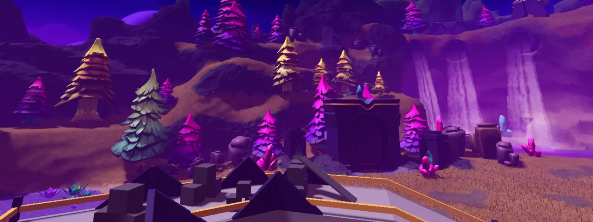
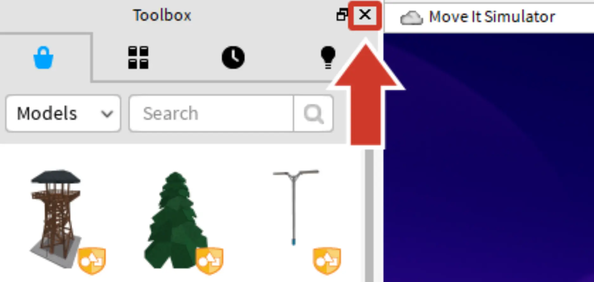
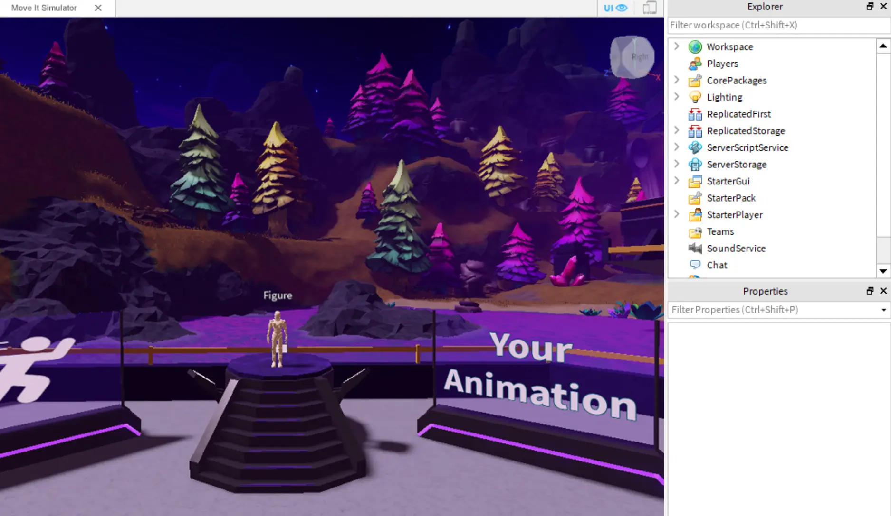
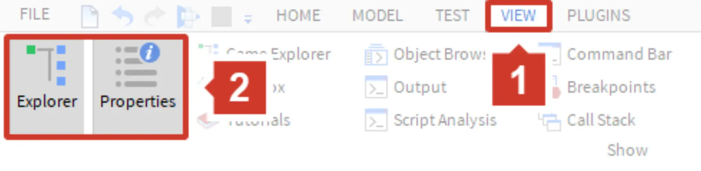

# Opening the Template

## 목차
- [Opening the Template](#opening-the-template)
  - [목차](#목차)
  - [템플릿 개요](#템플릿-개요)
  - [템플릿 열기](#템플릿-열기)
  - [불필요한 창 닫기](#불필요한-창-닫기)
  - [출처](#출처)
  - [다음](#다음)

---
당신의 움직임 시뮬레이터에서는 플레이어가 트랙을 돌아다니며 별을 얻습니다. 플레이어가 별 세 개를 얻으면 레벨 업하고 더 빨리 이동할 수 있습니다. 더 많이 움직일수록 더 빨리 이동하게 됩니다.

<video controls src="../img/03_03_Opening_the_Template/overview-game-progress.mp4" width="100%"></video>

## 템플릿 개요

시뮬레이터 스타일의 게임을 만들기 위해 모든 파트가 포함된 템플릿이 준비되어 있습니다. 여기에는 코드와 나중에 커스터마이즈할 수 있는 시작 세계가 포함되어 있습니다.

## 템플릿 열기

이제 Roblox Studio를 열 차례입니다! 필요하다면 [Studio](https://www.roblox.com/create)를 다운로드한 후, [다음](https://create.roblox.com/docs/ko-kr/education/build-it-play-it-island-of-move/opening-the-template#open-the-template)으로 이동하여 **Move It Simulator** 템플릿을 엽니다.

<!-- <UseStudioButton variant="" buttonTextTranslationKey="Action.EditInStudio" placeId="5353920686" universeId="1876281622" /> -->

## 불필요한 창 닫기

Roblox Studio를 처음 실행할 때, 현재 필요하지 않은 추가 창이 열릴 수 있습니다. 이러한 창을 닫으면 작업 공간이 더 넓어집니다. 나중에 언제든지 다시 열 수 있습니다.

1. 3D 뷰의 왼쪽에 있는 각 창을 클릭하여 닫습니다. 닫을 것이 보이지 않으면 다음 단계로 넘어갑니다.

   

2. **오른쪽**의 창은 그대로 둡니다. Studio는 아래 이미지처럼 보여야 합니다.

   
   <Alert severity="warning">
   <AlertTitle>오른쪽 창이 보이지 않나요?</AlertTitle>
   창을 보려면:

   a. **보기** 탭으로 이동하여 활성화합니다.

   b. 그런 다음 **탐색기(Explorer)**와 **속성(Properties)**를 클릭합니다.

   

   </Alert>

---
## 출처
[Opening the Template](https://create.roblox.com/docs/ko-kr/education/build-it-play-it-island-of-move/opening-the-template)

---
## [다음](./03_04_Test_the_Game.md)
