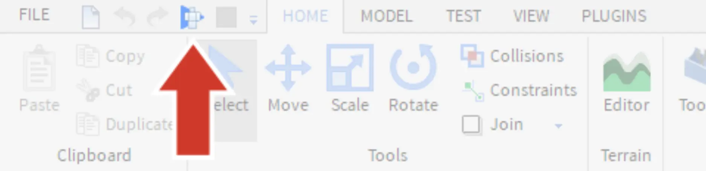
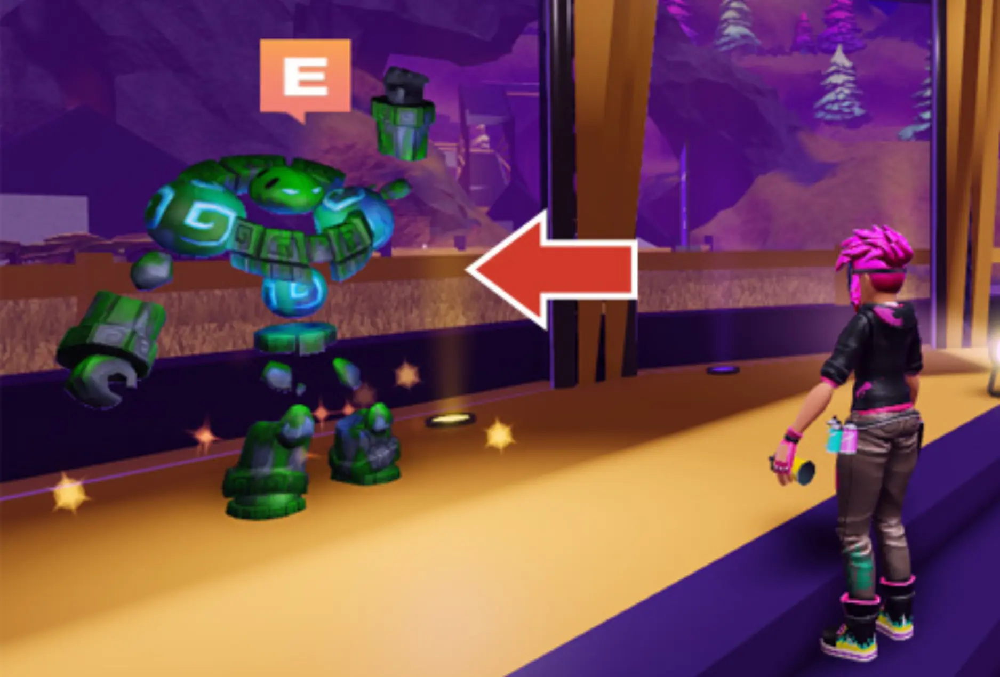
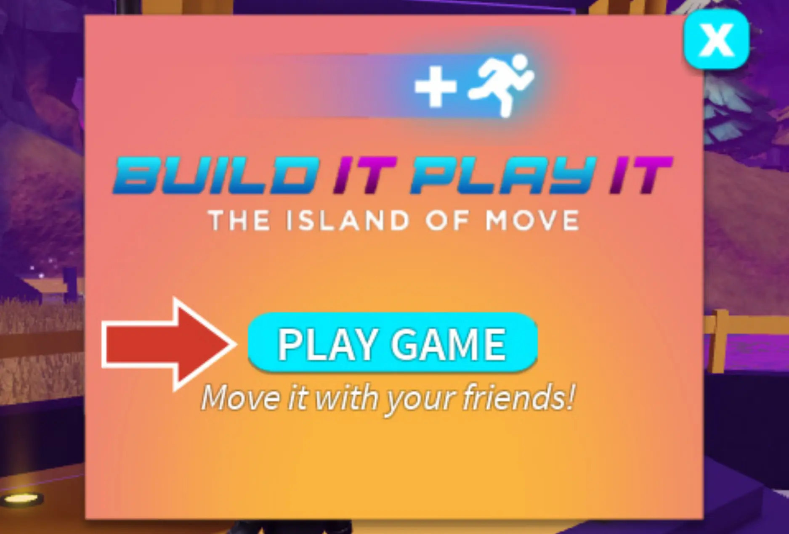
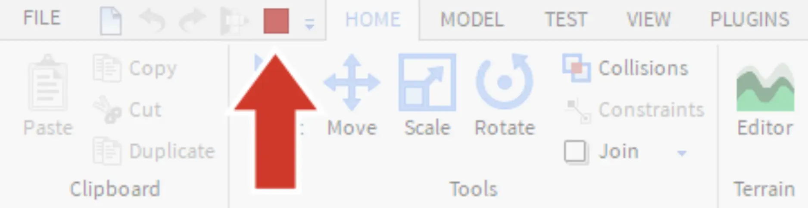

# Test the Game

## 목차
- [Test the Game](#test-the-game)
  - [목차](#목차)
  - [출처](#출처)
  - [다음](#다음)

---
애니메이션을 시작하기 전에 템플릿을 테스트하여 게임이 어떻게 작동하는지 확인하세요. 게임 내에서 플레이어는 이동 버튼을 클릭하거나 모바일 기기를 사용하여 실제로 움직이면서 트랙을 따라 진행합니다. 플레이어는 처음에는 천천히 시작하고 점점 더 빨라집니다.

1. 테스트하려면 **Play**를 클릭하세요.

   

2. 게임에서 **_Freddie_**, 골렘에게 다가가 클릭하거나 <kbd>E</kbd>를 누르세요.

   

3. 게임에 들어가려면 **Play Game**을 클릭하세요.

   

4. 게임에 들어가면 **Move** 버튼을 반복해서 클릭하여 앞으로 나아가세요. 캐릭터는 클릭할 때마다 자동으로 트랙을 따라갑니다.

   <video controls src="../img/03_04_Test_the_Game/click-game-button.mp4" width="100%"></video>

5. 빨간색 사각형을 클릭하여 **Stop** 버튼을 누르면 게임이 종료됩니다.

   

---
## 출처
[Test the Game](https://create.roblox.com/docs/ko-kr/education/build-it-play-it-island-of-move/test-the-game)

---
## [다음](./03_05_Creating_Animations.md)
