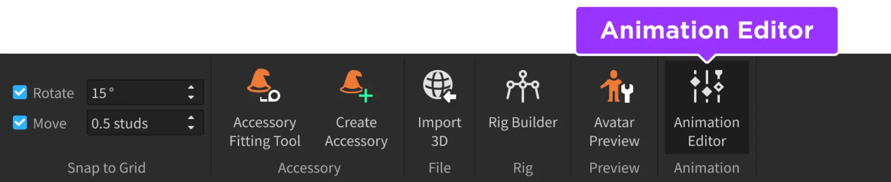
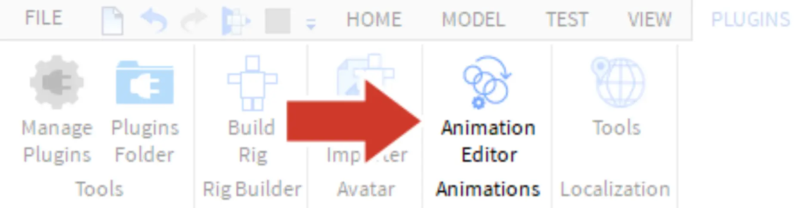
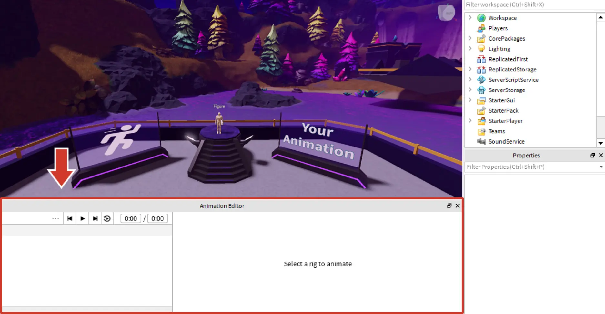
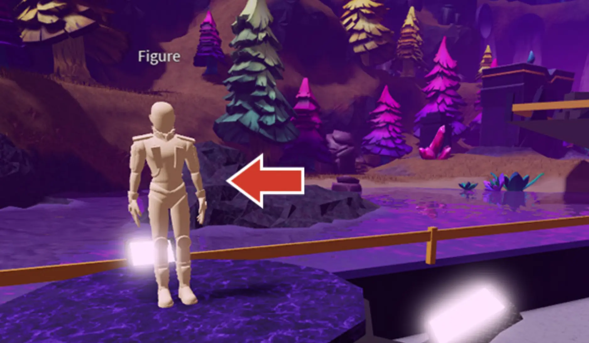
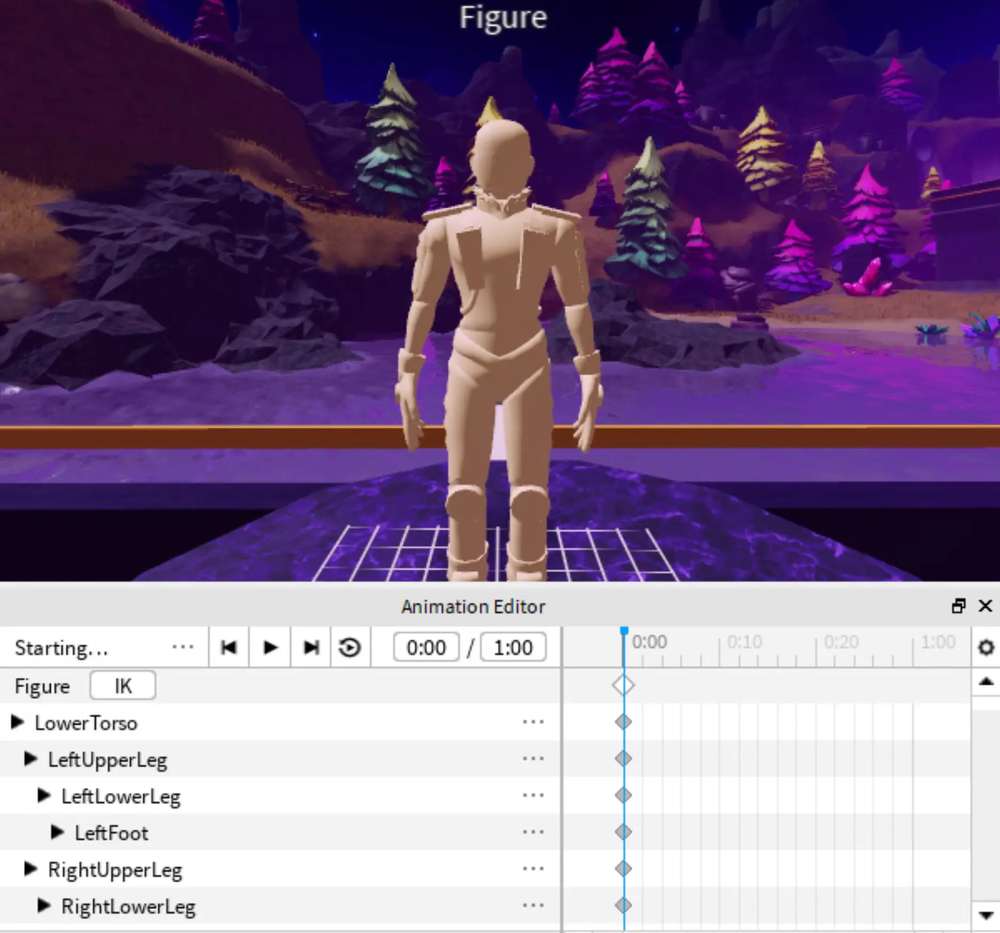
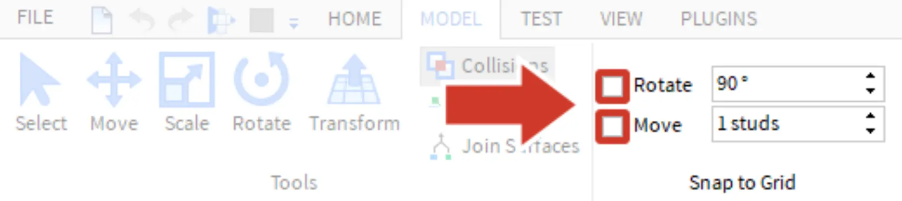

# Creating Animations

## 목차
- [Creating Animations](#creating-animations)
  - [목차](#목차)
  - [애니메이션 편집기 설정](#애니메이션-편집기-설정)
  - [포즈 준비](#포즈-준비)
  - [출처](#출처)
  - [다음](#다음)

---
애니메이션을 만드는 것은 액션 피규어를 포즈하는 것과 비슷합니다. 이 튜토리얼에서는 두 가지 포즈를 만들 것입니다. 게임이 실행되면 Roblox Studio가 포즈를 연결하여 애니메이션을 만듭니다.

<video controls src="../img/03_05_Creating_Animations/show-animation-breakdown.mp4" width="100%"></video>

## 애니메이션 편집기 설정

포즈와 최종 애니메이션은 애니메이션 편집기를 사용하여 생성됩니다.

1. 애니메이션 편집기를 찾으려면 **아바타** 탭을 선택하세요.

   

2. **애니메이션 편집기**를 클릭하세요.

   

   애니메이션 편집기가 화면 하단에 열릴 것입니다.

   

3. 다음으로, 애니메이션을 적용할 캐릭터가 필요합니다. 단상 위에 이미 설정된 캐릭터가 있습니다. 위에 있는 **피규어**를 선택하세요.
   

   카메라는 선택된 피규어에 초점을 맞추고, 애니메이션 편집기에는 피규어를 구성하는 부품 이름이 나타납니다.

   

## 포즈 준비

포즈를 만들기 전에 프로그램 설정을 변경하고 카메라 위치를 조정하여 피규어를 포즈하기 쉽게 만드세요.

1. **모델** 탭에서 **그리드에 맞추기** 섹션을 찾으세요. **회전**과 **이동**이 선택되지 않았는지 확인하세요.

   

2. 카메라 컨트롤을 사용하여 애니메이션을 적용할 부품을 잘 볼 수 있도록 카메라를 이동하세요. 이동 중에는 <kbd>Shift</kbd>를 눌러 카메라 움직임을 느리게 할 수 있습니다.

   <video controls src="../img/03_05_Creating_Animations/show-move-camera.mp4" width="100%"></video>

   <Alert severity="info">
   **카메라 컨트롤**

     <table>
     <thead>
       <tr>
         <th>**동작**</th>
         <th>**컨트롤**</th>
       </tr>
     </thead>
     <tbody>
       <tr>
         <td>**이동**</td>
         <td><kbd>W A S D</kbd> </td>
       </tr>
       <tr>
         <td>**회전**</td>
         <td>오른쪽 마우스 버튼을 눌러 주변을 둘러보기</td>
       </tr>
       <tr>
         <td>**확대/축소**</td>
         <td>스크롤 휠 사용</td>
       </tr>
       <tr>
         <td>**초점 맞추기**</td>
         <td>특정 부품에 카메라 초점을 맞추려면 <kbd>F</kbd> 누르기</td>
       </tr>
     </tbody>
     </table>
   </Alert>

   <Alert severity="warning">
   <AlertTitle>카메라를 움직일 수 없나요?</AlertTitle>
   카메라가 <kbd>W A S D</kbd> 키를 눌러도 움직이지 않으면, 게임 월드 내의 아무 곳이나 클릭하세요.
   </Alert>

---
## 출처
[Creating Animations](https://create.roblox.com/docs/ko-kr/education/build-it-play-it-island-of-move/creating-animations)

---
## [다음](./03_06_Create_the_First_Pose.md)
