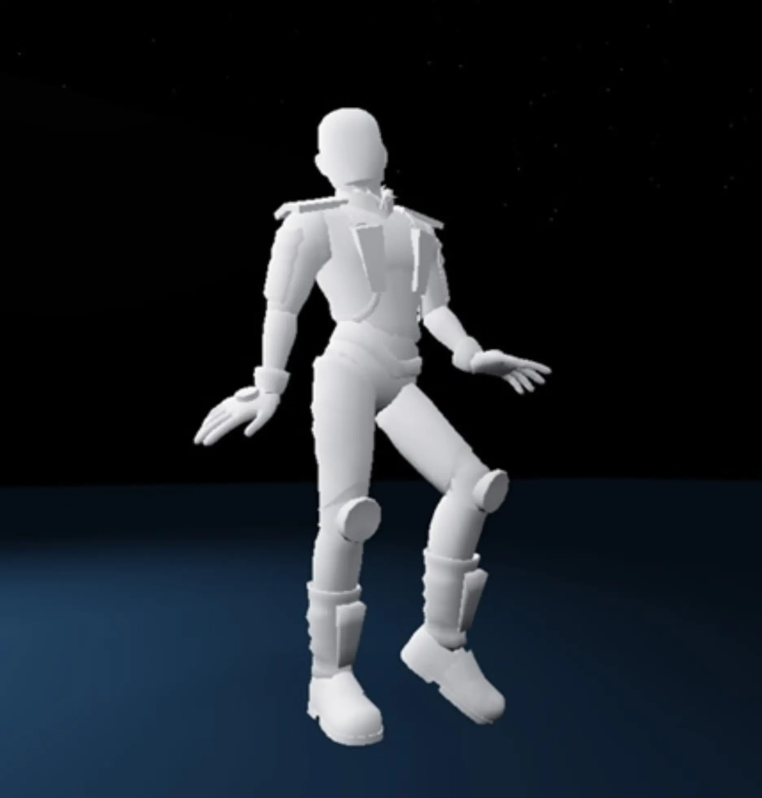

# Create the First Pose

## 목차
- [Create the First Pose](#create-the-first-pose)
  - [목차](#목차)
  - [피규어 포즈 만들기](#피규어-포즈-만들기)
  - [출처](#출처)
  - [다음](#다음)

---
애니메이션의 첫 번째 포즈를 만드는 것부터 시작하세요. 이 튜토리얼에서는 수영 애니메이션을 보여주지만, 여러분의 애니메이션은 상상하는 대로 만들 수 있습니다. 만들고자 하는 애니메이션에 따라 첫 번째 포즈는 매우 다를 수 있습니다.

<GridContainer numColumns="3">
  <figure>
    
    <figcaption>수영</figcaption>
  </figure>
  <figure>
    
    <figcaption>쭈그리기</figcaption>
  </figure>
  <figure>
    
    <figcaption>춤추기</figcaption>
  </figure>
</GridContainer>

## 피규어 포즈 만들기

피규어 포즈는 머리나 팔꿈치 같은 개별 부위와 관절을 회전시켜 만듭니다.

1. 회전하려면 몸의 부위를 클릭하세요. 그러면 회전 핸들이 나타납니다.

   <video controls src="../img/03_06_Create_the_First_Pose/click-upper-arm.mp4" width="100%"></video>

   <Alert severity="warning">
   **회전 문제 해결**

   - **문제:** 회전 핸들을 클릭할 수 없음
     다른 부위가 클릭을 막고 있을 수 있습니다. 카메라를 회전시켜 클릭하려는 부위에 마우스를 올렸을 때 파란색 상자가 보일 때까지 조정해 보세요.

   - **문제:** 회전 핸들이 보이지 않음
     화살표 세트가 보이는 경우, <kbd>R</kbd>을 눌러 **회전** 도구를 켜야 합니다.

    </Alert>

2. 핸들을 **드래그**하여 회전시킵니다. 각 핸들은 다른 방향으로 회전합니다. 변경 사항은 (<kbd>Ctrl</kbd> + <kbd>Z</kbd> 또는 <kbd>⌘</kbd> + <kbd>Z</kbd>)를 눌러 **되돌리기** 할 수 있습니다.

   <video controls src="../img/03_06_Create_the_First_Pose/rotate-upper-arm.mp4" width="100%"></video>

3. 첫 번째 포즈가 완성될 때까지 다양한 부위를 계속 회전시킵니다. 작업하는 동안 여러 각도에서 포즈를 보기 위해 카메라를 변경하세요.

   <video controls src="../img/03_06_Create_the_First_Pose/timelapse-first-pose.mp4" width="100%"></video>

---
## 출처
[Create the First Pose](https://create.roblox.com/docs/ko-kr/education/build-it-play-it-island-of-move/create-the-first-pose)

---
## [다음](./03_07_Save_and_Publish.md)
