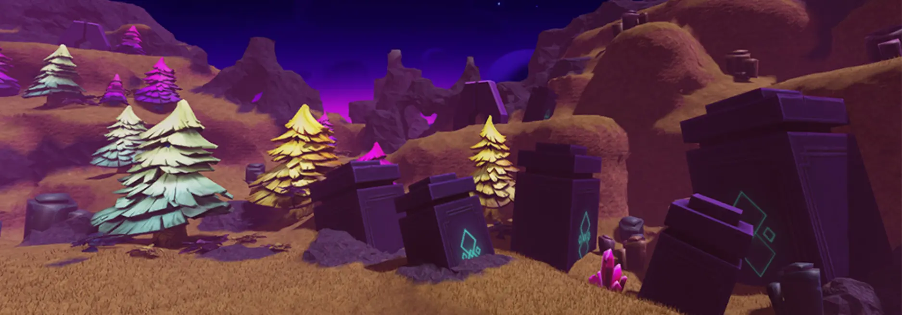
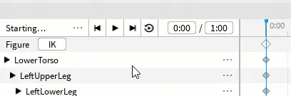
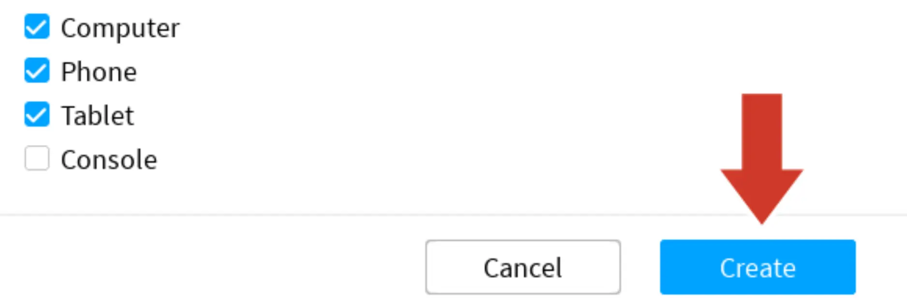

# Save and Publish

## 목차
- [Save and Publish](#save-and-publish)
  - [목차](#목차)
  - [애니메이션 저장하기](#애니메이션-저장하기)
  - [장소 저장하기](#장소-저장하기)
  - [출처](#출처)
  - [다음](#다음)

---

## 애니메이션 저장하기

첫 번째 포즈가 완성되었으면 애니메이션을 저장하세요.

1. 애니메이션 편집기에서 세 점 아이콘 (...)을 찾아 클릭합니다. 그런 다음 **Save**를 선택합니다.

   

## 장소 저장하기

애니메이션이 저장되었지만, 전체 프로젝트를 Roblox에 게시하여 저장하는 것이 중요합니다. 작업하는 동안이나 큰 변화를 준 후에는 **게시**하는 것이 좋습니다.

1. **파일 → Roblox에 게시**를 선택하여 게시 창을 엽니다.

   

2. 장소 이름과 선택적으로 설명을 입력합니다.

   

3. 원한다면 **Phone**과 **Tablet**을 선택합니다. 준비가 되면 **Create** 버튼을 클릭합니다. 한 번 게시되면, 게임은 계정에 연결되어 있기 때문에 어떤 컴퓨터에서든 편집할 수 있습니다.

   

   <Alert severity="info">
   <AlertTitle>이 게임은 모바일에서 실행됩니다</AlertTitle>
   플레이어는 가속도계를 이용하여 모바일 장치로 캐릭터를 이동할 수 있습니다. 데스크톱 장치에서 플레이하는 사람들은 여전히 버튼을 클릭하여 이동합니다.
   </Alert>

   <Alert severity="info">
   <AlertTitle>게시 후 저장하기</AlertTitle>
   다음에 작업을 저장하려면 **파일 → Roblox에 게시**로 이동하거나 단축키(<kbd>Alt</kbd> + <kbd>P</kbd>)를 사용하세요.
   </Alert>

---
## 출처
[Save and Publish](https://create.roblox.com/docs/ko-kr/education/build-it-play-it-island-of-move/save-and-publish)

---
## [다음](./03_08_)
