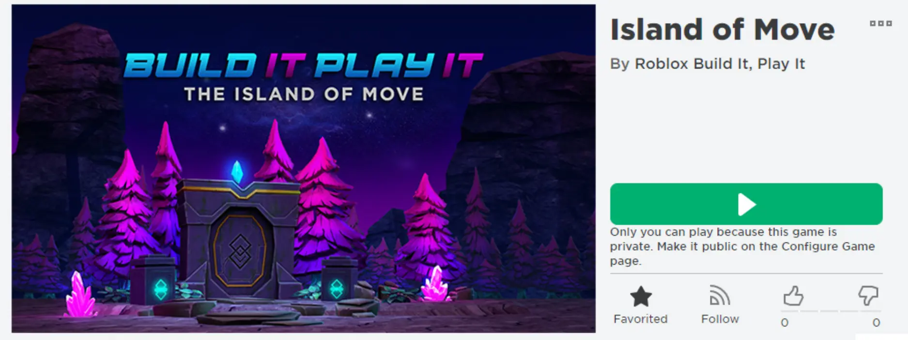

# Challenge Checkpoint

## 목차
- [Challenge Checkpoint](#challenge-checkpoint)
  - [목차](#목차)
  - [출처](#출처)
  - [다음](#다음)

---
애니메이션이 준비되었습니다! **Build It 배낭**과 **Setting the Stage** 배지를 얻어 새로운 기술을 축하하세요.

1. 아이템을 받으려면 이 코드를 사용해야 합니다. 아래 **코드**를 **복사**하세요.

   `SettingTheStage`

2. 아래의 **Enter World**를 클릭하여 Roblox 게임 페이지를 여세요. 이 게임에는 여러분이 작업한 것의 완성된 예시가 포함되어 있습니다.

   

   <a href="https://www.roblox.com/games/5306359293/Island-of-Move">
   <Button variant="contained">Enter World</Button>
   </a>

3. 게임에서, 게임 내 캐릭터인 **_Freddie_**와 상호작용하여 도전을 시작하세요. 메뉴에서 **REDEEM CODE**를 클릭합니다. 다음 화면에서 이 페이지에서 찾은 코드를 붙여넣어 아이템을 받으세요!

   

---
## 출처
[Challenge Checkpoint](https://create.roblox.com/docs/ko-kr/education/build-it-play-it-island-of-move/challenge-checkpoint)

---
## [다음](./03_09_Looping_Animations.md)
