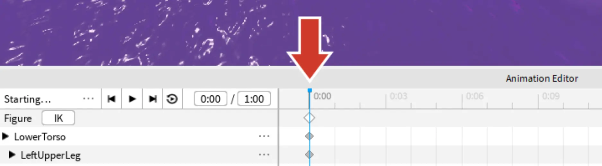
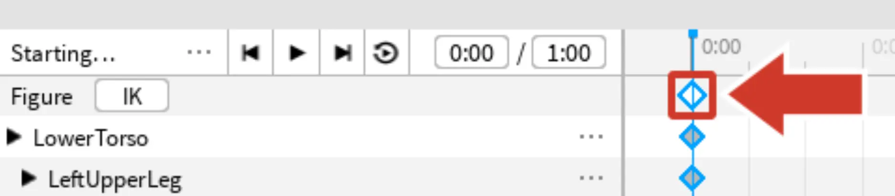
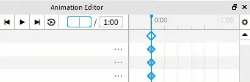
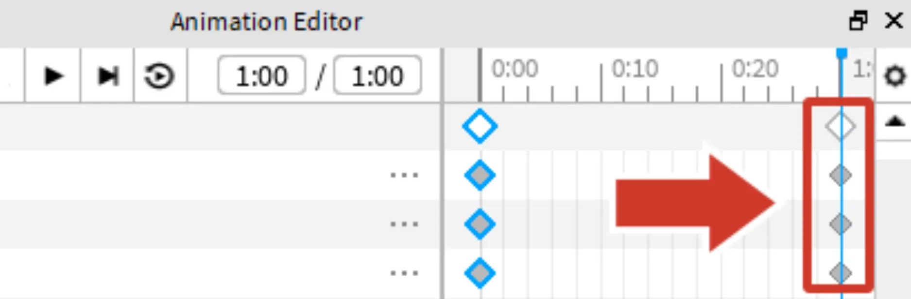

# Looping Animations

## 목차
- [Looping Animations](#looping-animations)
  - [목차](#목차)
  - [첫 번째 포즈 복사하기](#첫-번째-포즈-복사하기)
  - [출처](#출처)
  - [다음](#다음)

---

애니메이션이 부드럽게 반복되도록 하기 위해, 두 번째 포즈를 만들기 전에 첫 번째 포즈를 애니메이션의 끝으로 복사하세요. 애니메이션 끝으로 이동하려면 **타임라인**에서 위치를 변경해야 합니다. 이는 애니메이션을 초 단위로 나타내는 번호가 매겨진 선입니다.

## 첫 번째 포즈 복사하기

첫 번째 포즈는 타임라인의 `0:00`에 있습니다.

1. 애니메이션 편집기에서 타임라인의 **맨 위 하얀 다이아몬드**를 클릭합니다. 이 다이아몬드는 전체 시작 포즈를 나타냅니다. 하얀 다이아몬드에 파란 테두리가 있는지 확인하세요 (선택된 상태를 의미합니다).

   

2. <kbd>Ctrl</kbd> + <kbd>C</kbd> 또는 <kbd>⌘</kbd> + <kbd>C</kbd>를 눌러 포즈를 복사합니다.

3. 애니메이션 끝으로 이동하려면 현재 시간 상자를 찾아 클릭하고 내부 텍스트를 **지웁니다**. 그 상자에 `1:00`을 입력하고 <kbd>Enter</kbd>를 누릅니다. 파란 선이 애니메이션 끝으로 이동한 것을 확인할 수 있습니다.

   

4. 첫 번째 포즈를 끝에 붙여넣으려면 <kbd>Ctrl</kbd> + <kbd>V</kbd> 또는 <kbd>⌘</kbd> + <kbd>V</kbd>를 누릅니다. 새로운 다이아몬드 세트가 끝에 나타날 것입니다.

   

---
## 출처
[Looping Animations](https://create.roblox.com/docs/ko-kr/education/build-it-play-it-island-of-move/looping-animations)

---
## [다음](./03_10_Adding_the_Second_Pose.md)
