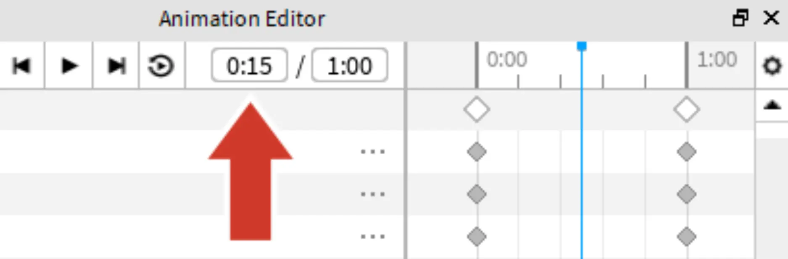

# Adding the Second Pose

## 목차
- [Adding the Second Pose](#adding-the-second-pose)
  - [목차](#목차)
  - [애니메이션 재생하기](#애니메이션-재생하기)
  - [출처](#출처)
  - [다음](#다음)

---

다음으로 타임라인의 중간으로 이동하여 두 번째 포즈 작업을 시작하세요. 포즈를 디자인한 후, Roblox Studio는 모든 것을 연결하여 아래와 같은 반복 애니메이션을 만들 것입니다.

<video controls src="../img/03_10_Adding_the_Second_Pose/full-swim-animation.mp4" width="100%"></video>

1. 두 번째 포즈를 중간에 배치하려면 현재 시간을 `0:15`로 설정합니다.

   

2. **회전 도구**를 사용하여 두 번째 포즈를 만듭니다. 작업하는 동안 카메라를 움직이는 것을 잊지 마세요.

   <video controls src="../img/03_10_Adding_the_Second_Pose/show-middle-timelapse.mp4" width="75%"></video>

   <Alert severity="info">
   <AlertTitle>더 빠르게 포즈 만들기</AlertTitle>
   몸통에 연결된 팔과 허벅지 같은 부위부터 회전시켜 포즈를 만드는 속도를 높이세요. 그런 다음 손과 발을 포즈하세요.
   </Alert>

   <Alert severity="warning">
   <AlertTitle>포즈를 처음부터 시작하기</AlertTitle>
   포즈가 마음에 들지 않아 처음부터 다시 시작하고 싶으신가요? 언제든지 포즈를 초기 기본값으로 재설정할 수 있습니다.

   1. 재설정하려는 포즈의 상단 하얀 다이아몬드를 마우스 오른쪽 버튼으로 클릭합니다.

   2. **선택 항목 재설정**을 선택합니다.
    </Alert>

## 애니메이션 재생하기

애니메이션이 작동하는 모습을 확인할 시간입니다! 애니메이션이 바로 멈추지 않도록 루핑을 켜고 게임 내에서 어떻게 보일지 더 잘 확인할 수 있습니다.

1. 루핑을 켜려면 **루프** 아이콘을 클릭하세요.

   

2. 애니메이션을 재생하려면 <kbd>Space</kbd>를 누릅니다.

   <video controls src="../img/03_10_Adding_the_Second_Pose/show-full-swim-animation.mp4" width="75%"></video>

3. 테스트를 중지하려면 다시 <kbd>Space</kbd>를 누릅니다.

---
## 출처
[Looping Animations](https://create.roblox.com/docs/ko-kr/education/build-it-play-it-island-of-move/looping-animations)

---
## [다음](./03_11_Challenge_Checkpoint.md)
