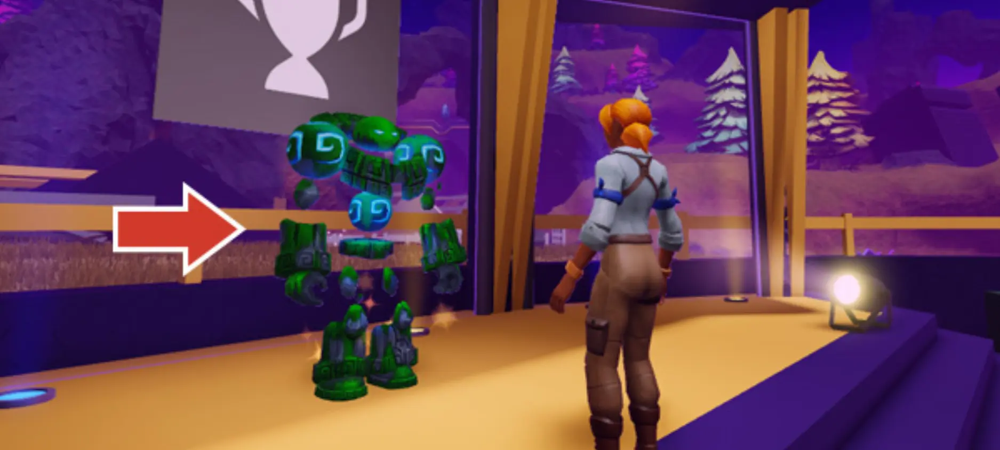

# Challenge Checkpoint

## 목차
- [Challenge Checkpoint](#challenge-checkpoint)
  - [목차](#목차)
  - [출처](#출처)
  - [다음](#다음)

---

애니메이션이 준비되었습니다! 새로운 기술을 축하하며 **Hustle Hat**과 **Strike a Pose** 배지를 받으세요.

1. 아래 코드를 **복사**하세요.

   `StrikeAPose`

2. 아래의 **Enter World**를 클릭하여 Roblox 게임을 여세요. 게임에서 Freddie라는 캐릭터와 상호작용하고 **REDEEM CODE**를 클릭하세요. 이 페이지에서 복사한 코드를 사용하여 아이템을 받으세요.

   

   <a href="https://www.roblox.com/games/5306359293/Island-of-Move">
   <Button variant="contained">Enter World</Button>
   </a>

---
## 출처
[Challenge Checkpoint](https://create.roblox.com/docs/ko-kr/education/build-it-play-it-island-of-move/challenge-checkpoint-2)

---
## [다음](./03_12_Exporting_Animations.md)
