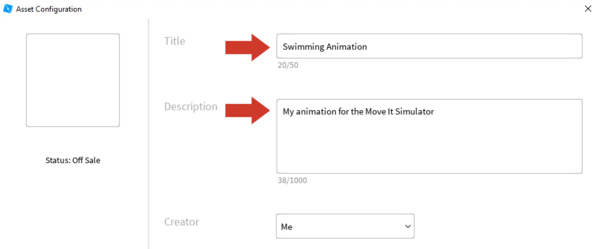

# Exporting Animations

## 목차
- [Exporting Animations](#exporting-animations)
  - [목차](#목차)
  - [애니메이션 ID 가져오기](#애니메이션-id-가져오기)
  - [출처](#출처)
  - [다음](#다음)

---

애니메이션을 만들었지만 이제 게임에 추가해야 합니다. 애니메이션을 사용하려면 애니메이션 편집기에서 Roblox 플랫폼으로 내보내야 합니다.

1. 애니메이션 편집기에서 **...**을 클릭하고 **내보내기**를 선택하세요.

   

   <Alert severity="warning">
   <AlertTitle>애니메이션 편집기가 비어 있나요?</AlertTitle>
   Studio를 닫은 경우 애니메이션 편집기가 비어 있거나 닫혀 있을 수 있습니다.

   - 편집기를 열려면 Plugins → Animation Editor로 이동하세요.
   - 편집기가 비어 있으면 받침대에 있는 피규어를 다시 선택하세요.

    </Alert>

2. 팝업 창에서 애니메이션의 **이름**과 **설명**을 입력하세요.

   

3. **제출**을 클릭하세요.

   

## 애니메이션 ID 가져오기

애니메이션 ID는 게임이 어떤 애니메이션을 재생할지 알 수 있게 합니다. 게임에서 플레이어를 위한 내보낸 애니메이션의 ID를 사용하게 됩니다.

1. 애니메이션이 내보내지면  아이콘을 클릭하여 **ID를 복사**하세요. 녹색 "**_ID Copied!_**" 텍스트가 표시될 것입니다.

   

2. **닫기** 버튼을 누르세요.

---
## 출처
[Exporting Animations](https://create.roblox.com/docs/ko-kr/education/build-it-play-it-island-of-move/exporting-animations)

---
## [다음](./03_13_Change_the_Animation.md)
