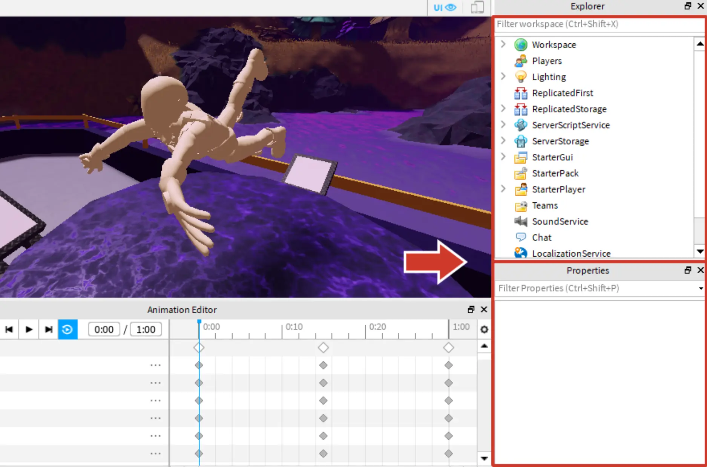
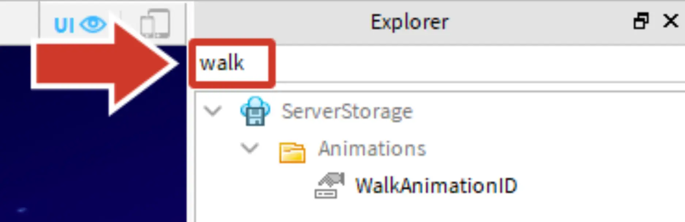
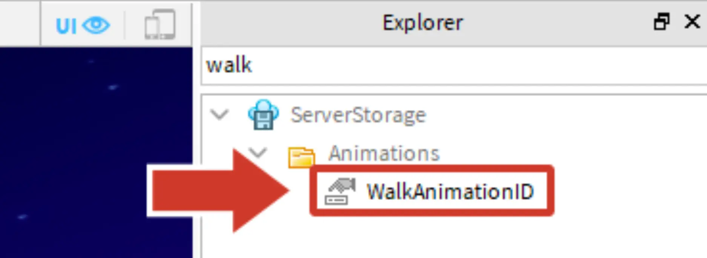
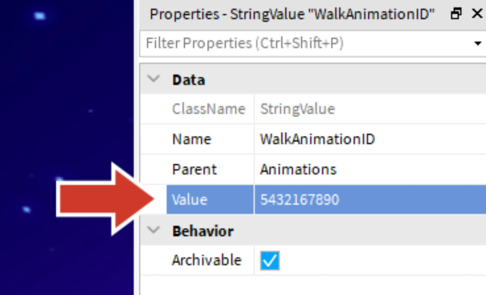
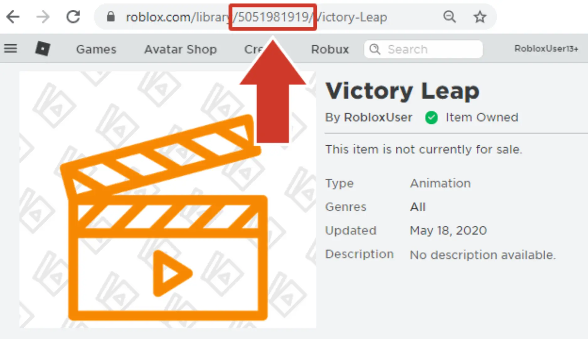

# Change the Animation

## 목차
- [Change the Animation](#change-the-animation)
  - [목차](#목차)
  - [애니메이션 ID 변경하기](#애니메이션-id-변경하기)
  - [테스트 및 확인](#테스트-및-확인)
  - [문제 해결 팁](#문제-해결-팁)
  - [출처](#출처)
  - [다음](#다음)

---
템플릿에는 플레이어가 달릴 때 사용할 애니메이션을 미리 설정할 수 있는 기능이 있습니다. 애니메이션을 변경하려면 기본 애니메이션을 자신의 애니메이션으로 교체해야 합니다.

## 애니메이션 ID 변경하기

이제 애니메이션 ID를 가지고 있으니 게임에 입력할 수 있습니다. 그러면 스튜디오가 어떤 애니메이션을 재생할지 알게 됩니다.

1. 스튜디오 오른쪽에 **Explorer**와 **Properties**라는 두 창이 표시되는지 확인하세요.

   

   <Alert severity="warning">
   <AlertTitle>Explorer나 Properties가 보이지 않나요?</AlertTitle>
   둘 중 하나라도 보이지 않으면 **View** 탭으로 이동하세요. 그런 다음 **Explorer**와 **Properties**를 모두 클릭하세요.
   </Alert>

2. 화면 오른쪽의 **Explorer**에서 게임의 모든 객체가 나열된 목록을 찾으세요.

3. 걷기 설정을 찾으려면 **검색 창**에 "walk"를 입력하세요.

   

4. **_WalkAnimationID_**를 클릭하세요.

   

5. Explorer 아래에서 **Properties** 창을 찾으세요.

6. **Value** 필드를 클릭하고 애니메이션 ID를 붙여넣기 하세요. (<kbd>Ctrl</kbd> + <kbd>V</kbd> 또는 <kbd>⌘</kbd> + <kbd>V</kbd>)

   

   <Alert severity="warning">
   <AlertTitle>애니메이션 ID가 필요하신가요?</AlertTitle>
   아무 것도 붙여넣기 되지 않았거나 다른 텍스트가 사용된 경우 애니메이션 ID를 다시 가져와야 합니다.

   1. [애니메이션](https://www.roblox.com/develop?View=24) 섹션의 **Create** 페이지를 엽니다.
   2. 내보낸 애니메이션을 찾아 클릭합니다.
   3. 브라우저의 URL에서 **ID**를 복사합니다.
      

   </Alert>

## 테스트 및 확인

애니메이션을 교체한 후 게임을 플레이하여 결과를 확인하세요.

1. **Play** 버튼을 누르세요.

2. 게임에서 **Move** 버튼을 눌러 애니메이션이 재생되는지 확인하세요.

   <video controls src="../img/03_13_Change_the_Animation/finished-animation.mp4" width="100%"></video>

   <Alert severity="warning">
   애니메이션을 업데이트하면 다시 **내보내기**를 해야 합니다.
   </Alert>

## 문제 해결 팁

**문제:** 애니메이션이 끊기거나 오류가 있는 것처럼 보입니다.

- 첫 번째와 마지막 포즈가 동일한지 확인하세요. 첫 번째 포즈의 다이아몬드를 마우스 오른쪽 버튼으로 클릭하고 복사합니다. 그런 다음 타임라인 끝에 해당 포즈를 붙여넣기 합니다.
- 선택한 피규어가 흰색 그리드 안에 있는지 확인하세요. 그렇지 않으면 벽이나 바닥을 통과할 수 있습니다.

**문제:** 애니메이션이 작업 중인 것이 아닙니다.

- 애니메이션 편집기를 통해 애니메이션을 게시했는지 확인하세요.
- Explorer에서 WalkAnimationID라는 객체를 찾으세요. 그 값이 숫자만 포함되어 있는지 확인하세요.

---
## 출처
[Change the Animation](https://create.roblox.com/docs/ko-kr/education/build-it-play-it-island-of-move/change-the-animation)

---
## [다음](./03_14_Invite_Friends_to_Play.md)
