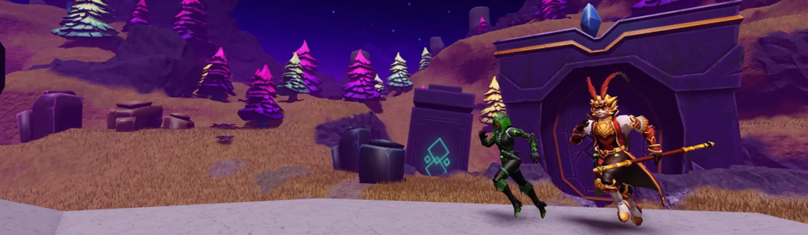
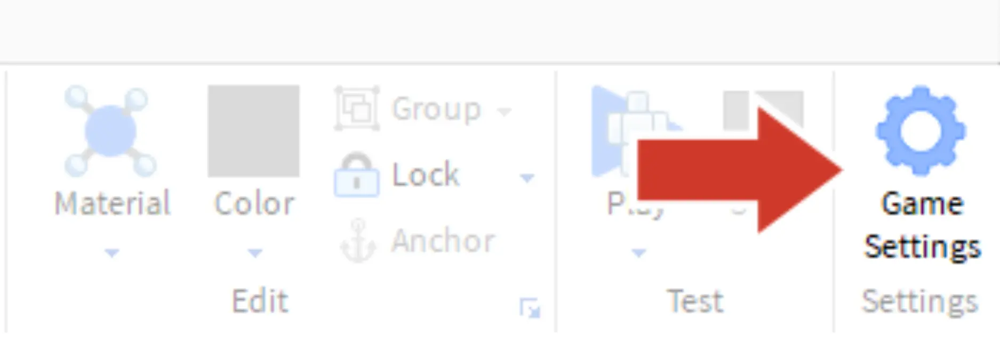
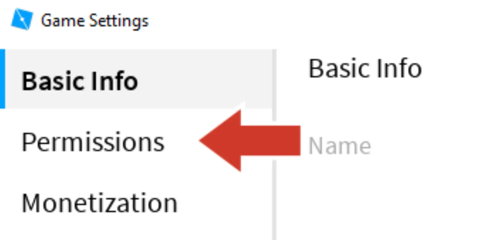
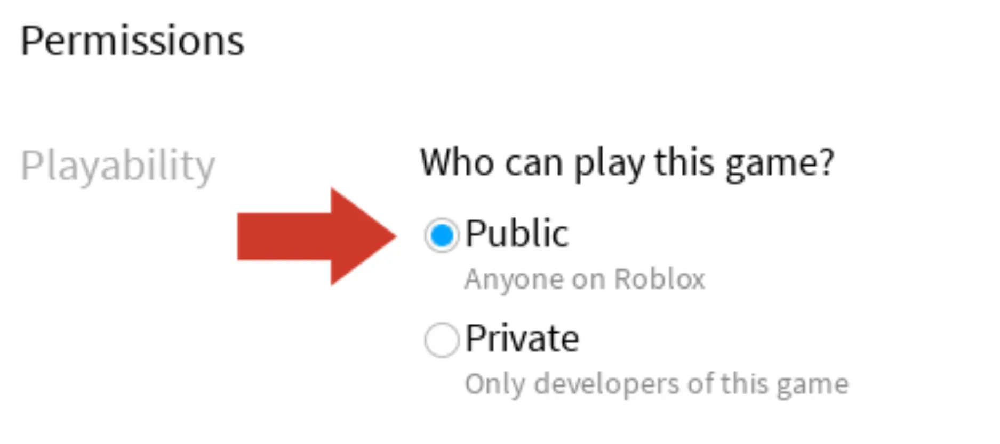

# Invite Friends to Play

## 목차
- [Invite Friends to Play](#invite-friends-to-play)
  - [목차](#목차)
  - [출처](#출처)
  - [다음](#다음)

---

움직이는 것은 친구들과 함께할 때 더 재미있습니다. 그래서 다른 사람들이 플레이할 수 있도록 게임을 설정해 봅시다. 게임이 처음 게시되면 자동으로 비공개로 설정됩니다. 이를 공개로 설정하여 다른 사람들이 참여할 수 있게 만드세요.

1. 게임을 **게시**하여 친구들이 최신 변경 사항을 확인할 수 있도록 합니다.

2. **Home** 탭에서 **Game Settings**를 클릭합니다.

   

3. 왼쪽 메뉴에서 **Permissions**를 선택합니다.

   

4. **Public**을 선택합니다.

   

5. **Save**를 클릭합니다.

---
## 출처
[Invite Friends to Play](https://create.roblox.com/docs/ko-kr/education/build-it-play-it-island-of-move/invite-friends-to-play)

---
## [다음](./03_15_Challenge_Checkpoint.md)
