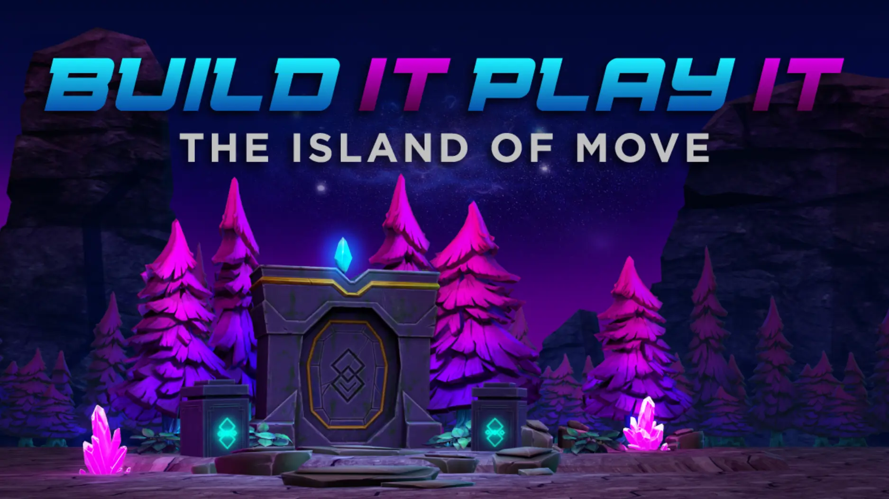

# Island of Move

## 목차
- [Island of Move](#island-of-move)
  - [목차](#목차)
  - [출처](#출처)
  - [다음](#다음)

---

Roblox Studio를 사용하여 플레이어가 모바일 기기로 실제 생활에서 움직이면서 레벨업하는 경험을 만드는 방법을 알려드리겠습니다. 플레이어가 어떻게 움직이는지는 여러분에게 달려 있습니다! 공중에서 수영하든, 트랙을 통해 춤을 추든, 상상력이 유일한 한계입니다.

Roblox에서 처음으로 건축을 하시나요, 아니면 이미 경험이 있으신가요? 애니메이션 제작에 관심 있는 모든 경험 수준을 위한 튜토리얼이 준비되어 있습니다.

---
## 출처
[Island of Move](https://create.roblox.com/docs/ko-kr/education/build-it-play-it-island-of-move/landing)

---
## [다음](./04_02_Animations_and_Feedback.md)
