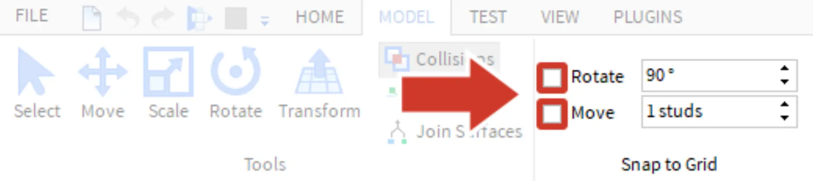
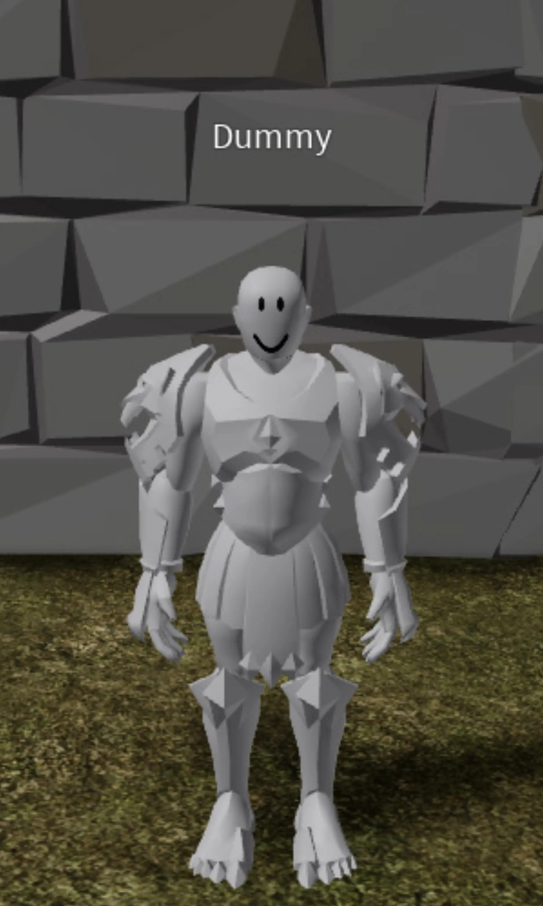

# Animations and Feedback

## 목차
- [Animations and Feedback](#animations-and-feedback)
  - [목차](#목차)
  - [애니메이션과 피드백](#애니메이션과-피드백)
  - [프로젝트 설정](#프로젝트-설정)
  - [애니메이션 설정](#애니메이션-설정)
    - [새로운 애니메이션 만들기](#새로운-애니메이션-만들기)
  - [출처](#출처)
  - [다음](#다음)

---
경험이 풍부한 개발자이신가요? 아니면 이제 막 시작하셨나요? 이 Build It, Play It Challenge에서 플레이어의 업적을 축하하는 승리 애니메이션을 만들어보세요! 완료 후에는 이 애니메이션을 어떤 경험에든 추가하여 작업을 더욱 매력적이고 흥미롭게 만들 수 있습니다. 이러한 애니메이션은 플레이어가 경기를 이기거나, 체크포인트에 도달하거나, 레벨업할 때 피드백을 제공하는 데 완벽합니다.

아래는 이 시리즈가 끝날 때 기대할 수 있는 애니메이션의 예입니다.

<video controls src="../img/04_02_Animations_and_Feedback/victoryPose_finalSingleObbyExample_web.mp4" width="100%"></video>

## 애니메이션과 피드백

애니메이션을 만드는 방법을 배우기 전에 애니메이션과 피드백이 어떻게 연결되는지 잠시 생각해보세요. 몬스터와 싸우는 어드벤처 게임을 상상해보세요. 몬스터를 때린 후 아무 일도 일어나지 않고 반응도 없고 사운드 효과도 없습니다. 게임이 고장난 것처럼 느껴질 수 있지만, 몇 번 더 때리면 몬스터가 그냥 사라집니다.

<video controls src="../img/04_02_Animations_and_Feedback/showNPCAnimationsFeedback_noFeedback.mp4" width="100%"></video>

이 시나리오는 몬스터가 사용자에게 **피드백**을 제공하지 않기 때문에 좌절감을 줍니다. 현실과 마찬가지로 플레이어가 게임 내에서 **행동**을 할 때 **반응**을 기대합니다. 정보가 풍부하고 시각적으로 매력적인 피드백을 설계하는 것은 플레이어를 참여시키는 성공적인 경험을 설계하는 데 매우 중요합니다.

피드백을 제공하는 한 가지 방법은 애니메이션입니다. 플레이어가 적을 공격하는 등의 행동을 할 때 애니메이션은 상대방이 공격받는 반응을 보여줄 수 있습니다. 이 반응은 플레이어에게 행동이 어떤 결과를 가져왔다는 것을 알려주어 세계의 일부분이 된 것처럼 느끼게 하고 혼란의 가능성을 줄입니다.

<video controls src="../img/04_02_Animations_and_Feedback/showNPCAnimationsFeedback_withFeedback.mp4" width="100%"></video>

## 프로젝트 설정

승리 애니메이션을 만드는 첫 번째 단계는 애니메이션 에디터를 사용하여 애니메이션을 만드는 것입니다. 나중에 코드를 연결하여 플레이어의 게임 내 업적을 축하할 것입니다. 이 코드는 여러분이 만든 어떤 경험에서도 작동할 것입니다.

<video controls src="../img/04_02_Animations_and_Feedback/showFinalAnimation_singleAlt.mp4" width="100%"></video>

## 애니메이션 설정

먼저 일부 설정을 변경하고 애니메이션 에디터를 엽니다. Roblox Studio는 사용자 지정 애니메이션을 디자인하고 게시할 수 있는 강력한 내장 애니메이션 에디터를 제공합니다.

1. Roblox Studio에서 프로젝트를 시작하거나 엽니다.
2. 애니메이션을 위해 부품을 자유롭게 조작해야 합니다. 이를 위해 Model 탭으로 가서 Rotate 및 Move 스냅핑이 꺼져 있는지 확인하세요.

   

3. 애니메이션 에디터를 열려면 Plugins > Animation Editor로 이동합니다.

   

4. 플레이어 애니메이션을 만들려면 캐릭터 리그가 필요합니다. Plugins 탭에서 Build Rig를 클릭합니다. 다음 팝업에서 원하는 리그를 선택합니다.

   <GridContainer numColumns="2">
     
     
   </GridContainer>

### 새로운 애니메이션 만들기

걷기나 점프와 같은 개별 애니메이션은 만들어서 저장해야 합니다.

1. 애니메이션 에디터에서 새로운 애니메이션 이름을 입력하고 Create를 클릭합니다.

   

2. 애니메이션을 만들려면 리그의 부품을 애니메이션 에디터에 추가해야 합니다. **(+)** 아이콘을 클릭하고 **Add All**을 선택합니다.

   

   <Alert severity="info">
   기본적으로 모든 새로운 애니메이션의 길이는 1초로 설정됩니다(1:00으로 표시됨). 다른 길이를 원하면 위치 표시기의 두 번째 상자를 변경하세요.

   
   </Alert>

---
## 출처
[Animations and Feedback](https://create.roblox.com/docs/ko-kr/education/build-it-play-it-island-of-move/animations-and-feedback)

---
## [다음](./04_03_Designing_Poses.md)
