# Designing Poses

## 목차
- [Designing Poses](#designing-poses)
  - [목차](#목차)
  - [기본 자세 설정](#기본-자세-설정)
  - [두 번째 포즈 만들기](#두-번째-포즈-만들기)
  - [세 번째 포즈 만들기](#세-번째-포즈-만들기)
  - [마지막 포즈 추가](#마지막-포즈-추가)
  - [애니메이션 테스트](#애니메이션-테스트)
  - [개선 및 내보내기](#개선-및-내보내기)
    - [포즈 추가](#포즈-추가)
    - [키프레임 이동](#키프레임-이동)
  - [애니메이션 내보내기](#애니메이션-내보내기)
  - [출처](#출처)
  - [다음](#다음)

---
이제 애니메이션이 설정되었으니 포즈를 만들기 시작할 시간입니다. 주요 포즈는 플레이어가 점프하거나 도구를 휘두르기 시작하는 순간과 같은 중요한 동작 지점입니다. 애니메이션에는 하나 이상의 주요 포즈가 있을 수 있습니다.

자신의 애니메이션을 생각할 때 이를 주요 포즈 세트로 나누는 것을 상상해보세요. 이 예제에서는 이러한 포즈로 축하 점프를 만드는 방법을 안내하겠습니다. 자신의 애니메이션에는 더 많거나 적은 포즈가 있을 수 있습니다.

<GridContainer numColumns="3">
  <figure>
    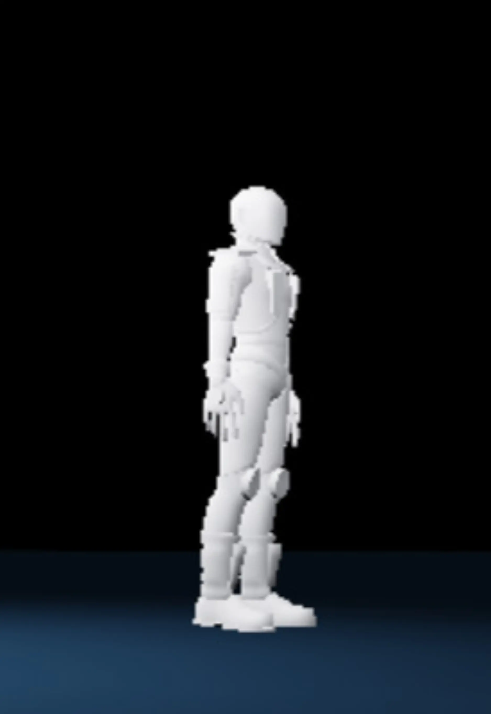
    <figcaption>기본 자세</figcaption>
  </figure>
  <figure>
    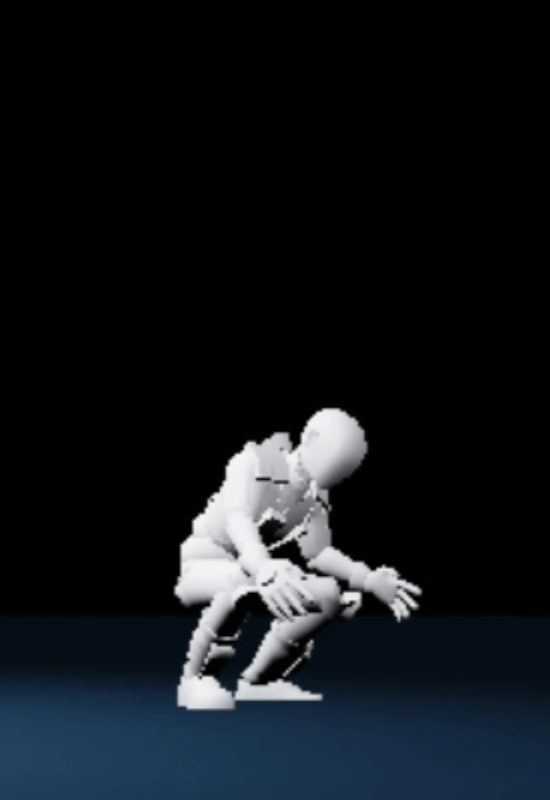
    <figcaption>몸을 움츠리기</figcaption>
  </figure>
  <figure>
    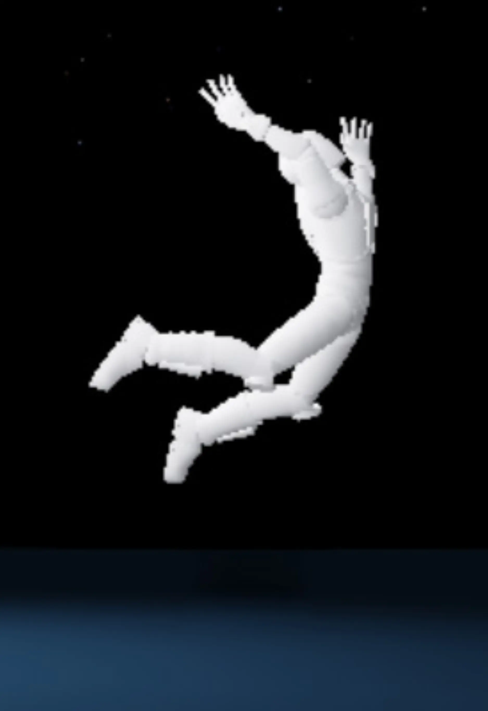
    <figcaption>도약</figcaption>
  </figure>
</GridContainer>

애니메이션 과정은 아바타의 부품을 이동하고 회전하여 주요 포즈를 만드는 것입니다. 애니메이션이 실행될 때, Studio는 포즈를 부드러운 동작으로 연결합니다.

<video controls src="../img/04_03_Designing_Poses/showOverallAnimationTimelapse_optimized.mp4" width="100%"></video>

## 기본 자세 설정

이 애니메이션의 시작과 끝에 사용되는 **기본** 자세는 플레이어가 휴식 중인 상태를 나타냅니다. 애니메이션이 플레이어의 휴식 상태로 시작되도록 시작 부분에 키프레임을 추가합니다. 애니메이션 과정에서 키프레임은 부품이 어떻게 배치되는지에 대한 정보를 저장합니다.

1. 애니메이션 에디터 타임라인에서 첫 번째 트랙을 오른쪽 클릭하고 Add Keyframe Here를 선택합니다. 이는 플레이어의 각 부품에 대해 키프레임을 만듭니다.

   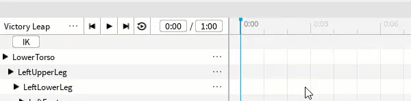

## 두 번째 포즈 만들기

두 번째 포즈는 플레이어가 도약하기 전에 몸을 움츠리는 모습을 보여줍니다. 애니메이션에 따라 두 번째 포즈는 다를 수 있습니다.

1. 리그가 선택되어 있는지 확인합니다. 그런 다음, 애니메이션 시간을 길이의 3분의 1로 설정합니다 (예: 0:09).

   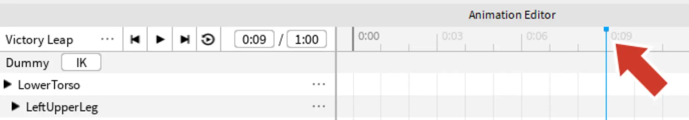

2. **Rotate** 도구를 사용하여 리그의 포즈를 시작합니다. 애니메이터가 포즈를 시작하는 한 가지 방법은 어깨와 같은 몸통에 연결된 부품으로 시작한 다음 손과 같은 부품으로 이동하는 것입니다.

   <video controls src="../img/04_03_Designing_Poses/showRotateArms_web.mp4" width="100%"></video>

   <Alert severity="info">
   모델의 부품을 클릭하는 대신, 애니메이션 에디터 계층에서 선택하는 것이 도움이 될 수 있습니다. 특히 손과 같은 작은 부품의 경우 그렇습니다.

   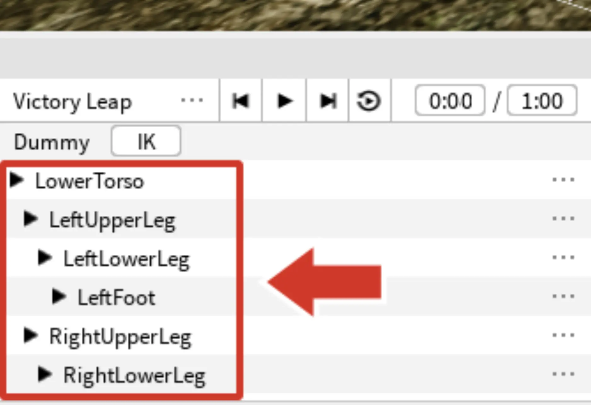
   </Alert>

3. 이 애니메이션에서는 플레이어가 점프하기 전에 몸을 움츠립니다. 다른 포즈를 하고 있다면 리그를 다르게 이동해야 할 수 있습니다. 리그를 이동하려면:

   - <kbd>R</kbd> 키를 눌러 Move 도구로 전환합니다.
   - LowerTorso 부품을 클릭하고(리그나 애니메이션 계층에서) 몸을 약간 아래로 위치시킵니다. 이 부품을 이동하면 전체 리그가 이동합니다.

   <video controls src="../img/04_03_Designing_Poses/showMoveBody.mp4" width="100%"></video>

   <Alert severity="warning">
   LowerTorso만 이동하세요. LowerTorso 외의 부품을 이동하면 몸 부품이 리그에서 분리될 수 있습니다.
   </Alert>

4. <kbd>R</kbd> 키를 눌러 Move와 Rotate 도구를 전환하며 리그를 계속 포즈를 잡습니다.

   <video controls src="../img/04_03_Designing_Poses/showPose2TimeLapse_optimized.mp4" width="100%"></video>

## 세 번째 포즈 만들기

다음 키프레임 세트는 중간에 있으며 애니메이션의 가장 극단적인 동작을 보여줍니다. 이 애니메이션에서는 아바타가 점프의 최고점에 있을 것입니다.

1. 상단 막대를 클릭하여 애니메이션 시간을 중간으로 설정합니다.

   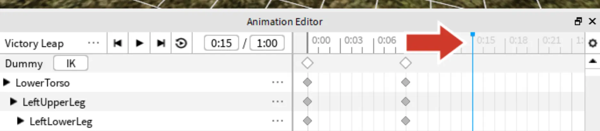

    <Alert severity="info">
    정확한 시간은 위치 표시기의 첫 번째 상자에 입력할 수 있습니다.

    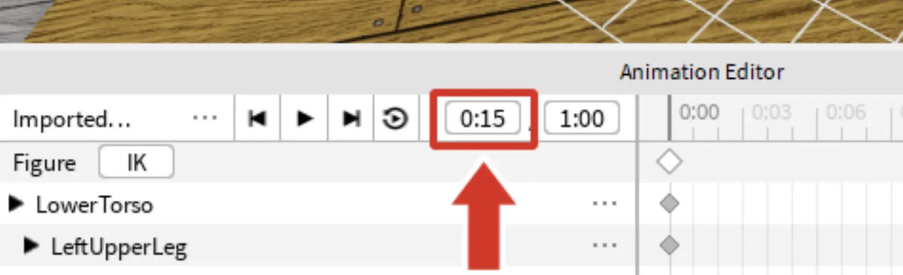

    </Alert>

2. 아래와 같이 Rotate 및 Move를 사용하여 포즈를 애니메이션화합니다. 작업하면서 움직임을 과장하여(팔을 더 넓게 벌리거나 머리를 돌리는 등) 애니메이션을 더 명확하고 흥미롭게 만드세요.

   <GridContainer numColumns="2">
     <figure>
       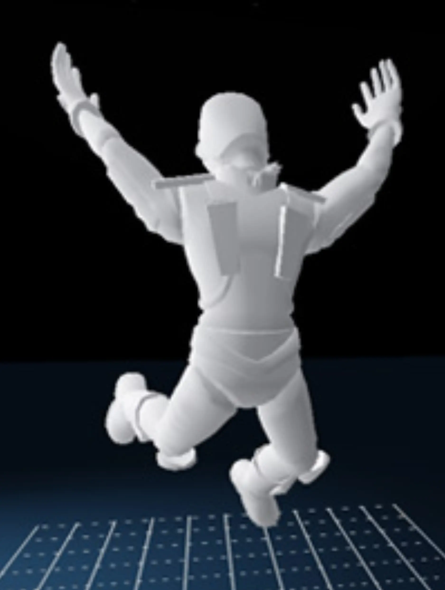
       <figcaption>전면 보기</figcaption>
     </figure>
     <figure>
       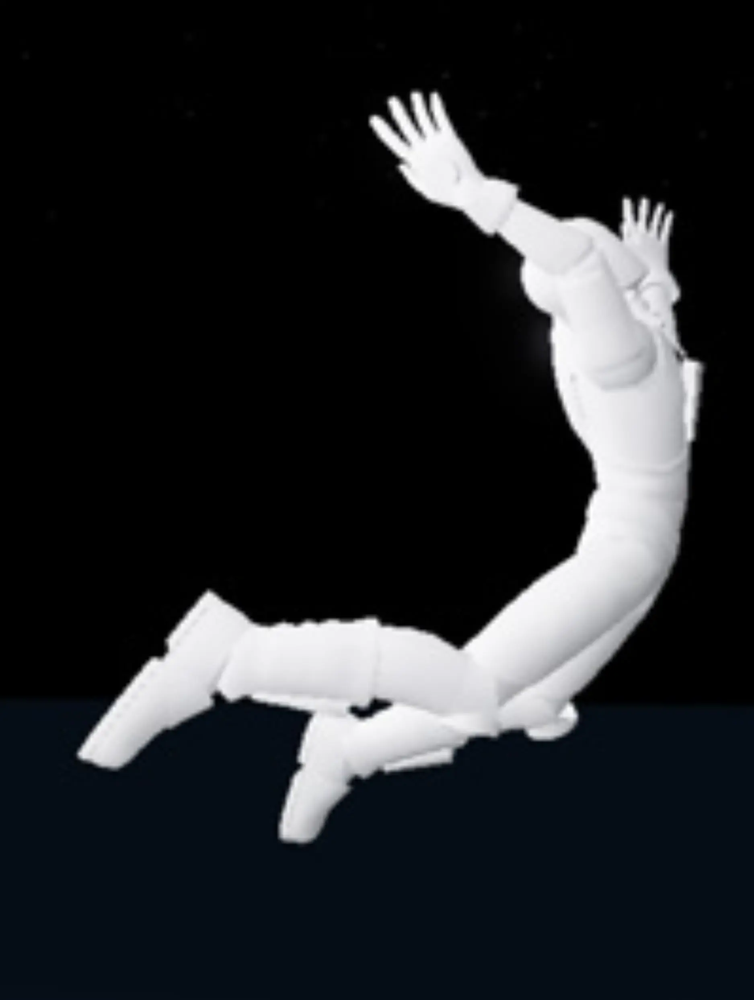
       <figcaption>측면 보기</figcaption>
     </figure>
   </GridContainer>

## 마지막 포즈 추가

마지막 포즈는 첫 번째 포즈를 복사하여 끝에 붙여넣습니다. 마지막 기본 포즈를 사용자 지정할 수도 있지만, 이는 애니메이션이 시작 지점으로 돌아가 부드럽게 반복되도록 하는 빠른 방법입니다.

1. 첫 번째 포즈의 타임라인에서 상단 키프레임을 선택합니다. 해당 지점의 모든 키프레임을 선택한 다음, 복사합니다 (<kbd>Ctrl</kbd> + <kbd>C</kbd> 또는 <kbd>⌘</kbd> + <kbd>C</kbd>).

   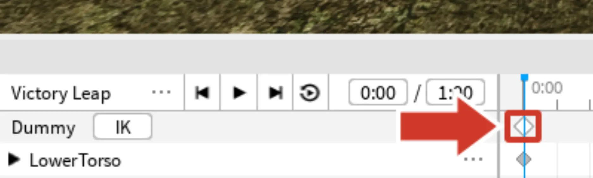

2. 타임라인을 클릭하거나 위치 표시기의 첫 번째 상자에 해당 값을 입력하여 애니메이션의 끝으로 이동합니다(예: 1:00).

3. 키프레임을 붙여넣습니다 (<kbd>Ctrl</kbd> + <kbd>V</kbd> 또는 <kbd>⌘</kbd> + <kbd>V</kbd>).

   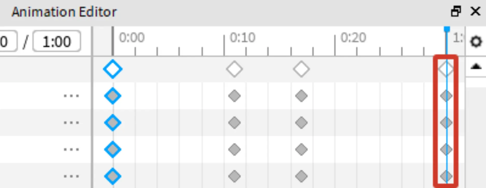

## 애니메이션 테스트

애니메이션을 여러 번 재생하면 변경하고 싶은 부분을 쉽게 찾을 수 있습니다.

1. **Looping**을 켜서 애니메이션 재생이 반복되도록 합니다.

   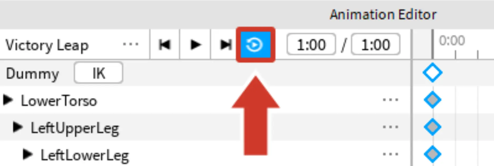

2. **Play**를 누릅니다.

   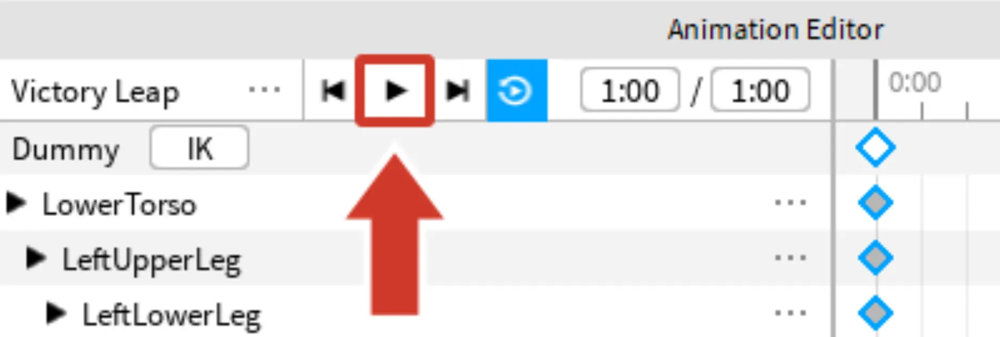

   <video controls src="../img/04_03_Designing_Poses/showFinalVictoryPose_simple.mp4" width="100%"></video>

## 개선 및 내보내기

키프레임을 만든 후에는 프레임을 추가하거나 미세 조정하여 애니메이션을 더욱 만족스럽게 만드세요. 아래는 애니메이션을 개선하는 몇 가지 선택적 방법입니다.

### 포즈 추가

추가 포즈는 애니메이션을 "그저 괜찮은" 것에서 "멋진" 것으로 바꿀 수 있는 미세한 디테일을 추가할 수 있습니다. 추가 포즈를 사용하여 움직임을 과장하거나, 기대감을 나타내거나, 캐릭터의 성격을 전달하세요.

예를 들어, 아래 비디오를 몇 번 주의 깊게 시청하세요. 오른쪽 애니메이션이 더 많은 포즈를 가지고 있어 더 다양한 표현 범위를 제공하는 것을 알

 수 있습니다.

<video controls src="../img/04_03_Designing_Poses/showImprovedAnimationMoreFrames_improved_optimized.mp4" width="100%"></video>

### 키프레임 이동

키프레임이 발생하는 시간을 조정하여 동작을 부드럽게 하거나 더 현실감 있게 만드세요.

1. 키프레임을 클릭합니다. 전체 포즈나 개별 부품을 선택할 수 있습니다.

   <GridContainer numColumns="2">
     <figure>
       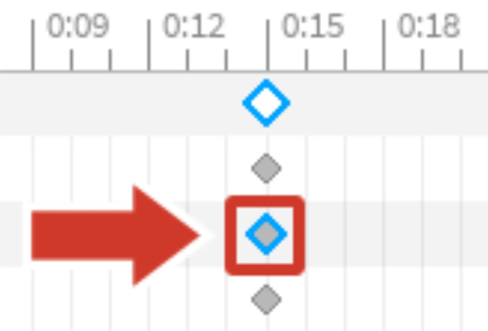
       <figcaption>개별 부품 선택</figcaption>
     </figure>
     <figure>
       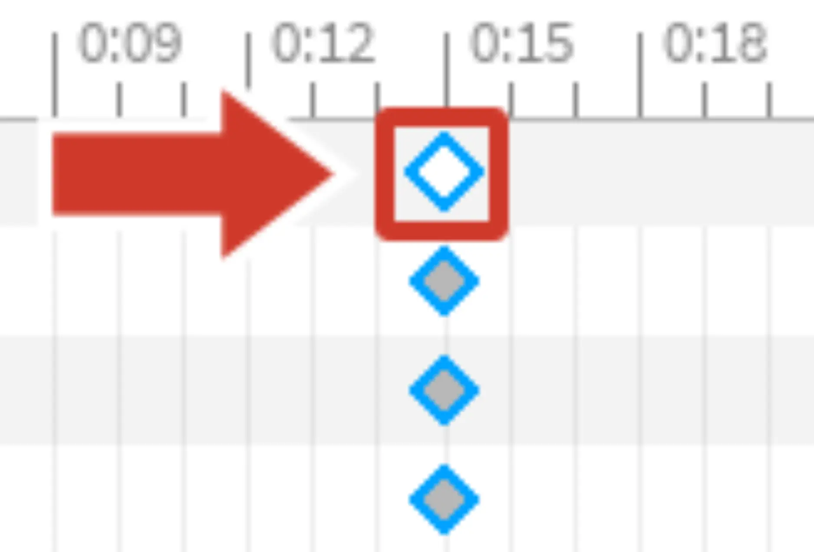
       <figcaption>전체 포즈 선택</figcaption>
     </figure>
   </GridContainer>

2. 키프레임을 왼쪽이나 오른쪽으로 끌어 새 위치에 놓습니다. 아래 비디오에서 애니메이션을 이동하면 어떻게 더 "생기 있는" 느낌이 드는지 확인하세요.

   <video controls src="../img/04_03_Designing_Poses/showChangeFrameDifference_opt.mp4" width="100%"></video>

## 애니메이션 내보내기

완료되면 애니메이션을 내보내서 게임에 추가할 수 있습니다.

1. 애니메이션 에디터 창의 왼쪽 상단에 있는 <code>...</code> 버튼을 클릭합니다.

   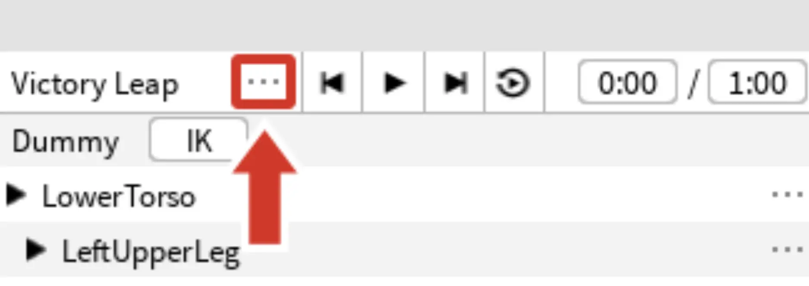

2. 그런 다음, **Export**를 선택합니다. 대화 상자를 따릅니다.

   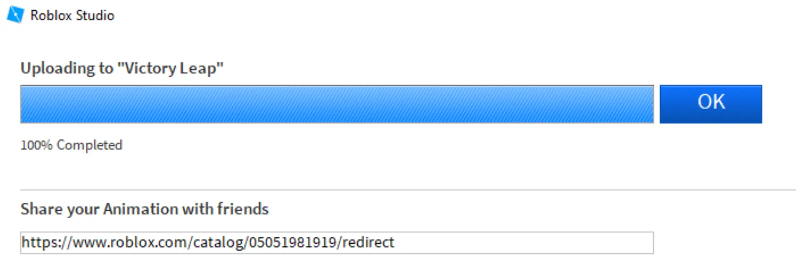

   <Alert severity="info">
   애니메이션에 추가 변경 사항이 있는 경우, 최신 버전을 보려면 다시 내보내는 것을 잊지 마세요.
   </Alert>

첫 애니메이션을 만들었습니다! 이제 게임에 추가해보세요.

---
## 출처
[Designing Poses](https://create.roblox.com/docs/ko-kr/education/build-it-play-it-island-of-move/designing-poses)

---
## [다음](./04_04_Adding_Animations.md)
