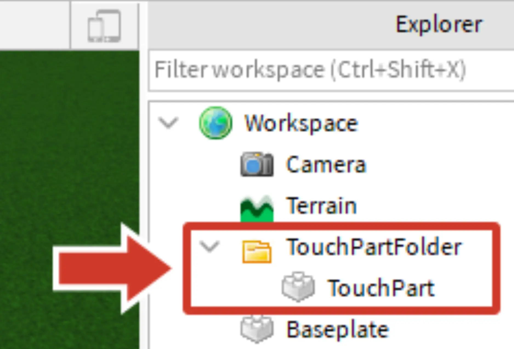
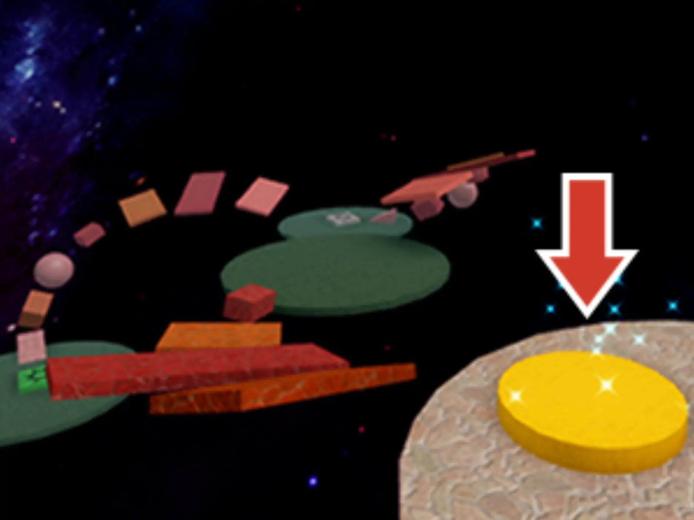
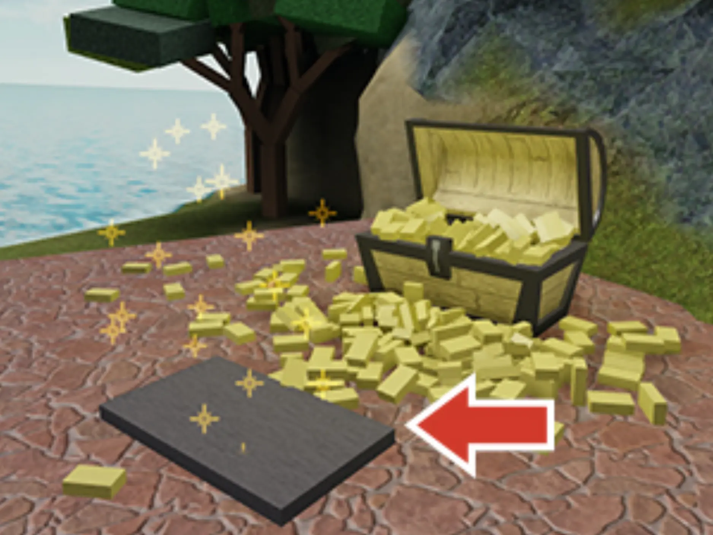
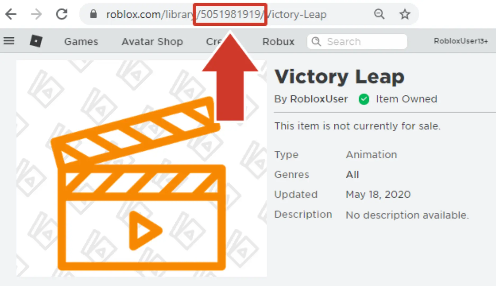
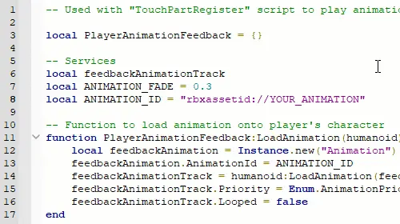

# Adding Animations

## 목차
- [Adding Animations](#adding-animations)
  - [목차](#목차)
  - [애니메이션 스크립팅](#애니메이션-스크립팅)
    - [프로젝트 설정](#프로젝트-설정)
  - [애니메이션 재생](#애니메이션-재생)
    - [애니메이션 설정](#애니메이션-설정)
  - [다음 단계](#다음-단계)
    - [애니메이션에 대해 배우기](#애니메이션에-대해-배우기)
    - [부품 애니메이션](#부품-애니메이션)
  - [출처](#출처)
  - [다음](#다음)

---
게임 내에서 애니메이션을 구현하려면 스크립트를 사용해야 합니다. 이 튜토리얼에서는 미리 만들어진 스크립트를 사용하여 이전에 만든 승리 애니메이션을 구현하는 방법을 배웁니다. 완료되면 이 애니메이션을 사용하여 플레이어가 오비의 끝에 도달하거나 비밀을 찾는 등 업적을 축하할 수 있습니다.

## 애니메이션 스크립팅

애니메이션은 **스크립트**를 사용하여 트리거됩니다. 한 가지 접근 방식은 이벤트를 사용하여 애니메이션을 다양한 상황에서 재생하는 것입니다. 예를 들어, 플레이어가 레벨을 완료하거나 적을 물리치거나 게임 내 구매를 할 때 애니메이션을 재생할 수 있습니다.

### 프로젝트 설정

이 프로젝트에서는 플레이어가 만졌을 때 해당 플레이어에게 애니메이션을 트리거하는 파트를 만듭니다.

1. 애니메이션을 재생할 모든 파트를 정리하려면 Workspace에 TouchPartFolder라는 이름의 폴더를 추가합니다(Workspace 위로 마우스를 올리고 +를 클릭).

2. TouchPartFolder에 파트를 추가합니다.

   

   파트가 애니메이션을 재생할 위치에 적절하게 배치되었는지 확인합니다. 예를 들어, 레벨의 끝이나 플레이어가 수집할 객체 근처에 배치합니다.

   <GridContainer numColumns="2">
     <figure>
       
       <figcaption>예시 승리 파트</figcaption>
     </figure>
     <figure>
       
       <figcaption>예시 상호작용 파트</figcaption>
     </figure>
   </GridContainer>

3. StarterPlayer > StarterCharacterScripts에 TouchPartRegister라는 이름의 LocalScript를 만듭니다. 그런 다음 아래 코드를 복사하여 붙여넣습니다.

   ```lua
   -- Used with "PlayerAnimationFeedback" script to play animations on part touches

   -- Services
   local ReplicatedStorage = game:GetService("ReplicatedStorage")
   local Players = game:GetService("Players")

   local player = Players.LocalPlayer
   local character = player.Character or player.CharacterAdded:Wait()
   local humanoid = character:WaitForChild("Humanoid")
   local canTouch = false

   -- Include feedback animation module
   local PlayerAnimationFeedback = require(ReplicatedStorage:WaitForChild("PlayerAnimationFeedback"))

   -- Function called when a part is touched
   local function onPartTouch(otherPart)
     if humanoid and canTouch == false then
       canTouch = true
       PlayerAnimationFeedback:PlayAnimation()
       canTouch = false
     end
   end

   -- On startup, call animation module load function
   PlayerAnimationFeedback:LoadAnimation(humanoid)
   -- Also bind a folder of parts to the "Touched" event to run "onPartTouch()"
   local touchPartFolder = workspace:WaitForChild("TouchPartFolder")
   local touchParts = touchPartFolder:GetChildren()

   for i, touchPart in touchParts do
     touchPart.Touched:Connect(onPartTouch)
   end
   ```

   이 스크립트는 TouchPartFolder의 모든 파트를 찾아 `Touched()` 이벤트를 부여합니다. 이벤트가 트리거되면 플레이어에게 애니메이션을 재생하는 함수를 실행합니다.

    <Alert severity="info">
    이 스크립트는 `Touched()`를 사용하지만, `MouseClick()` 또는 `Changed()`와 같은 다른 이벤트도 사용할 수 있습니다. 또한 TouchPartRegister 스크립트에서 플레이어에게 점수를 부여하는 등 자신의 게임 이벤트를 트리거할 수 있습니다. 추가할 수 있는 예제를 보려면 Health Pickups에 대한 기사를 참조하세요.
    </Alert>

4. 다음 스크립트는 플레이어에게 애니메이션을 트리거합니다. ReplicatedStorage에 PlayerAnimationFeedback라는 이름의 새 ModuleScript를 만듭니다. 그런 다음 아래 코드를 복사하여 붙여넣습니다.

   ```lua
   -- Used with "TouchPartRegister" script to play animations for a player
   local PlayerAnimationFeedback = {}

   local feedbackAnimationTrack
   local ANIMATION_FADE = 0.3
   local ANIMATION_ID = "rbxassetid://YOUR_ANIMATION"

   -- Function to load animation onto player's character
   function PlayerAnimationFeedback:LoadAnimation(humanoid)
     local feedbackAnimation = Instance.new("Animation")
     feedbackAnimation.AnimationId = ANIMATION_ID
     feedbackAnimationTrack = humanoid.Animator:LoadAnimation(feedbackAnimation)
     feedbackAnimationTrack.Priority = Enum.AnimationPriority.Action
     feedbackAnimationTrack.Looped = false
   end

   -- Function to play the animation
   function PlayerAnimationFeedback:PlayAnimation()
     feedbackAnimationTrack:Play(ANIMATION_FADE)
     task.wait(feedbackAnimationTrack.Length)
   end

   return PlayerAnimationFeedback

   ```

## 애니메이션 재생

애니메이션은 스크립트에서 식별, 로드 및 재생해야 합니다.

### 애니메이션 설정

스크립트는 어떤 애니메이션을 재생할지 알아야 합니다. 내보낸 애니메이션을 사용하려면 웹 브라우저를 통해 **애셋 ID**를 찾아야 합니다. 그런 다음 해당 ID를 사용하여 스크립트에서 애니메이션을 로드할 수 있습니다.

1. <a href="https://www.roblox.com/develop?View=24" target="_blank" rel="noopener">Animations</a> 페이지를 엽니다.

2. 내보낸 애니메이션을 찾아 클릭합니다.

3. 브라우저의 URL에서 ID를 복사합니다.

   

4. 스크립트 PlayerAnimationFeedback에서 `YOUR_ANIMATION`(8번째 줄)을 복사한 **ID**로 바꿉니다.

   

5. 프로젝트를 실행하고 플레이어가 파트를 만지면 애니메이션이 재생되는지 테스트합니다.

   <video controls src="../img/04_04_Adding_Animations/victoryPose_finalSingleObbyExample_web.mp4" width="100%"></video>

## 다음 단계

아래는 계속 학습할 수 있는 몇 가지 방법입니다.

### 애니메이션에 대해 배우기

지금까지 애니메이션을 만들고 경험에 추가하는 방법을 배웠습니다. 계속 학습하려면 [애니메이션](https://create.roblox.com/docs/ko-kr/animation) 개요 페이지를 방문하는 것을 권장합니다.

그 페이지에서는 곡선 편집기를 사용하여 부드러운 움직임을 만들거나 애니메이션을 개선하는 팁 등 애니메이션을 개선할 수 있는 유용한 링크를 찾을 수 있습니다.

### 부품 애니메이션

또한 선택 과목인 [부품 애니메이션](https://create.roblox.com/docs/ko-kr/education/build-it-play-it-island-of-move/animating-parts) 수업을 시작하여 부품을 확대, 회전 및 이동할 수 있는 기능인 트윈을 코딩하는 방법을 배우세요. 최종 프로젝트 샘플은 아래에 있습니다.

<video controls src="../img/04_04_Adding_Animations/exampleProject_tweeningButtonDoor.mp4" width="100%"></video>

---
## 출처
[Adding Animations](https://create.roblox.com/docs/ko-kr/education/build-it-play-it-island-of-move/adding-animations)

---
## [다음](./04_05_Animating_Parts.md)
