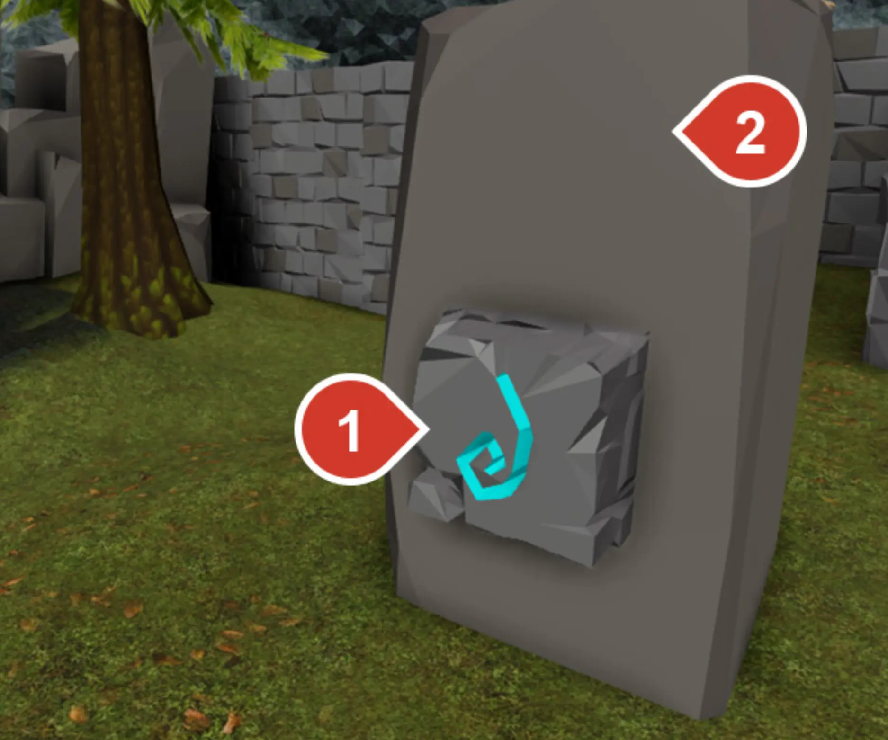
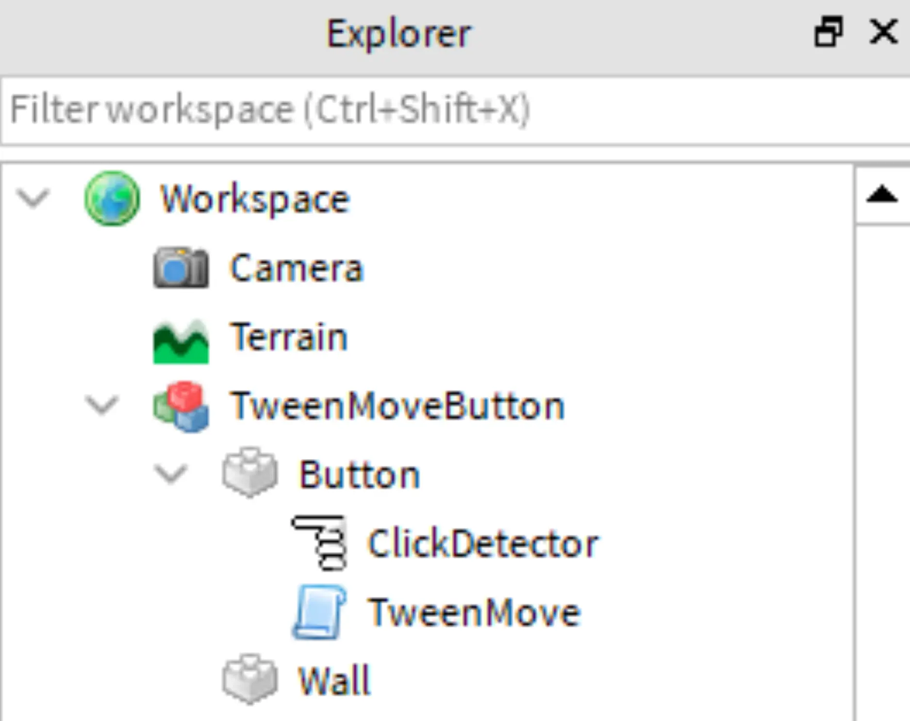
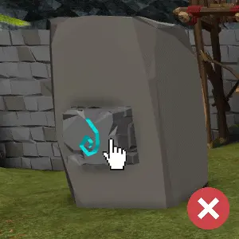
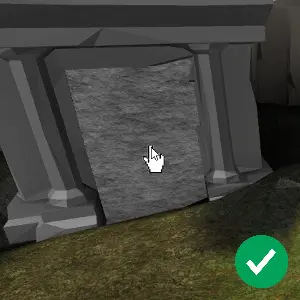
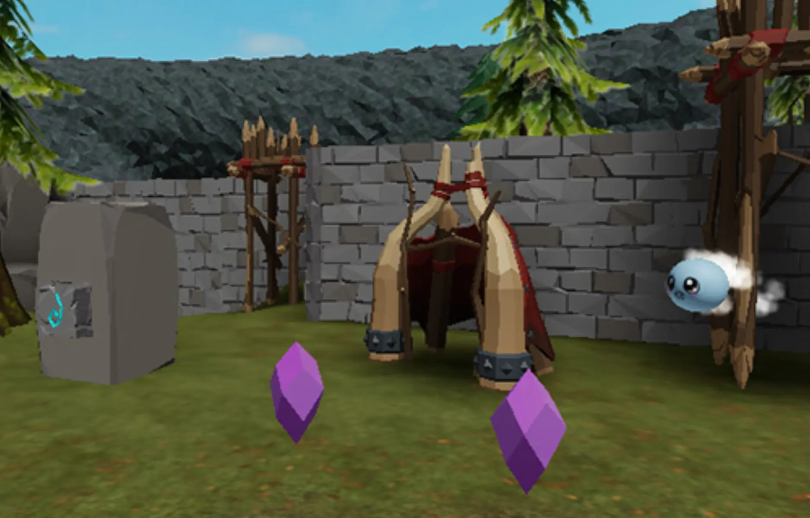

# Animating Parts

## 목차
- [Animating Parts](#animating-parts)
  - [목차](#목차)
  - [애니메이션과 트윈](#애니메이션과-트윈)
    - [프로젝트 설정](#프로젝트-설정)
  - [Move Tween 조정](#move-tween-조정)
    - [위치 변경](#위치-변경)
    - [트윈 시간 및 거리](#트윈-시간-및-거리)
  - [다른 속성 트윈](#다른-속성-트윈)
    - [회전](#회전)
    - [스케일 조정](#스케일-조정)
    - [색상 변경](#색상-변경)
  - [프로젝트 샘플](#프로젝트-샘플)
  - [출처](#출처)
  - [다음](#다음)

---
플레이어는 애니메이션을 통해 자신의 행동이 효과가 있는지 피드백을 받을 수 있습니다. 예를 들어, 나무를 때리면 흔들리거나, 애완동물을 먹이면 기뻐서 뛰어오르는 경우가 있습니다. 이번에는 플레이어가 클릭할 때 버튼이 움직이는 애니메이션을 만드는 방법을 보여드리겠습니다.

<video controls src="../img/04_05_Animating_Parts/exampleProject_tweeningButtonDoor.mp4" width="100%"></video>

## 애니메이션과 트윈

객체를 애니메이션화하는 한 가지 방법은 트윈을 사용하는 것입니다. **트윈**은 특정 시간 동안 시작 값에서 종료 값으로 변경하는 과정을 의미합니다. 트윈은 위치, 색상, 회전과 같은 속성을 변경하는 데 사용할 수 있습니다.

### 프로젝트 설정

이 프로젝트에서는 트윈이 객체를 시작 위치에서 목표 위치로 이동시킵니다.

1. 애니메이션화할 부품을 결정합니다. 아래 예시에서 `1`은 버튼이고 `2`는 벽입니다.

   

2. 이동할 부품에 ClickDetector와 TweenMove라는 이름의 스크립트를 추가합니다. ClickDetector의 이름은 변경하지 마세요.

   

   <Alert severity='warning'>
   여러 부품으로 구성된 모델을 사용하는 경우, 이동할 부품 하나를 선택하고(이 예제에서는 버튼) MoveTween 스크립트를 해당 부품의 자식으로 만듭니다.
   </Alert>

3. TweenMove 스크립트를 엽니다. 그런 다음 아래 스크립트를 복사하여 붙여넣습니다.

   ```lua
   -- Tweens a part back and forth based on a chosen axis
   -- The button has an on/off state which moves the part forwards or backwards

   local TweenService = game:GetService("TweenService")
   local button = script.Parent
   local clickDetector = button:FindFirstChildWhichIsA("ClickDetector")
   local buttonState = -1  -- Determines button direction; -1 means it will press in, 1 means it will pop out
   local inTween = false

   -- Customizable variables
   local TWEEN_TIME = 0.15
   local TWEEN_MOVE_DISTANCE = 1.5

   -- Tween variables
   local buttonTweenInfo = TweenInfo.new(
   	TWEEN_TIME,  -- Time
   	Enum.EasingStyle.Quad,  -- EasingStyle
   	Enum.EasingDirection.Out  -- EasingDirection
   )

   local function buttonPress()
   	-- If the button is tweening, prevent it from being used again
   	if inTween == true then
   		return
   	end

   	-- Calculate new CFrame for button position
   	local offsetCFrame = CFrame.new(0, TWEEN_MOVE_DISTANCE * buttonState, 0)
   	local newCFrame = button.CFrame:ToWorldSpace(offsetCFrame)

   	-- Create a tween and play it
   	local tweenButton = TweenService:Create(button, buttonTweenInfo, {CFrame = newCFrame})
   	tweenButton:Play()
   	inTween = true

   	-- On tween completion, make button usable again
   	tweenButton.Completed:Connect(function()
   		inTween = false
   		-- Invert the button state
   		buttonState *= -1
   	end)

   end

   clickDetector.MouseClick:Connect(buttonPress)
   ```

4. 프로젝트를 테스트하고 객체를 클릭합니다. 테스트하는 동안 객체가 잘못된 방향으로 이동하거나 거리가 맞지 않을 수 있습니다. 이는 다음 섹션에서 조정할 수 있습니다.

<GridContainer numColumns="2">
  <figure>
    
    <figcaption>잘못된 방향; 조정 필요</figcaption>
  </figure>
  <figure>
    
    <figcaption>올바르게 이동; 조정 불필요</figcaption>
  </figure>
</GridContainer>

## Move Tween 조정

스크립트를 추가한 후, 게임의 요구 사항에 맞게 조정할 수 있습니다. 버튼은 앞으로 뒤로 또는 위아래로 이동할 수 있습니다.

### 위치 변경

트윈은 시작 값에서 목표 값으로 전환합니다. 이 스크립트는 [CFrames](https://create.roblox.com/docs/ko-kr/workspace/cframes)를 사용하여 버튼을 현재 위치와 상대적으로 이동합니다. 이 방향은 스크립트의 **28번째 줄**에서 제어됩니다.

해당 줄에서 새로운 CFrame이 X, Y, Z 좌표를 사용하여 생성됩니다. 이 예제에서는 버튼이 Y 축을 따라 이동합니다.

```lua
-- Calculate new CFrame for button position
local offsetCFrame = CFrame.new(0, TWEEN_MOVE_DISTANCE * buttonState, 0)
local newCFrame = button.CFrame:ToWorldSpace(offsetCFrame)
```

버튼을 **다른** 방향으로 이동하려면 원하는 좌표 중 하나를 `TWEEN_MOVE_DISTANCE * buttonState`로 바꾸기만 하면 됩니다. 다른 모든 좌표는 0으로 설정합니다.

예를 들어, 이 줄은 버튼을 X 축을 따라 이동시킵니다.

```lua
-- Calculate new CFrame for button position
local offsetCFrame = CFrame.new( TWEEN_MOVE_DISTANCE * buttonState, 0, 0)
local newCFrame = button.CFrame:ToWorldSpace(offsetCFrame)
```

### 트윈 시간 및 거리

스크립트에는 트윈의 움직임에 영향을 미치는 다음 변수가 포함되어 있습니다. `TWEEN_TIME`과 같은 대문자 이름은 이 스크립트에서 수정할 수 있도록 작성되었습니다.

다음 변수 중 하나의 값을 변경해 보세요:

- 11번째 줄 - `TWEEN_TIME`: 트윈이 발생하는 데 걸리는 시간(초).
- 12번째 줄 - `TWEEN_MOVE_DISTANCE`: 버튼이 이동하는 거리(스튜드).

## 다른 속성 트윈

숫자 데이터 유형을 가진 대부분의 속성은 트윈이 가능합니다. 이 섹션에는 플레이어 피드백을 게임에 더 많이 도입하는 데 사용할 수 있는 회전과 같은 일반적인 속성이 포함되어 있습니다. 또한 여러 속성을 동시에 트윈할 수 있습니다.

전체 속성 목록은 `Class.TweenService` API 페이지를 참조하세요.

### 회전

회전을 위해서는 단순히 Vector3를 사용하는 대신 트윈과 CFrame을 결합합니다. 회전 트윈은 생물체가 기쁠 때 몸을 흔들거나 동전을 줍는 동안 회전시키는 데 사용할 수 있습니다.

다음 스크립트 예제에서는 생물체가 클릭되었을 때 위치와 회전을 모두 트윈하여 애완동물이 기쁠 때의 반응을 보여줍니다.

<video controls src="../img/04_05_Animating_Parts/exampleProject_tweeningPetRotate.mp4" width="100%"></video>

아래 코드는 `TWEEN_ROT_ANGLES`에 지정된 각도만큼 객체를 회전시킵니다.

```lua
-- Uses tween to make object rotate up and bounce
local TweenService = game:GetService("TweenService")
local partToTween = script.Parent
local clickDetector = partToTween:FindFirstChildWhichIsA("ClickDetector")
local inTween = false

-- Customizable variables
local TWEEN_TIME = 0.25
local TWEEN_ROT_ANGLES = -45
local TWEEN_MOVE_DISTANCE = 3

-- Tween variables
local tweenInfo = TweenInfo.new(
	TWEEN_TIME,  -- Time
	Enum.EasingStyle.Quad,  -- EasingStyle
	Enum.EasingDirection.Out,  -- EasingDirection
	1,  -- RepeatCount (when less than zero the tween will loop indefinitely)
	true  -- Reverses (tween will reverse once reaching its goal)
)

local function activateAction()
	-- If the object is tweening, prevent it from being tweened again
	if inTween == true then
		return
	end

	-- Calculate new CFrame for object position and rotation
	local offsetCFrame = CFrame.new(0, TWEEN_MOVE_DISTANCE, 0)
	local rotatedCFrame = CFrame.Angles(math.rad(TWEEN_ROT_ANGLES), 0, 0)
	offsetCFrame = offsetCFrame:ToWorldSpace(rotatedCFrame)
	local newCFrame = partToTween.CFrame:ToWorldSpace(offsetCFrame)

	-- Create a tween and play it
	local tweenObject = TweenService:Create(partToTween, tweenInfo, {CFrame = newCFrame})
	tweenObject:Play()
	inTween = true

	-- On tween completion, make object clickable again
	tweenObject.Completed:Connect(function()
		inTween = false
	end)
end

clickDetector.MouseClick:Connect(activateAction)
```


### 스케일 조정

게임 내 객체의 크기를 변경하면 플레이어가 상호작용했음을 나타낼 수 있습니다. 예를 들어, 체력 팩이나 보석과 같은 픽업 아이템은 터치 시 크기가 줄어들 수 있습니다. 부품을 스케일링하려면 트윈 목표를 원하는 크기의 새로운 Vector3로 변경하세요.

<video controls src="../img/04_05_Animating_Parts/showScaleTween.mp4" width="100%"></video>

```lua
-- Tween the scale of a part when it's touched, then destroy it
local TweenService = game:GetService("TweenService")
local partToScale = script.Parent
local inTween = false

-- Customizable variables
local TWEEN_TIME = 1
local TWEEN_SCALE = Vector3.zero

-- Tween variables
local tweenInfo = TweenInfo.new(
	TWEEN_TIME,  -- Time
	Enum.EasingStyle.Exponential,  -- EasingStyle
	Enum.EasingDirection.Out  -- EasingDirection
)

local function onPartTouch(otherPart)
	-- If the object is tweening, prevent it from being tweened again
	if inTween == true then
		return
    end

	local partParent = otherPart.Parent
    local humanoid = partParent:FindFirstChildWhichIsA("Humanoid")

	if humanoid then
		-- Prevent further collisions on object since it has been picked up
        partToScale.CanCollide = false

		-- Create a tween and play it
		local tweenObject = TweenService:Create(partToScale, tweenInfo, {Size = TWEEN_SCALE})
		tweenObject:Play()
        inTween = true

		-- On tween completion, destroy object
		tweenObject.Completed:Connect(function()
			partToScale:Destroy()
		end)
	end
end

partToScale.Touched:Connect(onPartTouch)
```

### 색상 변경

부품은 Color3 값을 트윈하여 색상을 전환할 수 있습니다. 예를 들어, 적이나 파괴 가능한 객체는 히트되거나 클릭되었을 때 색상을 깜빡이게 하여 피드백을 줄 수 있습니다.

<video controls src="../img/04_05_Animating_Parts/showScaleTween.mp4" width="100%"></video>

```lua
-- Tween an object's color upon click and destroy it after 3 clicks
local TweenService = game:GetService("TweenService")
local partToTween = script.Parent
local clickDetector = partToTween:FindFirstChildWhichIsA("ClickDetector")
local inTween = false

-- Customizeable variables
local TWEEN_TIME = 0.2
local COLOR_ON_HIT = Color3.fromRGB(255, 0, 50)
local hitCount = 0

-- Tween variables
local tweenInfo = TweenInfo.new(
	TWEEN_TIME,  -- Time
	Enum.EasingStyle.Exponential,  -- EasingStyle
	Enum.EasingDirection.InOut,  -- EasingDirection
	0,  -- RepeatCount (when less than zero the tween will loop indefinitely)
	true  -- Reverses (tween will reverse once reaching its goal)
)

local function activateAction()
	-- If the object is tweening, prevent it from being tweened again
	if inTween == true then
		return
	end

	-- Create a tween and play it
	local tweenObject = TweenService:Create(partToTween, tweenInfo, {Color = COLOR_ON_HIT})
	tweenObject:Play()
	inTween = true

	-- On tween completion, make object clickable again
	tweenObject.Completed:Connect(function()
		inTween = false
		-- Increment hit count
		hitCount += 1
		-- After 3 hits, destroy the object
		if hitCount == 3 then
			partToTween:Destroy()
		end
	end)
end

clickDetector.MouseClick:Connect(activateAction)
```

이 스크립트는 일반 파트를 사용하여 색상을 변경하지만, 텍스처가 적용된 MeshParts에도 사용할 수 있습니다. MeshParts는 Roblox Studio에서 직접 빌드한 부품이 아닌 가져온 3D 모델인 경우가 많습니다.

전체 텍스처가 적용된 MeshPart를 사용하는 경우 다음을 권장합니다:

1. MeshPart 대신 SpecialMesh를 사용합니다. 이는 MeshPart의 텍스처가 스크립트에 의해 색상이 조정되는 것을 무시하기 때문입니다.

2. 스크립트를 변경하여 Color 속성 대신 SpecialMesh의 VertexColor를 수정합니다.

## 프로젝트 샘플

모든 스크립트 예제를 이 복사 금지된 장소에서 확인하세요. 모든 스크립트를 가져와 수정할 수 있습니다.

<table>

<tbody>
<tr>
<td></td>

<td>
회전, 스케일링, 색상 변경 트윈 스크립트 포함.
<a href="https://www.roblox.com/games/5598816550/Tween-Animation-Showcase">
<Button variant="contained">보기</Button>
</a>
</td>

</tr>

</tbody>
</table>

---
## 출처
[Animating Parts](https://create.roblox.com/docs/ko-kr/education/build-it-play-it-island-of-move/animating-parts)

---
## [다음]()
