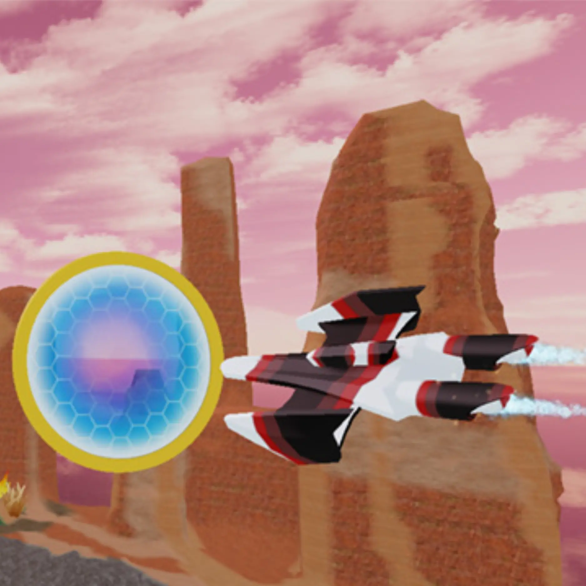
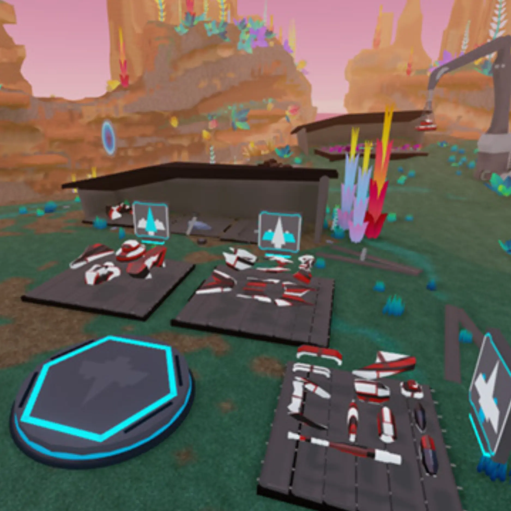
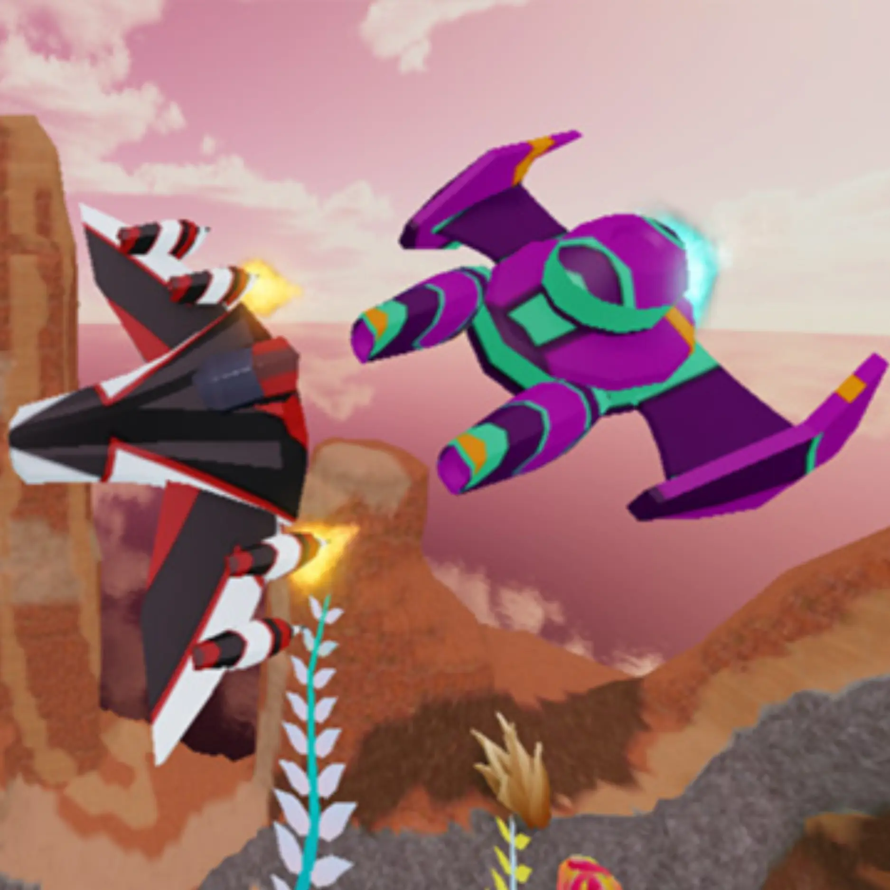
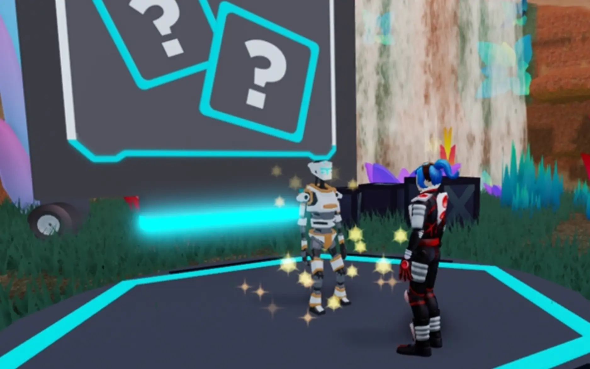

# Galactic Speedway

## 목차
- [Galactic Speedway](#galactic-speedway)
  - [목차](#목차)
  - [Roblox Studio 다운로드](#roblox-studio-다운로드)
  - [세 가지 레슨, 세 가지 보상](#세-가지-레슨-세-가지-보상)
  - [출처](#출처)
  - [다음](#다음)

---

천년의 우주 경주에 참가하세요! 우주선이 없다고요? 걱정 마세요. 모든 경주자는 Junker's Canyon의 버려진 은하계 우주 야드에서 찾을 수 있는 것을 사용하여 맞춤형 드리프트 스피더를 설계해야 합니다. Roblox Studio를 사용하여 이 아름다운 외계 ~~죽음의 함정~~, 음, 풍경에서 레이싱을 견딜 수 있는 우주선을 결합하는 방법을 배우세요.

<video controls
src="../img/05_01_Galactic_Speedway/overview-video.mp4"
width="100%"></video>

## Roblox Studio 다운로드

시작하려면 Roblox Studio가 필요합니다. 이 프로그램은 Roblox에서 모든 게임을 만들기 위해 사용되며 **PC**와 **Mac**에서 무료로 제공됩니다.

컴퓨터에서 Roblox 게임을 플레이한 적이 있다면 이미 Studio가 설치되어 있을 것입니다. 창작할 때는 **스크롤 휠이 있는 3버튼 마우스**를 사용하는 것을 강력히 권장합니다.

<Alert severity="info">
Roblox를 처음 사용하는 경우 다음 지침을 따르세요:
1. [계정 등록.](https://www.roblox.com/account/signupredir)
2. [Roblox Studio 다운로드.](https://www.roblox.com/create)
3. 설치 후, Roblox Studio 데스크탑 아이콘(Windows) 또는 도크 아이콘(Mac)을 더블 클릭하세요.
4. 로그인 화면에서 Roblox 사용자 이름과 비밀번호를 입력한 후 **로그인**을 클릭하세요.

새 계정을 만들 때는 다음 안전 수칙을 기억하세요:

- **비밀번호를 절대 공유하지 마세요**, 실제 친구와도 공유하지 마세요.
- **비밀번호를 어렵게 설정하세요** -- 사용자 이름이 "bloxdev"라면 비밀번호는 "bloxdev123"이 되어서는 안 됩니다.
- **Roblox 직원은 절대 비밀번호를 묻지 않습니다** -- 비밀번호를 묻는 사람은 [신고하기](https://en.help.roblox.com/hc/articles/203312410) 기능을 사용해 신고하세요.
- **무료 로벅스는 없습니다** -- 비밀 방법으로 무료 로벅스를 얻을 수 있다고 말하는 플레이어나 사이트를 절대 믿지 마세요!

추가 안전 팁은 <a href="https://en.help.roblox.com/hc/en-us/articles/203313380-Account-Security-Theft-Keeping-your-Account-Safe-">계정 보안 유지</a>를 참조하세요.
</Alert>

## 세 가지 레슨, 세 가지 보상

드리프트 스피더를 만들고 경주에 추가하려면 각 단계별 튜토리얼을 따라하세요.
<GridContainer numColumns="3">

  <figure>
    
    <figcaption>이륙하기</figcaption>
  </figure>
  <figure>
    
    <figcaption>날개 추가하기</figcaption>
  </figure>
  <figure>
    
    <figcaption>커스터마이즈 및 공유하기</figcaption>
  </figure>
</GridContainer>
각 레슨 후, Roblox에서 퀴즈 게임을 통해 아바타 아이템과 배지를 획득할 기회를 얻게 됩니다.

---
## 출처
[Galactic Speedway](https://create.roblox.com/docs/ko-kr/education/build-it-play-it-galactic-speedway/main-page)

---
## [다음](05_02_Get_Off_the_Ground.md)
