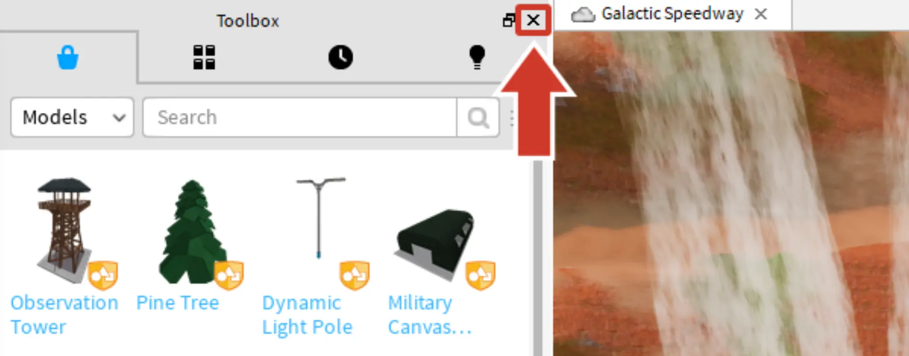

# Get Off the Ground

## 목차
- [Get Off the Ground](#get-off-the-ground)
  - [목차](#목차)
  - [템플릿 열기](#템플릿-열기)
  - [Junker's Canyon](#junkers-canyon)
  - [추가 창 닫기](#추가-창-닫기)
  - [출처](#출처)
  - [다음](#다음)

---

Driftspeeder를 만들기 위한 모든 부품과 연례 Junker's Canyon 경주를 위한 코드는 **Galactic Speedway** 템플릿에 포함되어 있습니다.

## 템플릿 열기

이제 Roblox Studio를 열어야 할 시간입니다! 필요하다면 [Studio 다운로드](https://www.roblox.com/create)하고 준비가 되면 이 페이지로 돌아오세요.

1. **Roblox Studio**를 엽니다.
2. 아래 버튼을 클릭하여 템플릿을 다운로드하세요.

   <a href="https://prod.docsiteassets.roblox.com/assets/education/build-it-play-it-galactic-speedway/get-off-the-ground/galactic-speedway-template.rbxl">
   <Button variant="contained">Download</Button>
   </a>

3. Roblox Studio에서 왼쪽 상단의 **파일 > 파일에서 열기**를 클릭하고 다운로드한 파일 `Galactic-Speedway-Template.rbxl`을 선택합니다.

   

## Junker's Canyon

템플릿을 열면, 교활한 건설자와 대담한 경주자들의 고향인 Junker's Canyon을 볼 수 있습니다. driftspeeder를 만들기 위해 **고철 처리장**에서 부품을 구하고 작업 구역에서 결합하세요. 완료되면 **경주 트랙 물길**에서 driftspeeder를 경주하여 Junker's Canyon의 챔피언이 되세요.

## 추가 창 닫기

처음으로 Roblox Studio를 실행하면 지금 당장 필요하지 않은 추가 창이 열릴 수 있습니다. 추가 창을 닫으면 작업할 공간이 더 넓어집니다. 나중에 언제든지 다시 열 수 있습니다.

1. 3D 뷰의 왼쪽에 있는 각 창을 **&times;**를 클릭하여 닫습니다. 닫을 것이 보이지 않으면 다음 단계로 넘어갑니다.

   

2. 오른쪽 창은 그대로 두세요. Studio는 아래 이미지와 같아야 합니다.

   

---
## 출처
[Get Off the Ground](https://create.roblox.com/docs/ko-kr/education/build-it-play-it-galactic-speedway/get-off-the-ground)

---
## [다음](05_03_Take_Flight.md)
