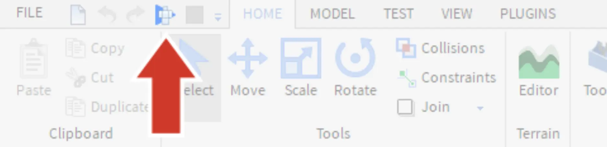
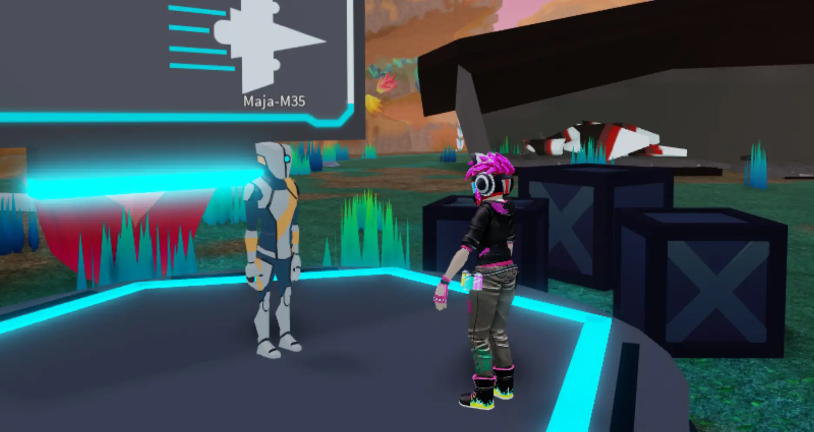
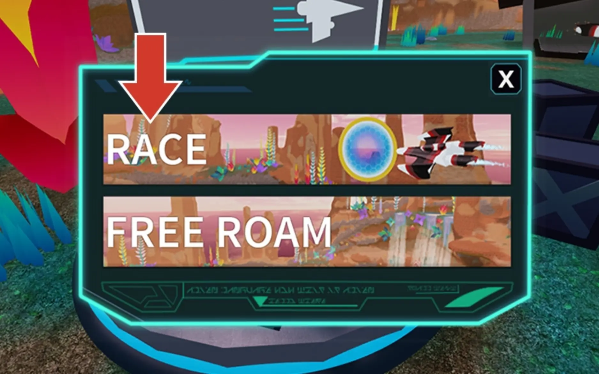
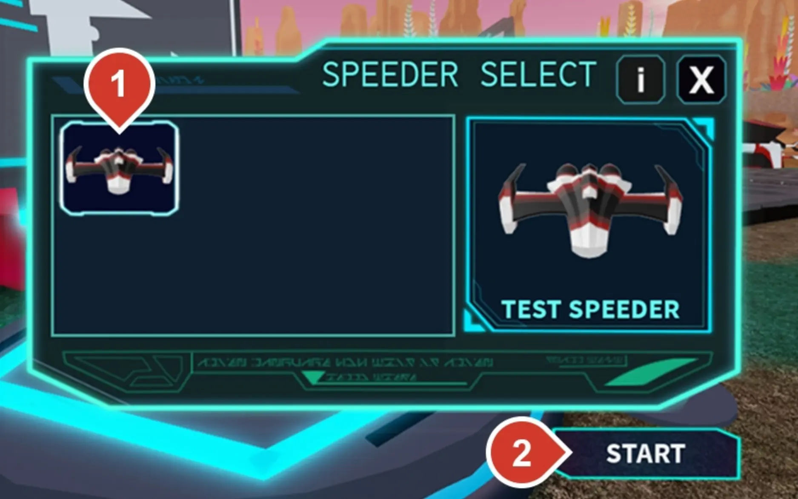
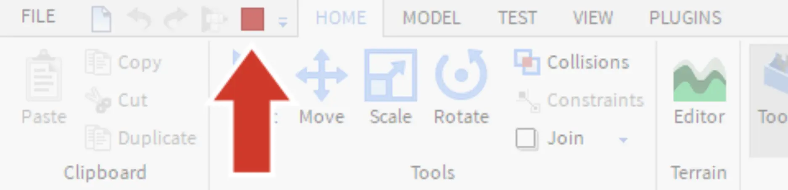

# Take Flight

## 목차
- [Take Flight](#take-flight)
  - [목차](#목차)
  - [출처](#출처)
  - [다음](#다음)

---

자신만의 driftspeeder를 설계하기 전에, 이미 차고에 있는 테스트 speeder를 날려보고 환경에 대해 파악해보세요.

1. **Play**를 클릭하여 테스트합니다.

   

2. 로봇 Maja-M35에게 다가가서 <kbd>E</kbd>를 누릅니다.

   

   아래는 게임 내의 조작법입니다.

   <table>
   <thead>
      <tr>
      <th>액션</th>
      <th>조작</th>
      </tr>
   </thead>
   <tbody>
      <tr>
      <td><b>이동</b></td>
      <td><kbd>W A S D</kbd> 또는 방향키</td>
      </tr>
      <tr>
      <td><b>회전</b></td>
      <td>오른쪽 마우스 버튼을 누르고 주위를 둘러보세요.</td>
      </tr>
      <tr>
      <td><b>팬</b></td>
      <td>가운데 마우스 버튼을 누르고 카메라를 드래그하세요.</td>
      </tr>
   </tbody>
   </table>

3. 메뉴 옵션에서 **Race**를 선택합니다. 레이스에서는 링을 통과하여 가장 빠른 시간을 기록합니다.

   

4. 현재 차고에는 선택할 수 있는 driftspeeder가 하나뿐입니다. 이를 선택한 후 **Start**를 클릭합니다.

   

5. 카운트다운이 끝날 때까지 기다립니다. 내부에 있는 동안, 아래의 조작법을 사용하여 비행에 익숙해지세요. 비행 중에는 마우스를 사용할 수 없으므로, speeder에서 **나가려면** <kbd>E</kbd>를 누르세요.

   아래는 speeder 조작법입니다.

   <table>
   <thead>
      <tr>
      <th>액션</th>
      <th>조작</th>
      </tr>
   </thead>
   <tbody>
      <tr>
      <td><b>Speeder 이동</b></td>
      <td><kbd>W A S D</kbd> 또는 방향키</td>
      </tr>
      <tr>
      <td><b>속도 부스트</b></td>
      <td><kbd>Shift</kbd></td>
      </tr>
      <tr>
      <td><b>Speeder 나가기</b></td>
      <td><kbd>E</kbd></td>
      </tr>
   </tbody>
   </table>

6. 빨간 사각형을 눌러 플레이를 중지하거나 <kbd>Shift</kbd> + <kbd>F5</kbd>를 누릅니다.

   

---
## 출처
[Take Flight](https://create.roblox.com/docs/ko-kr/education/build-it-play-it-galactic-speedway/take-flight)

---
## [다음](05_04_Designing_Your_Speeder.md)
