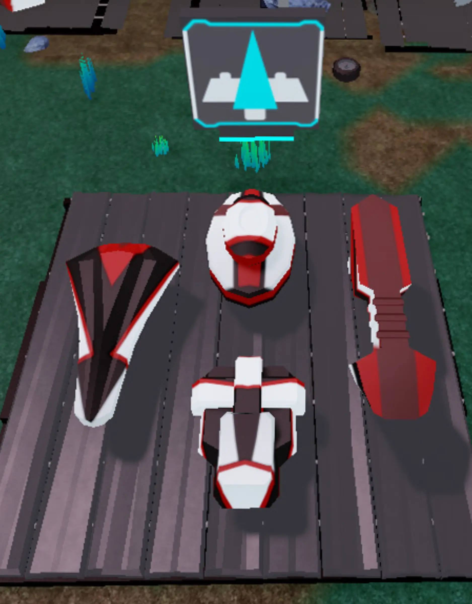

# Designing Your Speeder

## 목차
- [Designing Your Speeder](#designing-your-speeder)
  - [목차](#목차)
  - [부품 구하기](#부품-구하기)
  - [제작 준비하기](#제작-준비하기)
  - [카메라 뷰 변경](#카메라-뷰-변경)
  - [출처](#출처)
  - [다음](#다음)

---

이제 driftspeeder를 조종해봤으니, 직접 설계해볼 차례입니다. speeder는 세 단계로 제작됩니다:

<GridContainer numColumns="3">
  <figure>
    
    <figcaption>1: 본체</figcaption>
  </figure>
  <figure>
    
    <figcaption>2: 날개</figcaption>
  </figure>
  <figure>
    
    <figcaption>3: 장식</figcaption>
  </figure>
</GridContainer>

## 부품 구하기

고철장은 세 섹션으로 나누어져 있으며, 각 단계마다 필요한 부품을 구할 수 있습니다. 이 부품들을 결합하고, 회전시키고, 크기를 조정하여 수천 가지의 독특한 디자인을 만들 수 있습니다.

<GridContainer numColumns="3">
  <figure>
    
    <figcaption>1: 시작 본체</figcaption>
  </figure>
  <figure>
    
    <figcaption>2: 날개 세트</figcaption>
  </figure>
  <figure>
    
    <figcaption>3: 장식 부품</figcaption>
  </figure>
</GridContainer>

## 제작 준비하기

부품을 원하는 위치로 이동시키려면 먼저 **충돌**과 **이동 스냅**을 끄세요. 충돌을 끄면 객체가 서로를 통과할 수 있습니다. 스냅을 끄면 객체를 자유롭게 이동시킬 수 있습니다.

1. **Model** 탭에서 **Collisions**를 끕니다. 충돌이 꺼지면 버튼이 회색으로 강조되지 않습니다.
   <GridContainer numColumns="2">
     <figure>
       
       <figcaption>소품 사용 시 스냅 끄기</figcaption>
     </figure>
     <figure>
       
       <figcaption>건물 및 도로용 스냅 켜기</figcaption>
     </figure>
   </GridContainer>

2. Collisions 근처에서 **Move** 스냅이 **꺼져** 있는지 확인하세요.
   

## 카메라 뷰 변경

driftspeeder를 작업하려면 아래의 카메라 컨트롤을 사용하세요.

<Alert severity="info">
**카메라 컨트롤**
<table>
<thead>
   <tr>
     <th>액션</th>
     <th>조작</th>
   </tr>
</thead>
<tbody>
   <tr>
     <td><b>이동</b></td>
     <td><kbd>W A S D</kbd></td>
   </tr>
   <tr>
     <td><b>회전</b></td>
     <td>오른쪽 마우스 버튼을 누르고 둘러보기</td>
   </tr>
   <tr>
     <td><b>줌</b></td>
     <td>스크롤 휠 사용</td>
   </tr>
   <tr>
     <td><b>초점 맞추기</b></td>
     <td><kbd>F</kbd>를 눌러 특정 부품에 카메라 초점 맞추기</td>
   </tr>
</tbody>
</table>
</Alert>

카메라를 이동시켜 driftspeeder 본체와 작업 영역을 동시에 잘 볼 수 있도록 하세요.

<video controls src="../img/05_04_Designing_Your_Speeder/move-camera-to-focus.mp4" width="100%"></video>

<Alert severity="warning">
<AlertTitle>카메라가 움직이지 않나요?</AlertTitle>
<kbd>W A S D</kbd>를 눌러도 카메라가 움직이지 않으면 게임 세계 내부를 클릭하세요.
</Alert>

---
## 출처
[Designing Your Speeder](https://create.roblox.com/docs/ko-kr/education/build-it-play-it-galactic-speedway/designing-your-speeder)

---
## [다음](05_05_Moving_the_Body.md)
