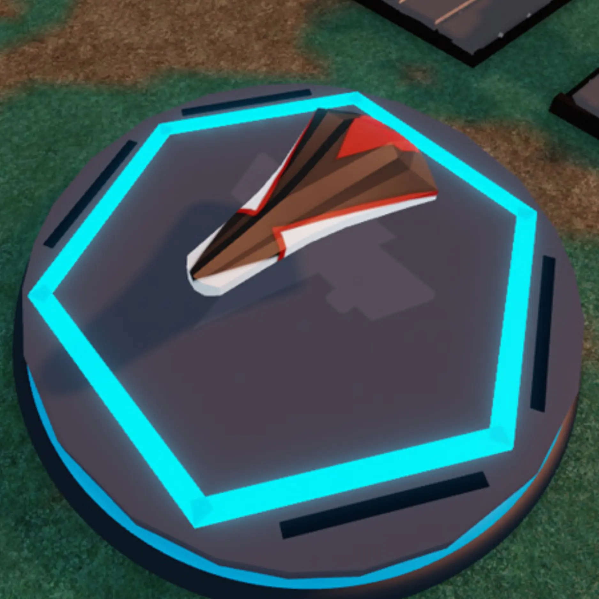
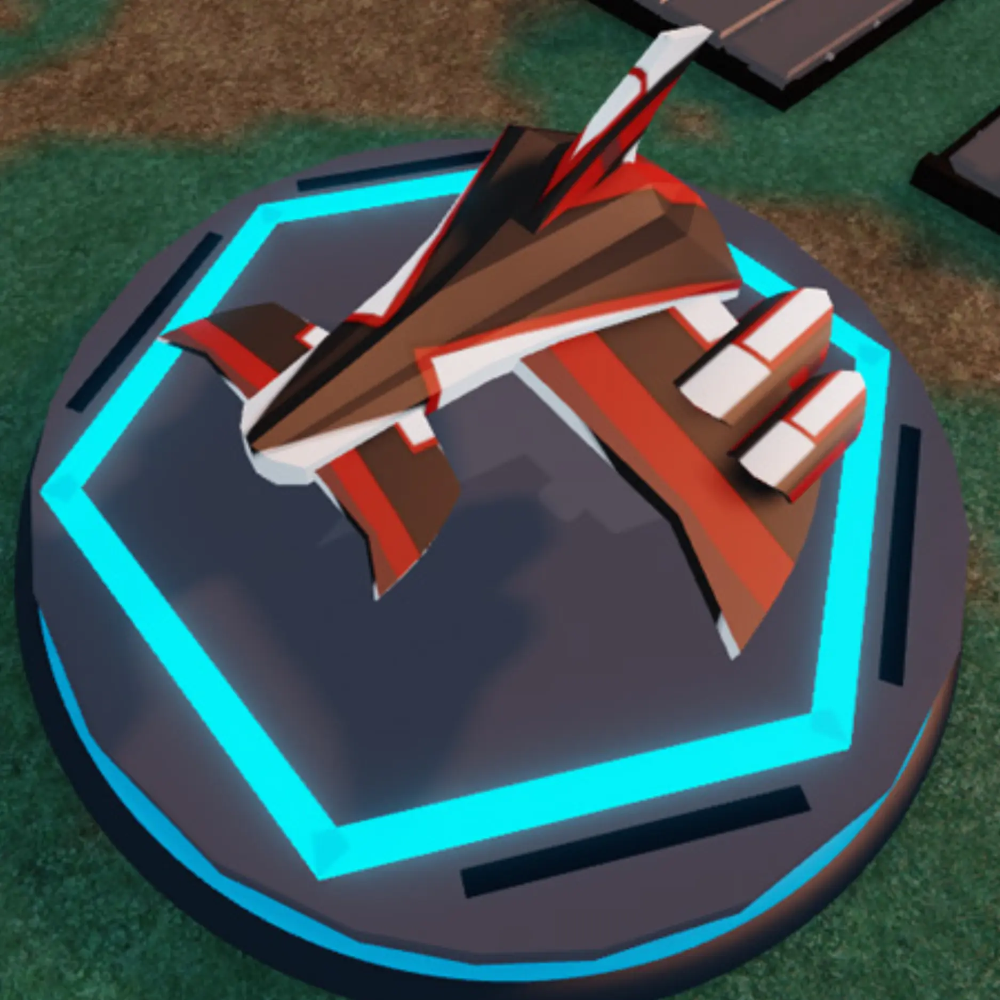
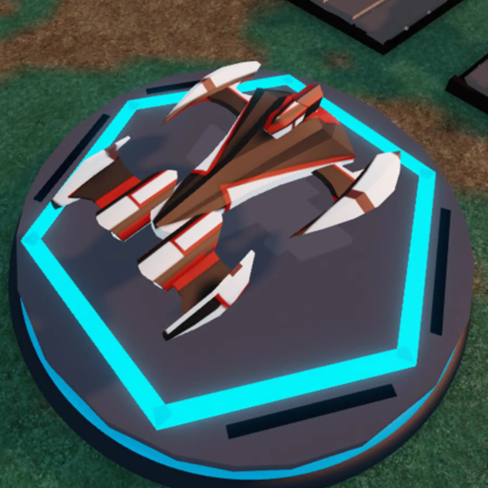
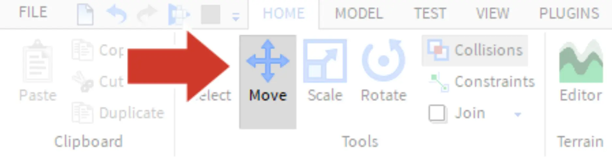
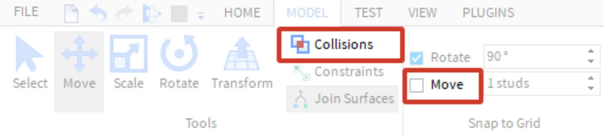

# Moving the Body

## 목차
- [Moving the Body](#moving-the-body)
  - [목차](#목차)
  - [출처](#출처)
  - [다음](#다음)

---
스크랩야드에는 선택할 수 있는 여섯 가지 다른 본체가 있습니다. 각 본체는 다른 부품들과 결합하여 완전히 다른 모습을 만들 수 있습니다.
<GridContainer numColumns="3">

  <figure>
    
    <figcaption>기본 본체</figcaption>
  </figure>
  <figure>
    
    <figcaption>가능한 디자인</figcaption>
  </figure>
  <figure>
    
    <figcaption>가능한 디자인</figcaption>
  </figure>
</GridContainer>

1. **Home** 탭에서 **Move** 도구를 선택합니다.
   
2. 원하는 본체를 선택한 다음, **방향 화살표**를 드래그하여 작업 영역의 중앙으로 이동합니다.
   <video controls src="../img/05_05_Moving_the_Body/move-body.mp4" width="100%"></video>

<Alert severity="warning">
<AlertTitle>부품이 끼이거나 느리게 움직이나요?</AlertTitle>
Model 탭에서 **Collisions**와 **Move** 스냅이 꺼져 있는지 확인하세요. 설정이 아래 그림과 같아야 합니다.

</Alert>

---
## 출처
[Moving the Body](https://create.roblox.com/docs/ko-kr/education/build-it-play-it-galactic-speedway/moving-the-body)

---
## [다음](05_06_Save_and_Publish.md)
