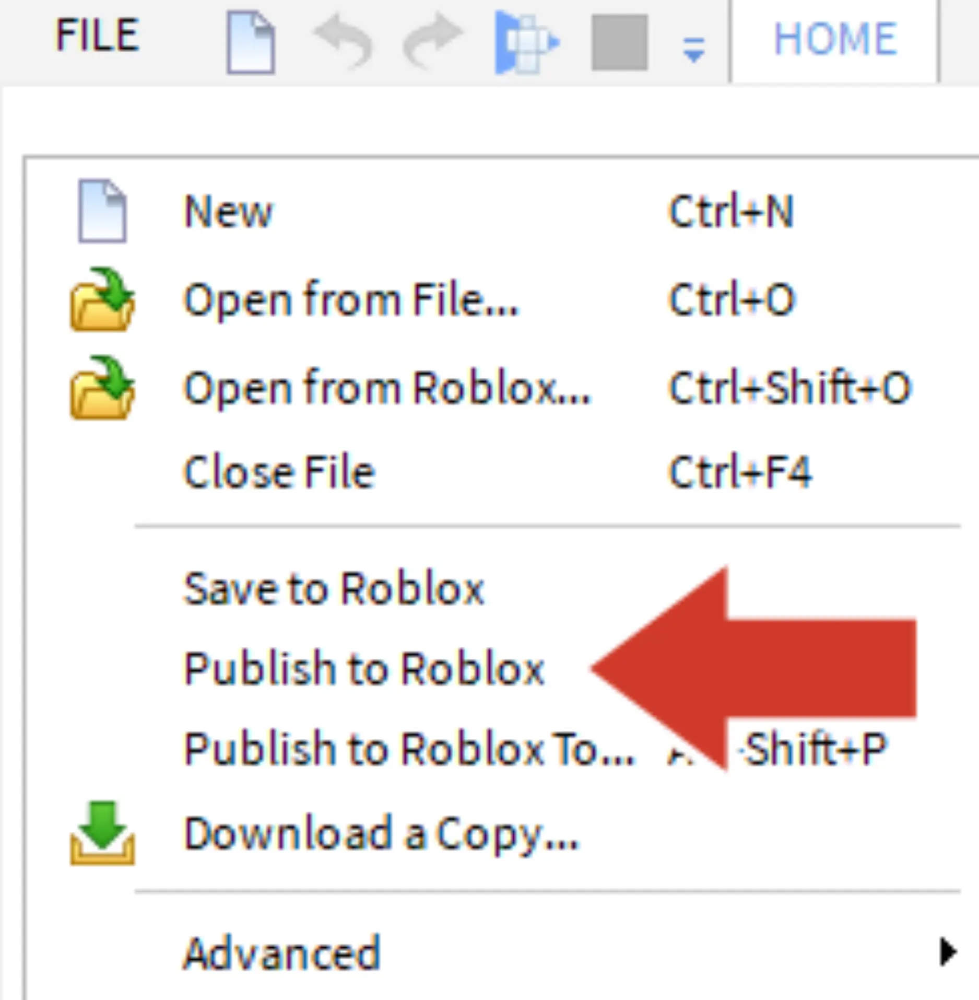
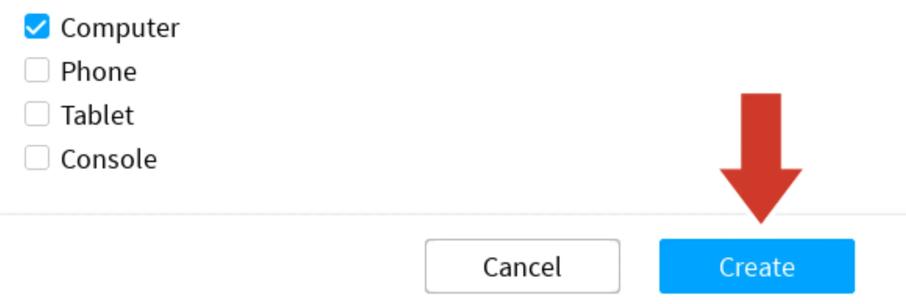

# Save and Publish

## 목차
- [Save and Publish](#save-and-publish)
  - [목차](#목차)
  - [출처](#출처)
  - [다음](#다음)

---

작업 중이거나 큰 변화를 줄 때마다 10분마다 게임을 게시하는 것이 좋습니다. 게시 후에는 어느 컴퓨터에서나 편집할 수 있습니다. 지금은 게임이 비공개 상태이지만, 드리프트스피더가 준비되면 모두가 플레이할 수 있도록 공개할 것입니다.

1. **File → Publish to Roblox**를 선택하여 게시 창을 엽니다.
   
2. 장소 이름과 선택 사항으로 설명을 입력합니다.
   
3. 준비가 되면 **Create** 버튼을 클릭합니다.
   

<Alert severity="info">
<AlertTitle>게시 후 저장하기</AlertTitle>
다음에 작업을 저장하려면 **File → Publish to Roblox**로 가거나 단축키 <kbd>Alt</kbd>+<kbd>P</kbd> 또는 <kbd>⌘</kbd>+<kbd>P</kbd>를 사용하세요.
</Alert>

---
## 출처
[Save and Publish](https://create.roblox.com/docs/ko-kr/education/build-it-play-it-galactic-speedway/save-and-publish)

---
## [다음](05_07_Take_the_Challenge.md)
