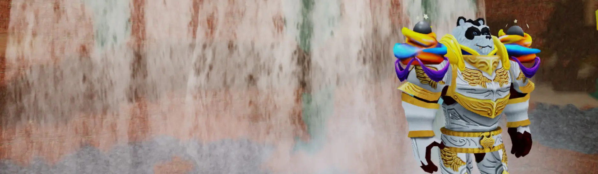
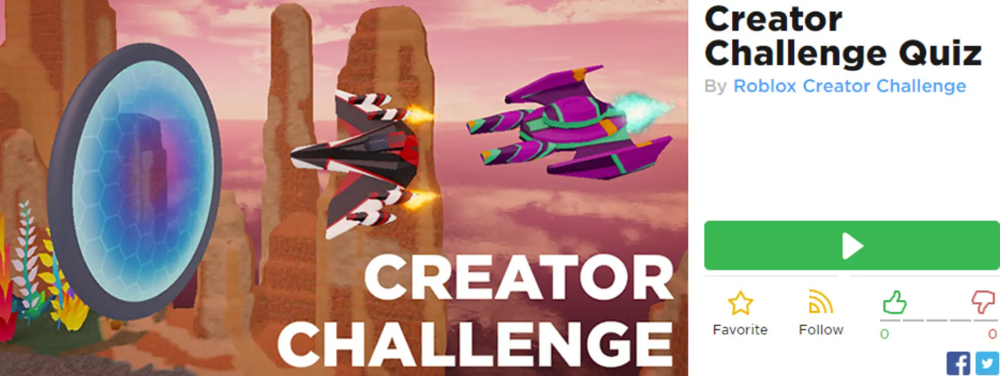
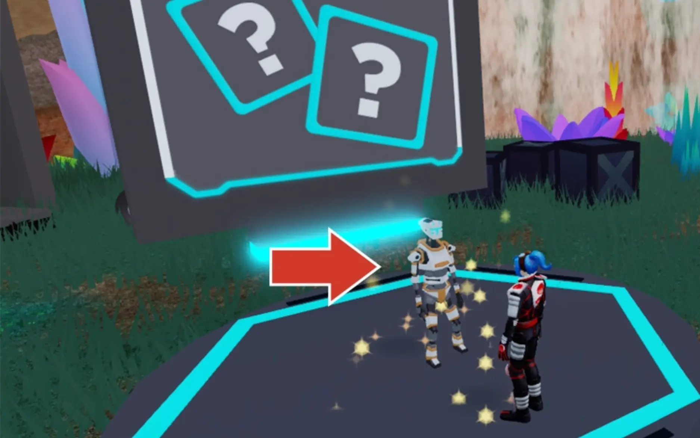

# Take the Challenge

## 목차
- [Take the Challenge](#take-the-challenge)
  - [목차](#목차)
  - [출처](#출처)
  - [다음](#다음)

---

**슈퍼노바 폴드론** 아바타 아이템과 **Getting off the Ground** 배지를 획득하며 지식을 테스트해 보세요!

1. 아래의 **Play Quiz Game**을 클릭하여 Roblox 게임을 엽니다. 방금 배운 내용에 대한 질문에 답하여 챌린지를 완료하세요.
   
   <a href="https://www.roblox.com/games/4201429814/Roblox-Creator-Challenge">
   <Button variant="contained">Play Quiz Game</Button>
   </a>
2. 게임에서 로봇과 상호작용하여 챌린지를 시작하세요.
   

---
## 출처
[Take the Challenge](https://create.roblox.com/docs/ko-kr/education/build-it-play-it-galactic-speedway/take-the-challenge)

---
## [다음](05_08_Adding_Wings.md)
