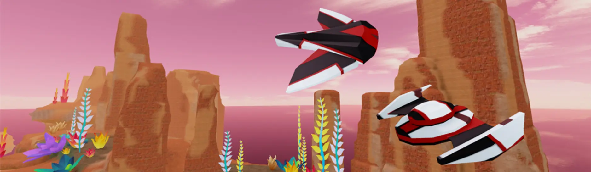
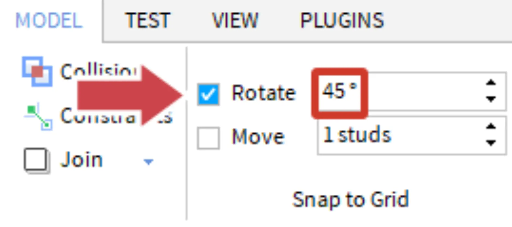
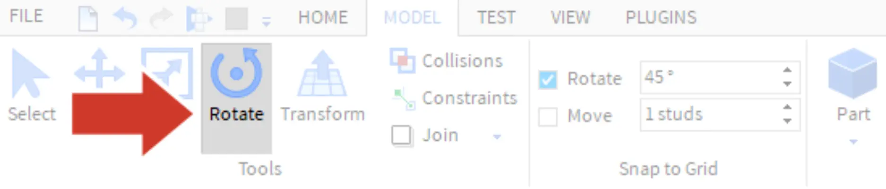
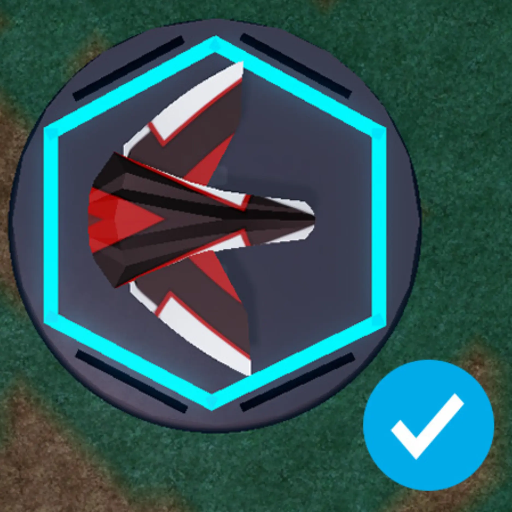
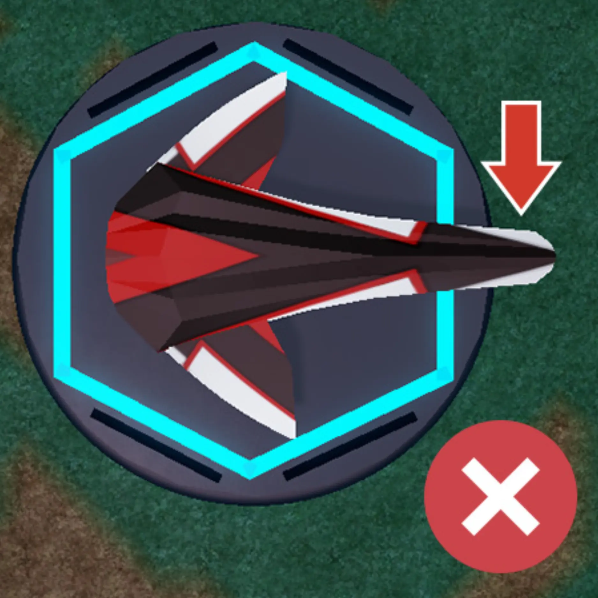

# Adding Wings

## 목차
- [Adding Wings](#adding-wings)
  - [목차](#목차)
  - [스냅 설정 변경](#스냅-설정-변경)
  - [첫 번째 날개 배치](#첫-번째-날개-배치)
  - [출처](#출처)
  - [다음](#다음)

---

경주에서 제대로 작동하려면 드리프트스피더는 하나의 본체만 가질 수 있습니다. 하지만 날개와 기타 부품은 원하는 만큼 추가할 수 있습니다.

## 스냅 설정 변경

날개를 추가하기 전에 **회전 스냅**을 설정하여 날개의 위치를 쉽게 조정할 수 있도록 합니다. 스냅은 부품을 한 번에 일정한 각도로 회전시킵니다.

1. **모델** 탭에서 **스냅 설정** 섹션을 찾습니다.
2. **회전**이 선택되어 있는지 확인합니다.
3. 회전 옆에 45를 입력합니다. 이미 45로 설정되어 있다면 다음 단계로 진행합니다.
   

## 첫 번째 날개 배치

1. 고철 야적장의 두 번째 섹션에서 날개를 클릭한 다음, 이동 도구를 사용하여 작업 영역으로 드래그합니다.
   <video controls src="../img/05_08_Adding_Wings/move-wing.mp4" width="100%"></video>
   <Alert severity="warning">
   <AlertTitle>날개 이동에 문제가 있나요?</AlertTitle>
   **모델** 탭에서 **충돌** 및 **이동** 스냅이 꺼져 있는지 확인하세요.
   </Alert>

2. 날개를 회전하려면 **회전** 도구를 선택하고 핸들을 드래그합니다. 각 핸들은 다른 방향으로 회전합니다.
   
   <video controls src="../img/05_08_Adding_Wings/rotate-wing.mp4" width="100%"></video>
   <Alert severity="info">
   <AlertTitle>단축키로 빠르게 회전하기</AlertTitle>
   개체를 90도 회전하려면 해당 부품을 선택하고 <kbd>Ctrl</kbd>+<kbd>R</kbd> 또는 <kbd>⌘</kbd>+<kbd>R</kbd>를 누르세요.
   </Alert>

3. 날개의 크기를 조정하려면 **크기 조정** 도구를 선택하고 원하는 크기로 핸들을 드래그합니다.
   <video controls src="../img/05_08_Adding_Wings/scale-wing.mp4" width="100%"></video>
4. 원한다면 고철 야적장에서 **맞춤 날개**를 사용하여 드리프트스피더의 다른 쪽에도 동일한 날개를 추가하세요.
   <Alert severity="warning">
   <AlertTitle>드리프트스피더를 작업 영역 내에 유지하기</AlertTitle>
   경주 중에 스피더가 협곡을 통과할 수 있도록 모든 부품을 파란색 선 내에 유지하세요.
   <GridContainer numColumns="2">
   
   
   </GridContainer>
   </Alert>

---
## 출처
[Adding Wings](https://create.roblox.com/docs/ko-kr/education/build-it-play-it-galactic-speedway/adding-wings)

---
## [다음](05_09_Duplicate_and_Design.md)
