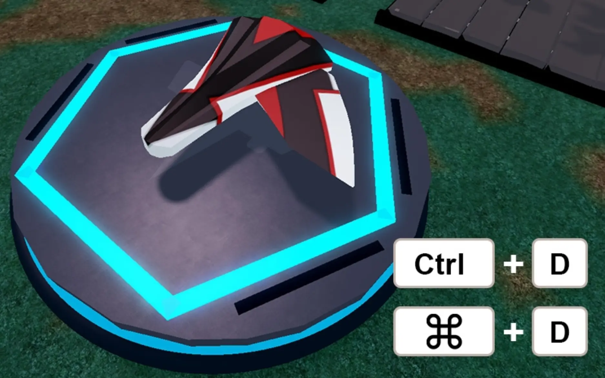
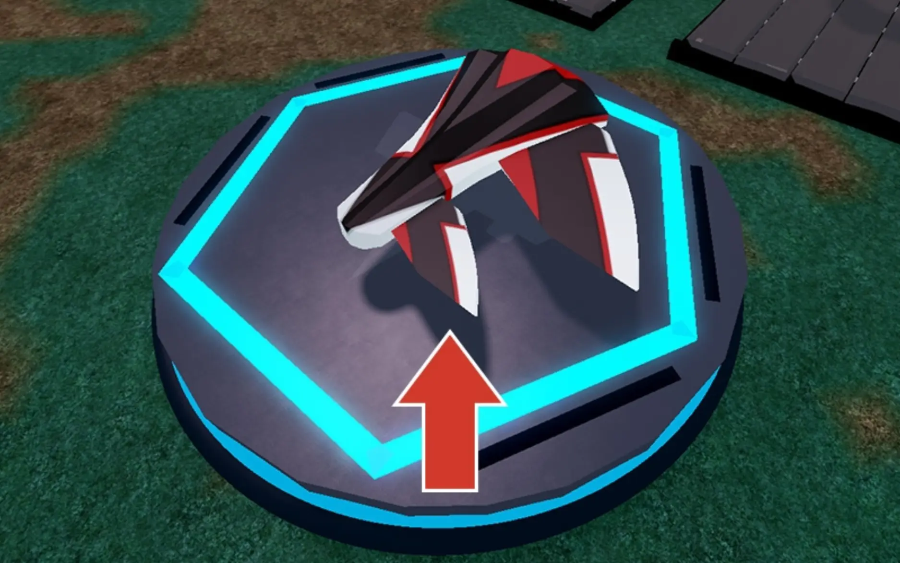
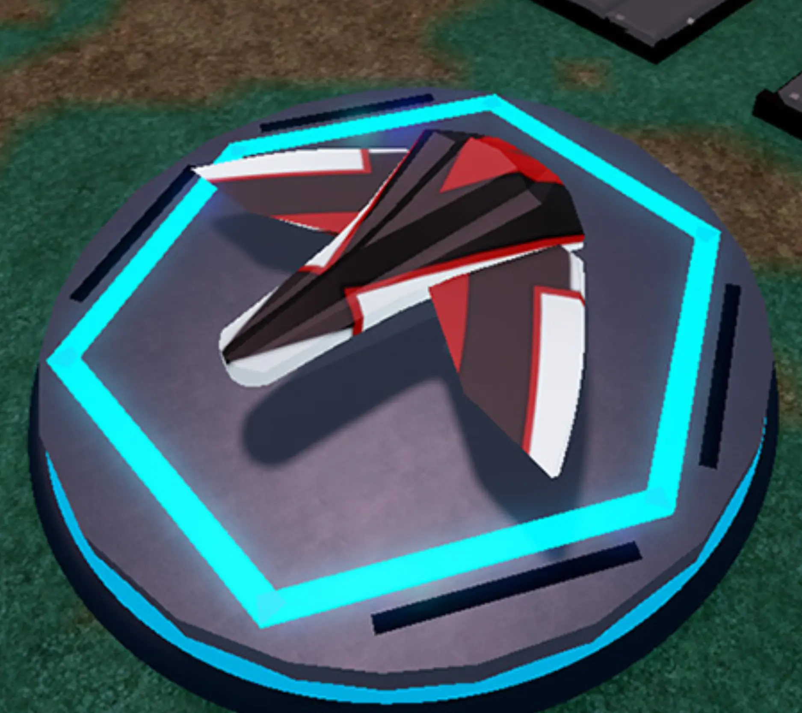
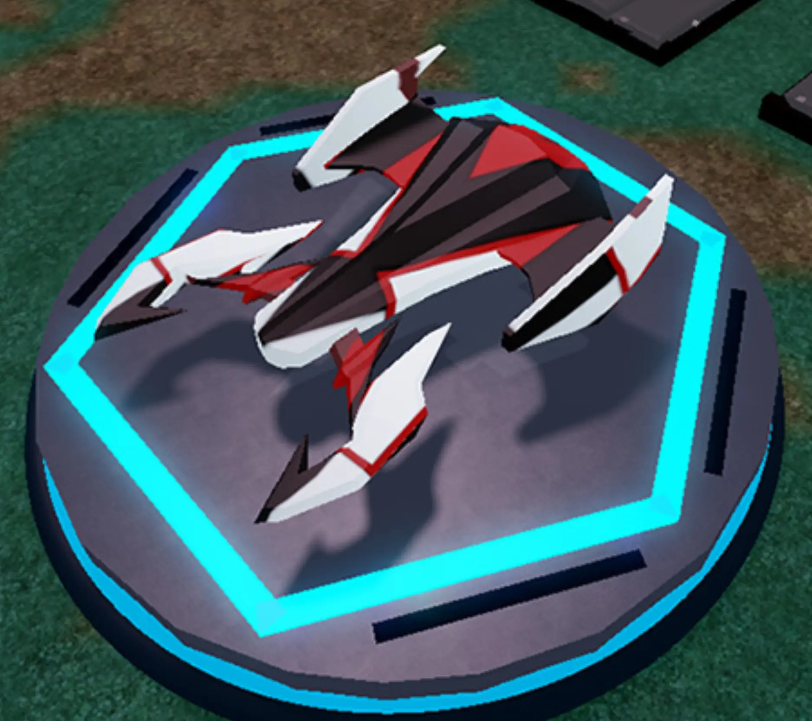
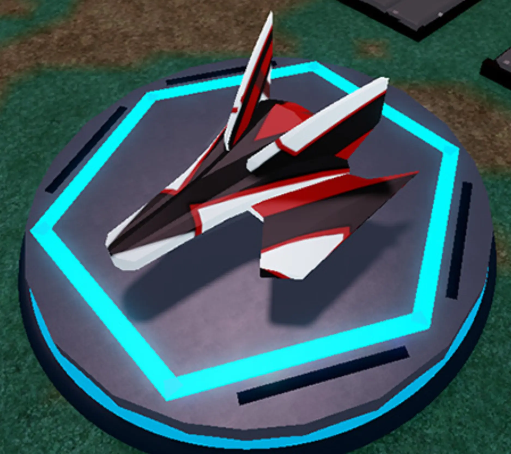
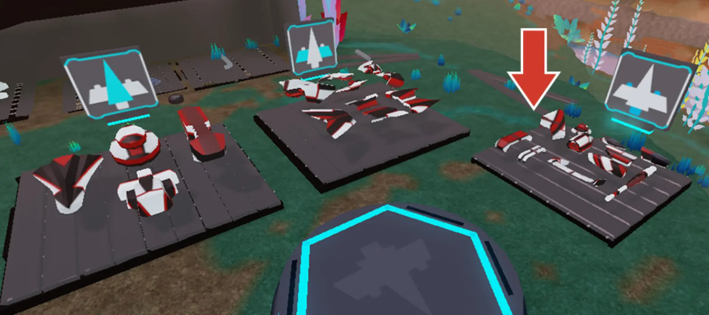
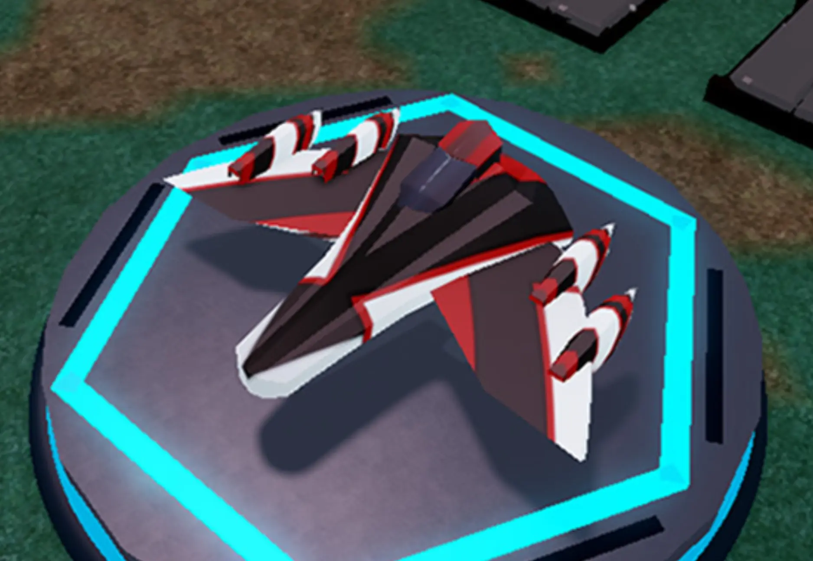
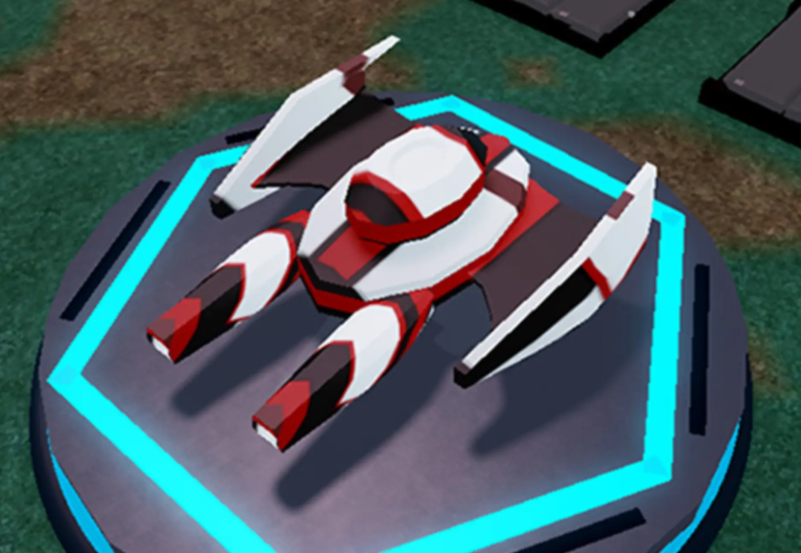
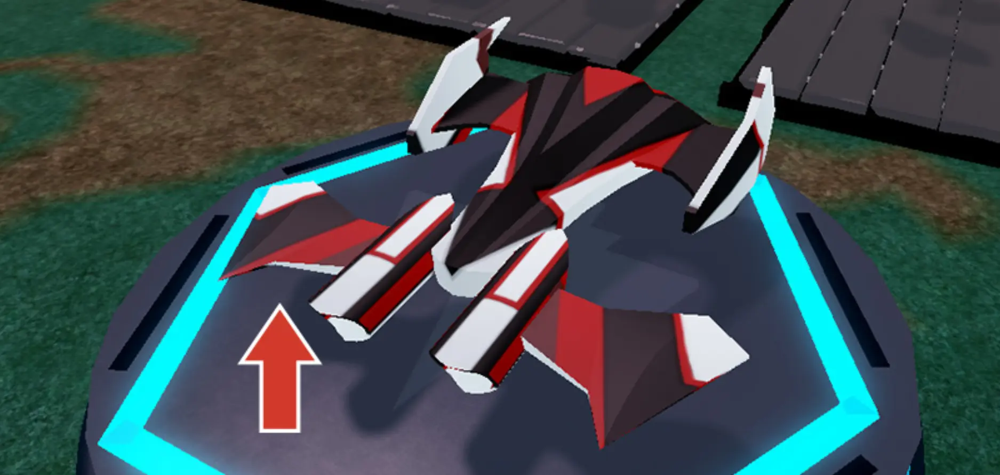

# Duplicate and Design

## 목차
- [Duplicate and Design](#duplicate-and-design)
  - [목차](#목차)
  - [계속 빌드하기](#계속-빌드하기)
  - [장식 추가](#장식-추가)
  - [출처](#출처)
  - [다음](#다음)

---

부품을 만들 때 중복하여 여러 번 사용할 수 있습니다. 이는 고철 야적장의 부품을 재사용하거나 이미 스피더에 추가된 것을 복사할 때 유용합니다.

1. 방금 추가한 날개를 클릭하고 중복합니다 (<kbd>Ctrl</kbd>+<kbd>D</kbd> 또는 <kbd>⌘</kbd>+<kbd>D</kbd>).
   눈에 띄는 변화는 없습니다. 충돌이 꺼져 있어 날개가 원래 것과 겹쳐집니다.
   
2. **이동**, **회전**, **크기 조정** 도구를 사용하여 첫 번째 날개와 다르게 위치시킵니다.
   
   <Alert severity="info">
   <AlertTitle>정확한 회전 설정</AlertTitle>
   일정한 각도로 회전하는 대신 회전 스냅을 꺼서 자유롭게 회전할 수 있습니다. **모델** 탭에서 **회전** 옆의 상자를 선택 해제합니다. 완료 후에는 다시 켜는 것을 잊지 마세요.
   <video controls src="../img/05_09_Duplicate_and_Design/rotate-compare.mp4" width="100%"></video>
   </Alert>

## 계속 빌드하기

부품을 사용하는 방법을 알게 되었으니 원하는 만큼 날개를 추가하여 멋진 디자인을 만들어 보세요. 다음 디자인을 참고로 사용하세요:

<GridContainer numColumns="3">
  
  
  
</GridContainer>

## 장식 추가

고철 야적장의 세 번째 섹션에서 추력기나 스포일러 같은 장식 부품을 사용하여 스피더를 더욱 개인화하세요.

아래는 장식이 추가된 두 가지 다른 스피더입니다.

<GridContainer numColumns="2">
  
  
</GridContainer>

<figure>
  
  <figcaption>추력기 장식에 추가된 날개</figcaption>
</figure>

<Alert severity="info">
  <AlertTitle>확장으로 더 큰 함선 만들기</AlertTitle>
  부품을 사용하여 객체를 배치할 수 있는 범위를 확장하여 본체에서 더 멀리 건설하세요.
</Alert>

---
## 출처
[Duplicate and Design](https://create.roblox.com/docs/ko-kr/education/build-it-play-it-galactic-speedway/duplicate-and-design)

---
## [다음](05_10_Grouping_the_Parts.md)
