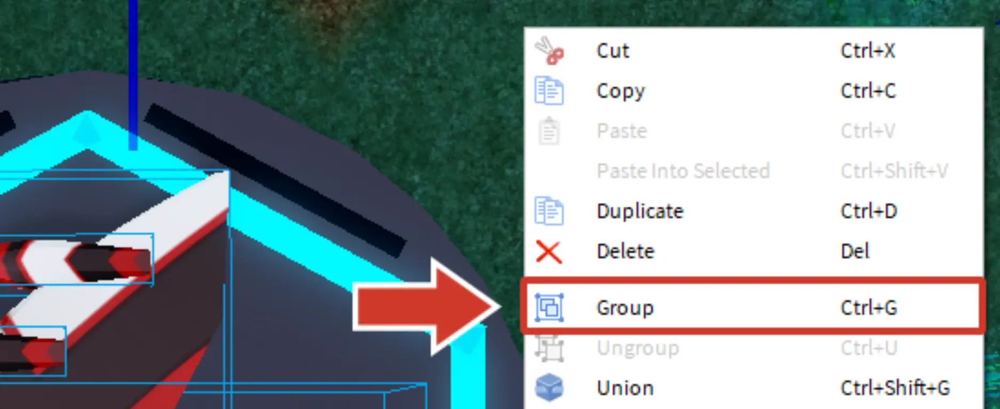

# Grouping the Parts

## 목차
- [Grouping the Parts](#grouping-the-parts)
  - [목차](#목차)
  - [출처](#출처)
  - [다음](#다음)

---

드리프트스피더가 거의 완성되었습니다! 이제 모든 것을 **그룹화**하여 하나의 모델로 만들기만 하면 됩니다. 그룹화가 완료되면 본체에 연결된 코드가 전체 스피더에 적용됩니다.

1. 그룹화하기 전에 카메라를 위에 위치시켜 전체 디자인을 잘 볼 수 있도록 하고, 클릭하고 드래그하여 **드리프트스피더 부품만** 선택합니다.
   <video controls src="../img/05_10_Grouping_the_Parts/grouping.mp4" width="100%"></video>
2. 아무 곳에서나 오른쪽 클릭을 하고 **그룹화**를 선택합니다 (<kbd>Ctrl</kbd>+<kbd>G</kbd> 또는 <kbd>⌘</kbd>+<kbd>G</kbd>) 모든 것을 하나의 모델로 결합합니다.
   
3. 다음 단계로 넘어가기 전에 드리프트스피더를 이동시켜 모든 것이 그룹화되었는지 다시 확인합니다. 남겨진 부품이 있거나 스피더의 일부가 아닌 객체를 그룹화한 경우, 그룹화를 취소합니다 (<kbd>Ctrl</kbd>+<kbd>Z</kbd> 또는 <kbd>⌘</kbd>+<kbd>Z</kbd>) 그리고 다시 시도합니다.
   <video controls src="../img/05_10_Grouping_the_Parts/test-grouping.mp4" width="100%"></video>

---
## 출처
[Grouping the Parts](https://create.roblox.com/docs/ko-kr/education/build-it-play-it-galactic-speedway/grouping-the-parts)

---
## [다음](05_11_Add_to_the_Garage.md)
