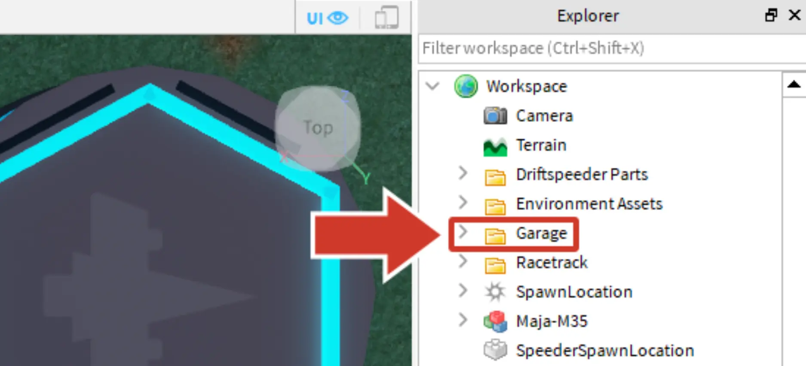
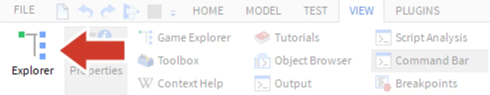
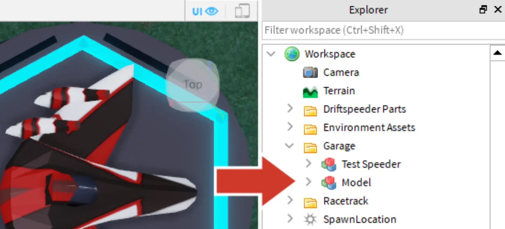
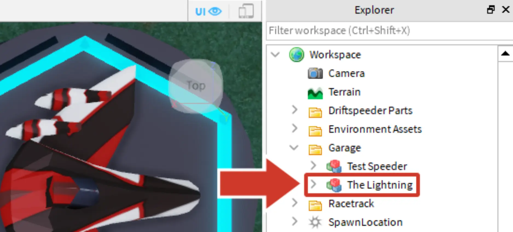

# Add to the Garage

## 목차
- [Add to the Garage](#add-to-the-garage)
  - [목차](#목차)
  - [출처](#출처)
  - [다음](#다음)

---

이전에 테스트 스피더를 비행했던 것을 기억하시나요? 이제 자신의 스피더를 비행하려면 다른 차량과 함께 차고에 배치해야 합니다.

1. 드리프트스피더를 오른쪽 클릭합니다. 메뉴에서 **잘라내기**를 선택합니다. 스피더가 잠시 사라지지만 올바른 폴더에 추가하면 다시 나타납니다.
   <video controls src="../img/05_11_Add_to_the_Garage/cut-speeder.mp4" width="100%"></video>
2. **탐색기**에서 **_Garage_**라는 폴더를 찾을 때까지 스크롤합니다.
   
   <Alert severity="info">
   <AlertTitle>탐색기가 보이지 않나요?</AlertTitle>
   탐색기를 닫았거나 보이지 않는다면, View 탭으로 가서 Explorer를 클릭하여 활성화하세요.
   
   </Alert>

3. 붙여넣기를 사용하지 말고, **_Garage_**를 오른쪽 클릭하고 **Paste Into**를 선택합니다. 그러면 스피더가 다시 나타납니다.
   
   <Alert severity="warning">
   <AlertTitle>드리프트스피더가 나타나지 않나요?</AlertTitle>
   스피더를 다시 가져오려면, 실행 취소(<kbd>Ctrl</kbd>+<kbd>Z</kbd> 또는 <kbd>⌘</kbd>+<kbd>Z</kbd>)를 사용하고 **잘라내기** 및 **Paste Into** 과정을 반복합니다.
   </Alert>

4. 드리프트스피더의 이름을 **_The Lightning_**처럼 설명적인 이름으로 지정합니다. 탐색기에서 **_Model_**을 오른쪽 클릭하고 **이름 바꾸기**를 선택합니다. 새 이름을 입력한 후 <kbd>Enter</kbd>를 눌러 완료합니다.
   

   <Alert severity="warning">
   <AlertTitle>그룹화 후 변경 사항 적용</AlertTitle>
   스피더에 변경 사항을 적용하려면, 그룹 해제를 한 다음 변경 사항을 적용하세요. 완료 후 다시 그룹화합니다.

   새로운 부품을 추가한 경우, 모델을 다시 차고로 이동해야 합니다:

   1. 그룹 해제 및 변경 사항 적용.
      - 게임 세계에서 드리프트스피더를 오른쪽 클릭하고 **Ungroup**을 선택합니다.
      - 변경 사항을 적용합니다.

   2. 부품을 다시 그룹화합니다.
      - 스피더의 모든 부품을 선택합니다.
      - 게임 세계에서 아무 곳이나 오른쪽 클릭하고 **Group**을 선택합니다 (<kbd>Ctrl</kbd>+<kbd>G</kbd> 또는 <kbd>⌘</kbd>+<kbd>G</kbd>).

   3. 필요한 경우 다시 차고 폴더로 이동합니다.
      - 탐색기에서 스피더가 **Garage** 폴더에 있는지 확인합니다. 그렇지 않으면, **잘라내기** 및 **Paste Into**를 사용하여 다시 이동합니다.
      - **Model**을 오른쪽 클릭하고 **이름 바꾸기**를 선택하여 드리프트스피더의 이름을 지정합니다.

   </Alert>

---
## 출처
[Add to the Garage](https://create.roblox.com/docs/ko-kr/education/build-it-play-it-galactic-speedway/add-to-the-garage)

---
## [다음](05_12_Test_the_Speeder.md)
