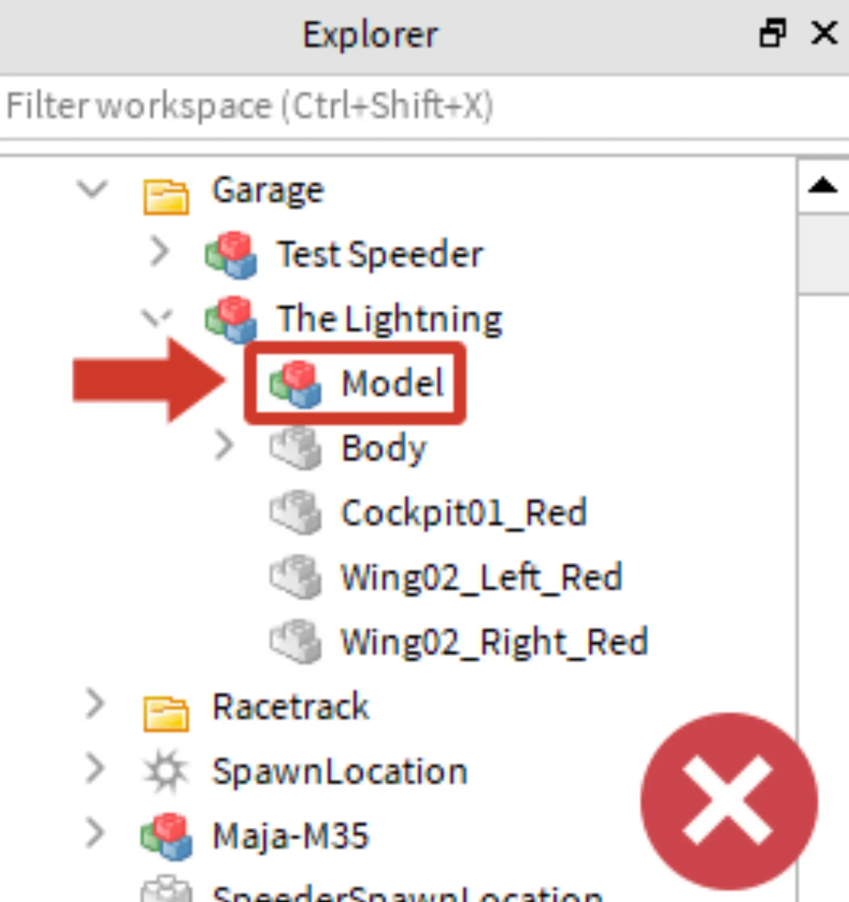

# Test the Speeder

## 목차
- [Test the Speeder](#test-the-speeder)
  - [목차](#목차)
  - [스피더 문제 해결](#스피더-문제-해결)
  - [출처](#출처)
  - [다음](#다음)

---

다음 단계로 넘어가기 전에, 스피더가 제대로 작동하는지 확인하세요.

1. **재생**을 클릭합니다.
2. 스피더를 테스트 비행하려면 로봇 Maja-M35와 대화합니다. 그런 다음 **Race**를 선택하고 선택 메뉴에서 스피더를 선택합니다.
   

3. 비행 중에 드리프트스피더가 의도한 대로 보이는지 확인하세요. 그런 다음 **재생 테스트를 중지**하고 필요한 경우 문제를 수정합니다. <kbd>Shift</kbd> + <kbd>F5</kbd>를 눌러 재생 테스트를 중지할 수 있습니다.

<video controls src="../img/05_12_Test_the_Speeder/test-speeder.mp4"  width="100%"></video>

## 스피더 문제 해결

드리프트스피더가 선택 화면에 나타나지 않으면 다음 단계를 확인하세요:

**스피더가 _Garage_에 있는지 확인하세요.**

1. 스피더를 클릭하여 탐색기에서 위치를 확인합니다.
2. 탐색기에서 스피더가 **_Garage_** 폴더 안에 있는지 확인합니다.
3. **_Garage_**에 없으면, **잘라내기** 및 **Paste Into**를 사용하여 이동시킵니다.

**스피더에 _Body_가 있는지 확인하세요.**

- 게임 내 코드는 Body 파트가 모델 내에 그룹화된 스피더만 로드합니다.

<GridContainer numColumns="2">
  <figure>
    
    <figcaption>추가 모델 없음</figcaption>
  </figure>
  <figure>
    
    <figcaption>추가 모델이 문제를 일으킴</figcaption>
  </figure>
</GridContainer>

---
## 출처
[Test the Speeder](https://create.roblox.com/docs/ko-kr/education/build-it-play-it-galactic-speedway/test-the-speeder)

---
## [다음](05_13_Take_the_Challenge.md)
