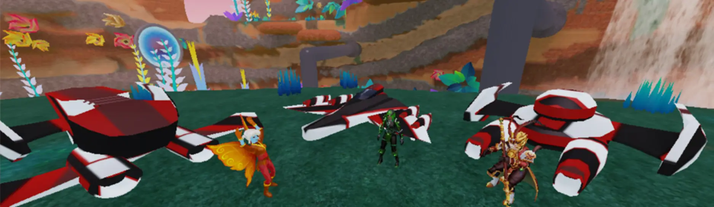
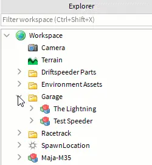
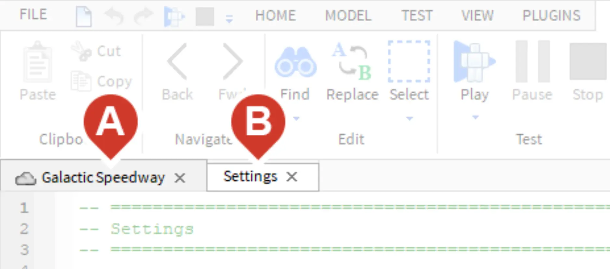

# Take the Challenge

## 목차
- [Take the Challenge](#take-the-challenge)
  - [목차](#목차)
  - [엔진 수정](#엔진-수정)
  - [설정 스크립트](#설정-스크립트)
  - [출처](#출처)
  - [다음](#다음)

---



이 마지막 레슨은 드리프트 스피더를 더 빠르게 하거나 회전 속도를 높이는 등 마무리 작업에 관한 것입니다. 완료되면 비행을 시작하고 친구들과 작품을 공유하세요.

## 엔진 수정

드리프트 스피더의 속도나 회전 속도를 변경하려면 **_Settings_** 스크립트를 열어야 합니다. Roblox에서는 코드가 Lua 코딩 언어를 사용하여 스크립트 내부에 입력됩니다. 게임은 종종 게임이 해야 할 각 작업에 대한 별도의 스크립트를 가지고 있습니다.

1. 스피더를 클릭합니다.
2. **Explorer**에서 **_Garage_** 폴더와 드리프트 스피더를 찾습니다.
3. 드리프트 스피더의 이름 옆에 있는 &#9656; 화살표를 클릭하여 확장합니다. 그런 다음 **_Body_**를 찾아 &#9656;를 클릭하여 연결된 스크립트를 확인합니다.
   
4. **_Settings_** 스크립트를 더블 클릭하여 엽니다.
   <Alert severity="info">
   <AlertTitle>스크립트와 게임 뷰 간 전환</AlertTitle>
   **게임 월드** (A)와 **스크립트** (B)는 별도의 탭에 있습니다. 필요에 따라 앞뒤로 전환하세요.
   
   </Alert>

## 설정 스크립트

스크립트에서는 `DefaultSpeed` 또는 `BoostSpeed`와 같은 단어를 볼 수 있습니다. 이러한 단어는 **변수**입니다. 변수는 필요한 정보를 변경할 수 있는 자리 표시자입니다.

```lua
-- ================================================================================
-- Settings
-- ================================================================================

local Settings = {}

Settings.DefaultSpeed = 100		-- Speed when not boosted [Studs/second, Range 50-300]
Settings.BoostSpeed = 200		-- Speed when boosted [Studs/second, Maximum: 400]
Settings.BoostAmount = 10		-- Duration of boost in seconds
Settings.Steering = 5			-- How quickly the speeder turns [Range: 1-10]
-- ================================================================================

return Settings
```

기본 속도 설정을 높여 트랙에서 가장 빠른 스피더로 만드세요.

1. `Settings.DefaultSpeed = 100` 라인의 숫자를 `50`(느리게)에서 `300`(빠르게) 사이의 아무 숫자로 변경합니다.

   ```lua
   Settings.DefaultSpeed = 100		-- Speed when not boosted [Studs/second, Range 50-300]
   Settings.BoostSpeed = 200		-- Speed when boosted [Studs/second, Maximum: 400]
   Settings.BoostAmount = 10		-- Duration of boost in seconds
   Settings.Steering = 5			-- How quickly the speeder turns [Range: 1-10]
   ```

2. 플레이테스트를 하여 변경 사항이 어떤지 확인하세요. 속도가 드리프트 스피더의 디자인에 적합한지, 경주에서 사용할 때 흥미로울 것 같은지 자문해 보세요.
   <video controls src="../img/05_14_Customize_and_Share/compare-speeder-speeds.mp4" width="100%"></video>

3. 테스트가 끝나면 플레이테스트를 중지합니다. 비행 중에는 마우스를 사용할 수 없으므로, 스피더에서 나가려면 <kbd>E</kbd>를 눌러 플레이테스트를 중지하세요.
   <Alert severity="info">
   <AlertTitle>다양한 스피더 만들기</AlertTitle>
   여러 대의 스피더를 만들 경우, 각각의 스피더가 독특한 느낌을 주도록 서로 다른 강점과 약점을 부여하세요. 한 스피더는 일반적으로 느리지만 부스트가 더 빠를 수 있습니다. 다른 스피더는 매우 빠르지만 회전이 느릴 수 있습니다.
   </Alert>

---
## 출처
[Take the Challenge](https://create.roblox.com/docs/ko-kr/education/build-it-play-it-galactic-speedway/take-the-challenge-2)

---
## [다음](05_15_Going_for_a_Race.md)
