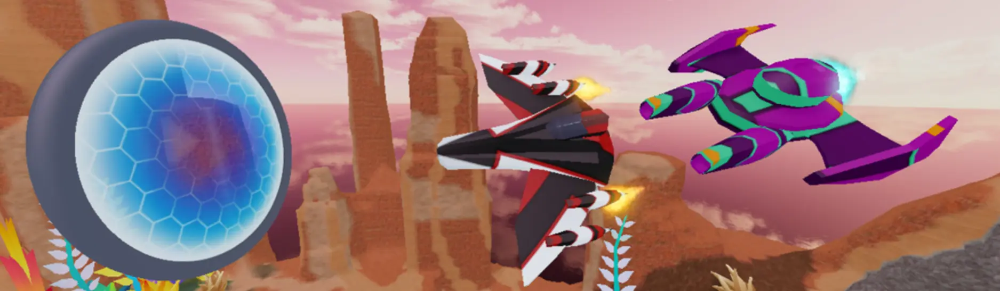
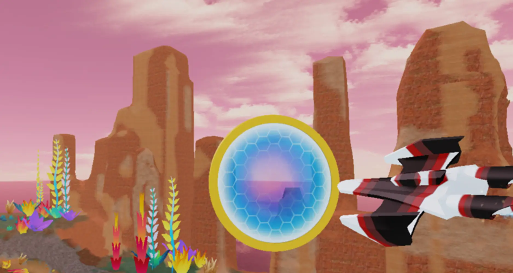
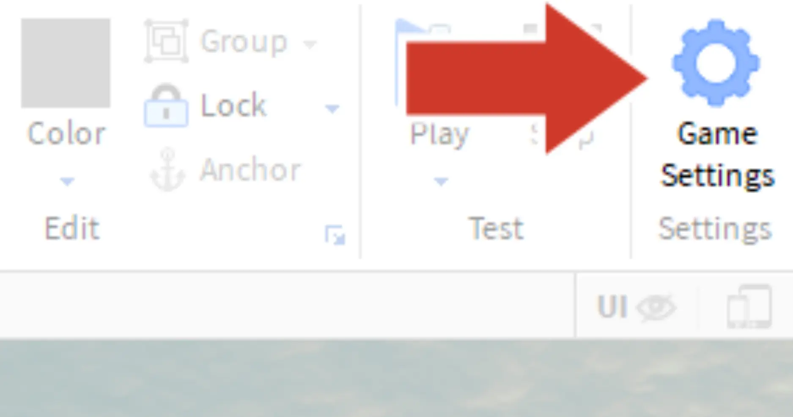
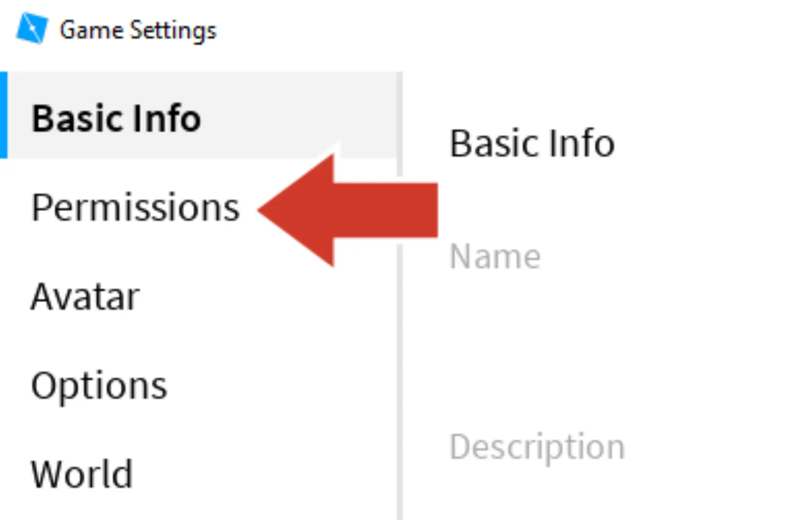
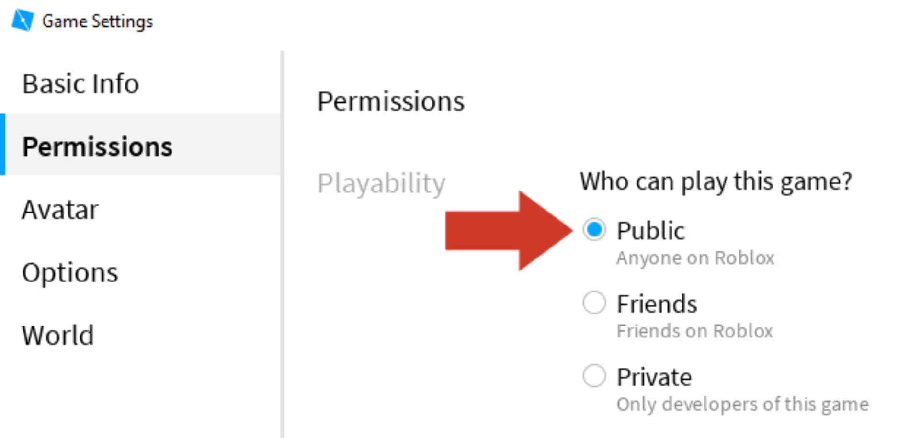

# Going for a Race

## 목차
- [Going for a Race](#going-for-a-race)
  - [목차](#목차)
  - [친구 초대하기](#친구-초대하기)
  - [출처](#출처)
  - [다음](#다음)

---

드리프트 스피더를 완전히 커스터마이즈했으니 실제 경주에서 테스트해볼 시간입니다!

1. **Play**를 클릭합니다.
2. 로봇에게 다가가 새 경주를 시작하고 드리프트 스피더를 선택하세요. 모든 링을 통과할 수 있는지 확인해보세요.

   

## 친구 초대하기

처음 게임을 게시할 때 자동으로 비공개로 설정됩니다. 다른 사람들이 당신의 스피더로 경주할 수 있도록 **공개**로 설정하세요.

1. 친구들이 최신 변경 사항을 받을 수 있도록 게임을 **게시**하세요.

2. 홈 탭에서 **Game Settings**를 클릭합니다.

   

3. 왼쪽 막대에서 **Permissions**를 선택합니다.

   

4. **Public**을 선택합니다.

   

5. **Save**를 클릭합니다.

---
## 출처
[Going for a Race](https://create.roblox.com/docs/ko-kr/education/build-it-play-it-galactic-speedway/going-for-a-race)

---
## [다음](05_16_Take_the_Challenge.md)
