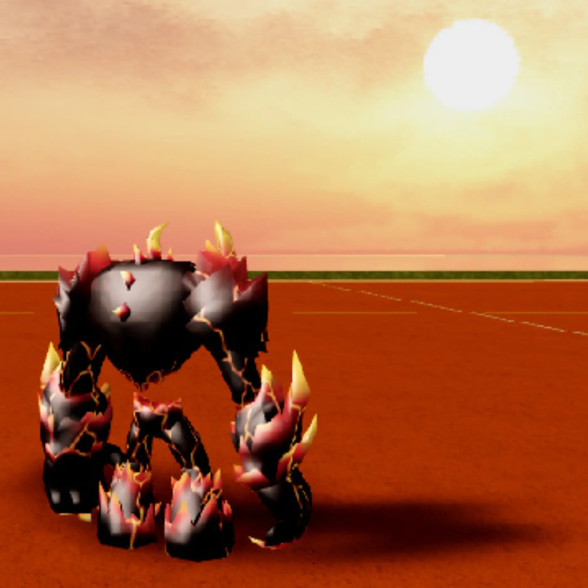
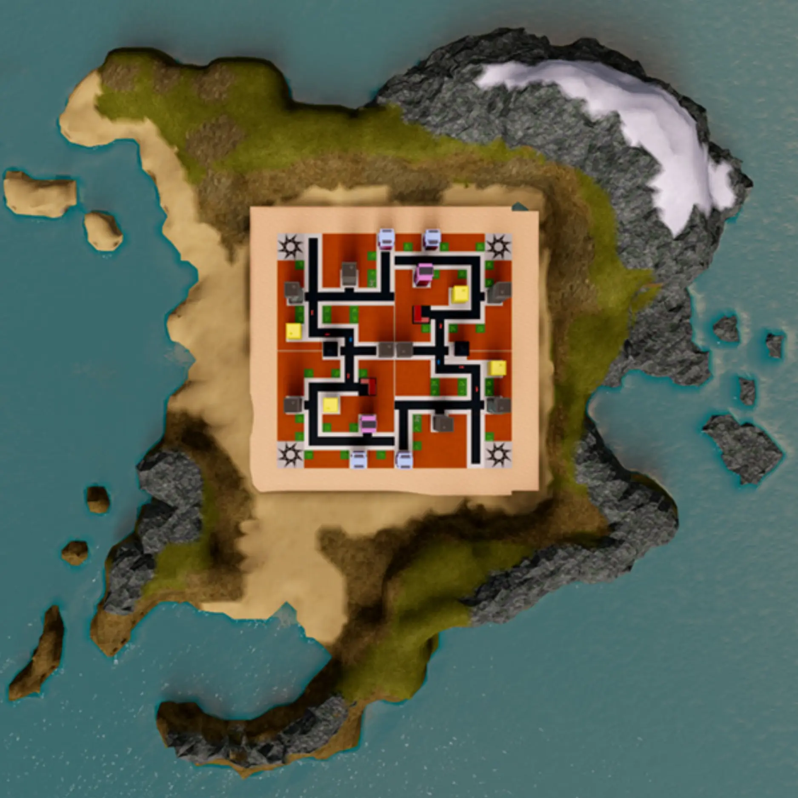
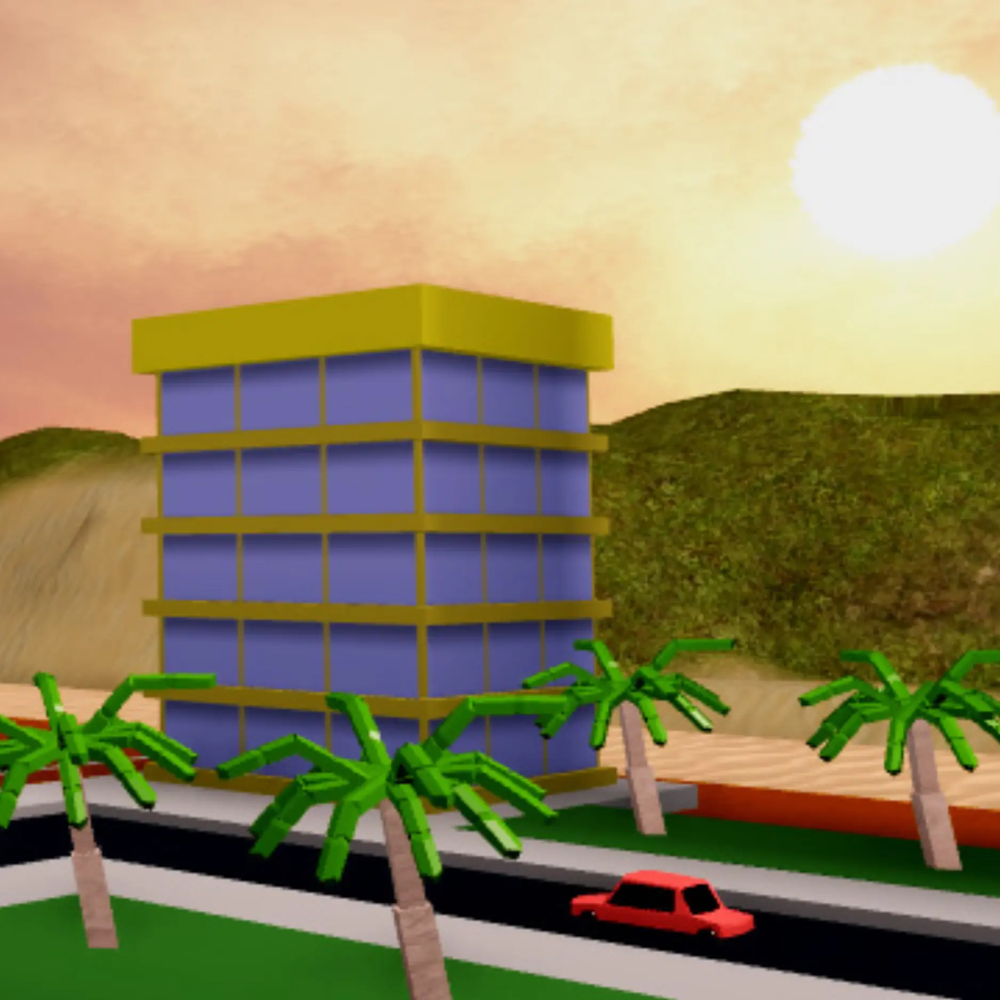
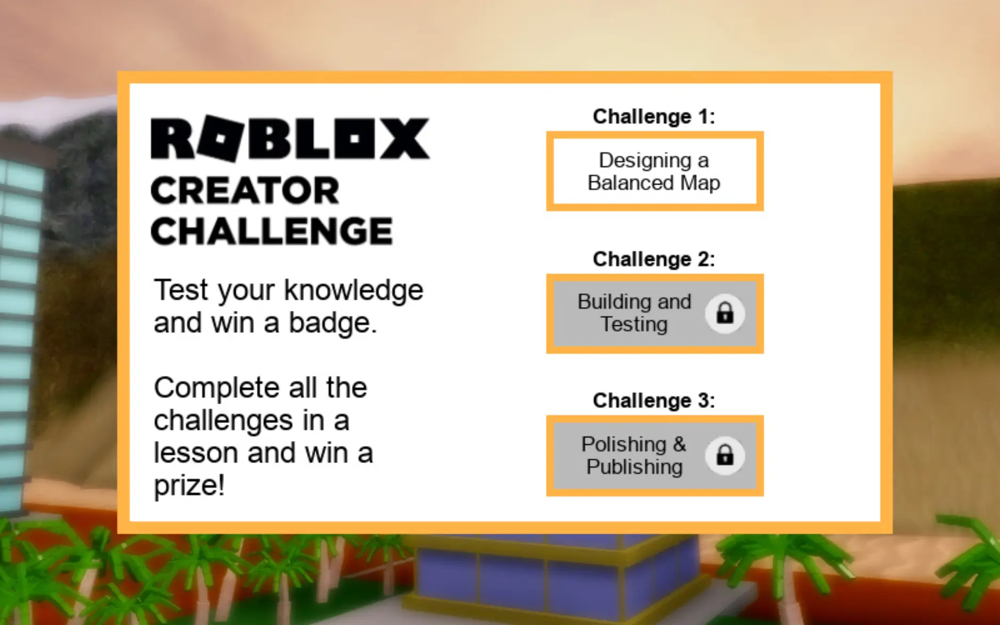

# Create and Destroy

## 목차
- [Create and Destroy](#create-and-destroy)
  - [목차](#목차)
    - [세 가지 레슨, 세 가지 보상](#세-가지-레슨-세-가지-보상)
  - [출처](#출처)
  - [다음](#다음)

---

플레이어들이 레이저 빔으로 도시를 파괴하여 점수를 얻는 멀티플레이어 맵을 디자인하는 방법을 배워보세요. 이 맵을 만드는 것은 배틀 로얄 또는 다른 전투 게임을 만드는 방법을 배우고자 하는 사람들에게 좋은 연습이 될 것입니다.

<video controls src="../img/06_01_Create_and_Destroy/cc2019_introVideo_final_webOptimize.mp4" width="100%"></video>

<Alert severity="info">
완성된 경험의 버전은 <a href='https://www.roblox.com/games/7290548674/Create-and-Destroy-Test-Map?'>Create and Destroy Test Map</a>에서 사용할 수 있습니다. Roblox가 설치되어 있지 않다면, 테스트 맵을 플레이하여 설치할 수 있습니다.
</Alert>

### 세 가지 레슨, 세 가지 보상

<GridContainer numColumns="3">
  <figure>
    
    <figcaption>1: 시작하기</figcaption>
  </figure>
  <figure>
    
    <figcaption>2: 빌드 및 테스트</figcaption>
  </figure>
  <figure>
    
    <figcaption>3: 마무리 및 게시</figcaption>
  </figure>
</GridContainer>

각 레슨이 끝난 후, Roblox에서 퀴즈를 플레이하여 가상 보상을 받을 기회를 얻을 수 있습니다.

---
## 출처
[Create and Destroy](https://create.roblox.com/docs/ko-kr/education/build-it-play-it-create-and-destroy/landing)

---
## [다음](06_02_Create_and_Destroy.md)
